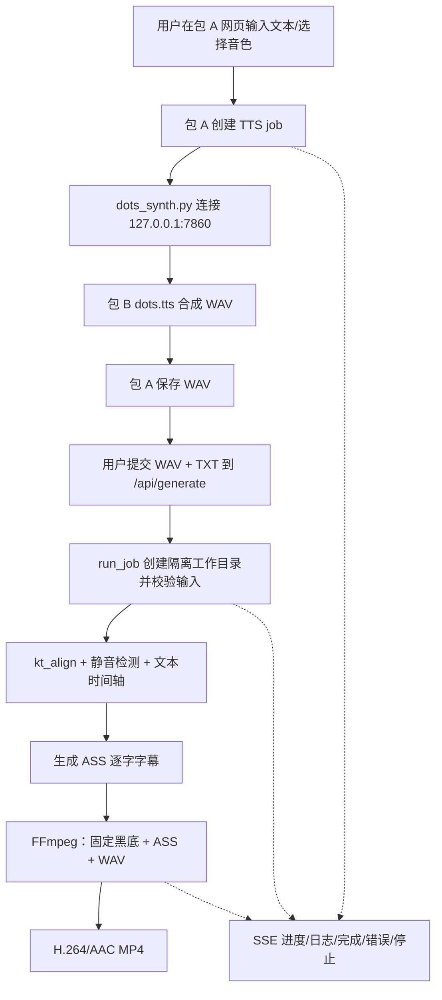
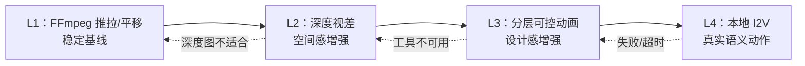
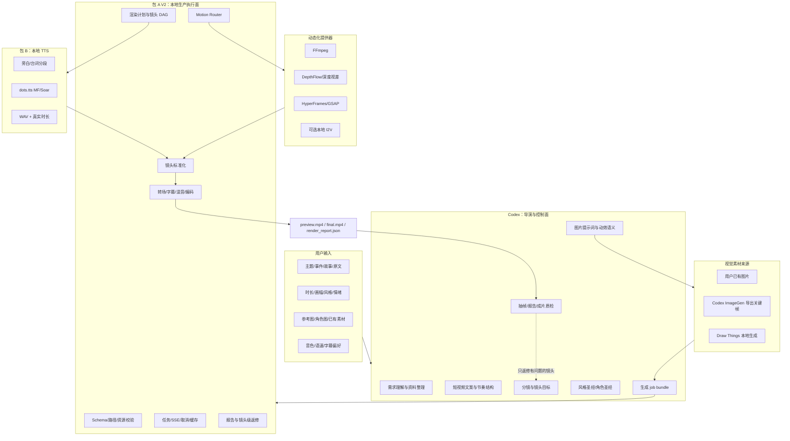
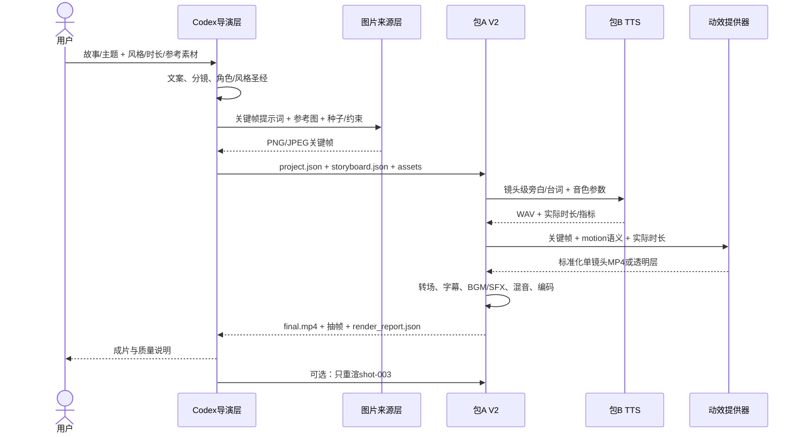
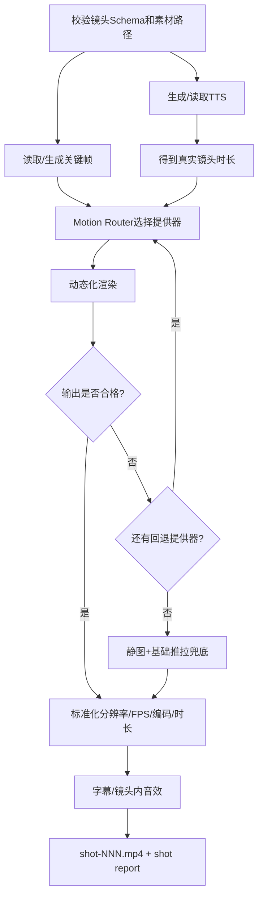

# 文本视音屏生成器：短视频 V2 核心需求与完整方案

> 本文件不是迁移清单，也不是泛泛的项目交接摘要。
>
> 它是后续开发的核心产品与技术说明书，回答四个最重要的问题：**用户究竟想做什么、当前项目究竟有什么、为什么选择这套方案、从输入到最终成片究竟怎样运行。**
>
> 新 Codex 会话应先完整阅读本文件，再阅读 `项目交接文档.md` 了解 Mac 迁移、当前工作树和环境准备信息。

---

## 0. 一页结论：先把最重要的事情说清楚

### 0.1 用户真正要做的不是“黑底文字视频升级版”

用户的目标是：

> 输入一个事件、故事、主题或原始文案，由 Codex 完成内容理解、文案改写、叙事结构、分镜、视觉提示词和制作规划；再由本项目在 Mac 本地完成配音、图片素材组织、图片动态化、镜头转场、字幕、音乐/音效、混音与最终合成，输出一条具有连续叙事、统一视觉风格和明显动态感的高质量竖屏短视频。

目标成片可以是：

- 动漫、插画、国风、电影概念图等非写实风格；
- 现实、写实、摄影、历史还原等风格；
- 第三人称旁白主导的故事视频；
- 旁白中穿插少量角色台词的视频；
- 多张关键画面按叙事顺序出现，每张画面通过镜头运动、视差、分层动画或局部生成式动作变成短动态镜头；
- 镜头之间有符合叙事逻辑的转场，声音、字幕和画面节奏互相配合。

用户提供过一个抖音搜索/成片链接作为视觉意图参考：

<https://www.douyin.com/jingxuan/search/%E6%97%A5%E6%9C%88%E5%90%8C%E9%94%99?aid=f31a139d-59a1-4dc4-a5c0-e83261239211&modal_id=7612910972684430961&type=general>

这里要理解的是“多张带动态感的叙事画面组成短视频”的制作形态，不应把目标误解为照搬该视频的素材、剧情或视觉版权内容，也不能在未实际完整观看参考视频时声称要像素级复刻。

### 0.2 第一版明确不要求什么

- 不要求角色口型与包 B 生成的台词精确同步。
- 不要求所有镜头都由生成式 Image-to-Video 模型制作。
- 不要求网页里输入一句话后完全脱离 Codex、全自动生成一切。
- 不要求第一版同时支持所有风格、所有画幅、多人连续对话和复杂动作戏。
- 不使用付费云 API 作为核心运行依赖。
- 不把“能生成 MP4”误当成“高质量短视频已经完成”。

### 0.3 对当前项目最准确的判断

当前项目不是一个可以随手丢弃的纯玩具 Demo，但也不是现成的 AI 短视频生产系统。

- **包 B** 是有实际模型、Apple Silicon/MPS 运行策略、版本化接口、参数校验、进度、分段、测试和实机数据的本地 TTS 子系统，复杂度和复用价值较高。
- **包 A** 已有本地任务管理、并发线程、SSE 进度、取消、目录隔离、路径安全、输出校验、TTS 调用、字幕对齐和 FFmpeg 合成等工程骨架，属于有工程化基础的单机应用。
- **包 A 当前视觉层** 仍是演示级：视频源固定为黑色背景，主要视觉内容是 ASS 动态字幕。
- **A+B 合体** 已经解决了不少与创意质量无关、但开发时很费时间的基础设施问题；完全重写会重复支付这些成本。

因此，正确方向不是整仓推倒，也不是继续往旧 `kt_video.py` 里堆条件，而是：

> 保留包 A 的任务/服务骨架和包 B 的 TTS，在包 A 内并行建立隔离的短视频 V2 管线；旧黑底流程继续作为 V1 回归基线。

### 0.4 推荐的最终职责分工

| 参与者 | 核心身份 | 负责 | 不负责 |
| --- | --- | --- | --- |
| 用户 | 制片人/需求方 | 主题、故事、目标风格、时长、重要限制、可选参考素材 | 手写 FFmpeg 命令、理解底层模型参数 |
| Codex | 导演与控制面 | 理解需求、文案、分镜、风格圣经、角色圣经、图片提示词、动效语义、任务包、质检与镜头返修 | 作为独立项目中的常驻免费模型 API；逐帧渲染视频 |
| 图片来源层 | 关键帧生产 | 用户图片、Codex ImageGen 导出图、Draw Things 本地图像生成 | 镜头拼接、TTS、任务状态 |
| 包 B | 本地配音引擎 | 分段文本转 WAV、音色、语速、停顿、真实音频时长 | 分镜、图片、视频渲染、转场 |
| 包 A V2 | 执行与生产引擎 | 校验任务包、调用 TTS、选择动效提供器、镜头渲染、转场、字幕、混音、缓存、回退、报告、最终 MP4 | 自己理解任意自然语言并充当大语言模型 |
| 动效提供器 | 单镜头动态化 | FFmpeg、HyperFrames、DepthFlow、可选本地 I2V | 决定故事结构和整片节奏 |

### 0.5 第一版推荐的现实技术组合

第一版不要把成功押在本地 I2V 上。推荐组合是：

1. Codex：文案、分镜、视觉提示词、镜头运动语义、任务包和质检。
2. ImageGen 或 Draw Things：生成统一风格的高质量关键帧。
3. 包 B：按镜头/旁白段生成 WAV。
4. FFmpeg：所有镜头必有的确定性动态基线、标准化、转场、字幕、混音与编码。
5. HyperFrames：复杂分层动画、遮罩、粒子、文字设计和高级转场。
6. DepthFlow：适合的图片做深度视差。
7. Draw Things 或其他经 M1 Pro 实测通过的本地 I2V：仅用于少量真正需要语义动作的“英雄镜头”。
8. 任一高级提供器失败时，自动回退到 FFmpeg 推拉/平移，整片仍然必须能够输出。

---

## 1. 完整需求定义

### 1.1 输入需求

整个“Codex + 项目”系统的最小输入可以只有：

- 一件事情；
- 一个故事；
- 一个主题；
- 一段需要改编的原始文本。

为了获得更可控的结果，可选补充：

- 目标时长，例如 30 秒、45 秒或 60 秒；
- 画幅，第一版默认竖屏 `9:16`；
- 动漫或写实风格；
- 情绪，例如紧张、温暖、神秘、史诗、悲伤、轻松；
- 目标人群；
- 旁白音色和语速；
- 是否允许角色台词；
- 角色参考图、服装参考、地点参考、画风参考；
- 禁止出现的内容；
- 用户已经拥有的图片、视频、音乐或声音素材。

系统不应强迫普通用户填写底层参数，例如 CRF、采样器、ControlNet 权重、FFmpeg filtergraph 或模型内部节点。

### 1.2 输出需求

用户真正需要的主产物是：

- 一条可以直接观看和发布前审阅的 `final.mp4`；
- 第一版默认 `1080x1920`、`9:16`、H.264/AAC；
- 多镜头连续叙事，而不是一张图撑完整段音频；
- 动漫或写实风格在同一个项目内保持统一；
- 画面与旁白内容基本对应；
- 每个镜头都有可感知但不过度的运动；
- 镜头间衔接不生硬；
- 有清楚、不过度遮挡画面的字幕策略；
- 旁白清晰，背景音乐和音效不盖住人声；
- 某个镜头失败时可以单独返修，不必重做整条视频。

除主视频外，项目还应输出可追踪的制作产物：

- `preview.mp4`：低成本快速预览；
- `shots/*.mp4`：每个镜头的标准化视频；
- `audio/*.wav`：镜头/台词级配音；
- `captions/*.ass` 或其他字幕文件；
- `storyboard.json`：最终执行分镜；
- `render_report.json`：提供器、耗时、重试、回退、错误与缓存信息；
- 关键帧和必要的中间素材。

### 1.3 成片体验需求

“高质量”不能只用分辨率描述。这个项目里的高质量至少包括六个维度：

1. **内容质量**：开头能建立兴趣，信息推进清楚，有转折或重点，有明确结尾。
2. **分镜质量**：每个镜头有存在理由，景别、构图和内容不会机械重复。
3. **视觉一致性**：角色长相、服装、时代、场景、光线、色彩和画风不频繁漂移。
4. **动态质量**：运动与画面结构匹配，不是每张图统一放大；人物边缘、脸和手不能出现明显破坏性变形。
5. **节奏质量**：镜头长度、旁白重音、字幕、转场和声音变化互相呼应。
6. **技术质量**：无黑帧、无花屏、无断音、无明显音画错位、播放器兼容、输出可追踪。

### 1.4 旁白与角色台词需求

- 第一版以第三人称旁白为默认，因为它最适合“静态关键帧 + 动态镜头”的形态。
- 角色台词可以作为独立音频段插入，但镜头只需在语义和节奏上匹配，不要求嘴唇逐音素同步。
- 不同角色可以使用不同参考音色，但第一版应限制主要角色数量，防止音色和视觉一致性同时失控。
- 文案必须按镜头或句群分段送入包 B，不能把长篇全文一次性合成后再勉强切割。

### 1.5 第一版范围边界

建议的 V2 MVP 默认范围：

| 项目 | 默认范围 |
| --- | --- |
| 成片长度 | 30–45 秒 |
| 镜头数量 | 6–10 个 |
| 画幅 | 1080x1920，9:16 |
| 帧率 | 先统一 25 或 30 FPS，具体在技术样片后冻结 |
| 风格 | 单项目一种主风格 |
| 主要角色 | 1–2 个 |
| 配音 | 第三人称旁白为主，可含少量角色台词 |
| 口型同步 | 不要求 |
| I2V | 可以为 0；实测通过后最多用于 1–2 个重点镜头 |
| 最低动效 | 每个镜头至少一种可见运动 |
| 转场 | 使用有限、可解释的转场集合 |
| 重渲 | 支持镜头级重做 |
| 网络/费用 | 核心执行路径本地、无按量付费云 API |

在正式 MVP 前，应先制作一个 15–20 秒、3 镜头的技术样片。技术样片不是产品交付，它用于在 M1 Pro 上验证图片生成、动态化、转场、TTS 和合成的真实质量与性能。

---

## 2. 当前项目真实流程与复杂度

### 2.1 当前 A+B 的端到端流程



直接代码证据：

- `【包A】视频引擎包/程序文件/网站/kt_web.py:171-250`：任务记录、事件历史和终态控制。
- `kt_web.py:441-554`：WAV/TXT 落盘、输入校验、调用 `kt_video.generate()`、成品校验和失败清理。
- `kt_web.py:555-683`：以子进程方式调用 `dots_synth.py`，并消费进度输出。
- `kt_web.py:1233-1299`：可重放的 SSE 事件和下载控制。
- `【包A】视频引擎包/程序文件/网站/dots_synth.py:82-94`：文本按约 200 字句群分块。
- `dots_synth.py:146-168`：协商包 B 的版本化接口或兼容旧接口。
- `dots_synth.py:324-381`：逐块 TTS、进度、WAV 拼接和最终时长。
- `【包A】视频引擎包/程序文件/引擎/kt_video.py:51-220`：文本清洗、分词、停顿检测和逐字时间轴。
- `kt_video.py:503-537`：最终 FFmpeg 命令。
- `kt_video.py:529`：视频源固定为 `color=c=black:s=1080x1920`。
- `【包B】语音引擎包/apps/gradio/api_contract.py:6-81`：版本、字段、默认值和参数边界。

### 2.2 包 B 已有的实机能力和限制

包 B 不是尚未验证的模型样例。仓库文档记录它已经在实际目标级设备 M1 Pro、32GiB 统一内存上验收：

- 推理策略为 PyTorch MPS + float32，不静默回退 CPU；
- 快速版 `dots-tts-mf` 是默认日常路径，4 步 MeanFlow；
- M1 Pro 连续测试的稳态中位 RTF 约 `2.82455`，可用但不是实时级；
- 质量版 `dots-tts-soar` 的实测 RTF 约 `9.4`，明显更慢；
- 超过约 200 字的长段可能局部音量变小，因此 V2 必须按镜头/句群合成；
- 包 A 和包 B 通过本机 `127.0.0.1` 接口协作，两个包使用独立运行时；
- 当前包 B 契约允许 `num_steps`、`guidance_scale`、`speed`、`max_pause`、`seed`、参考音频和文本规范化等参数。

直接证据见 `【包B】语音引擎包/macOS使用说明.md:5-32` 和 `【包B】语音引擎包/apps/gradio/api_contract.py:6-81`。

这些数据说明：包 B 可以作为 V2 的正式音频提供器起点，但镜头时长规划不能假设它实时返回，也不应默认所有片段都使用质量版。

### 2.3 三部分复杂度的客观评价

| 部分 | 当前复杂度 | 工程成熟度 | 视觉/产品成熟度 | 结论 |
| --- | --- | --- | --- | --- |
| 包 B | 中高 | 接近可复用的本地生产子系统 | 只负责音频，不评价视觉 | 不是简单脚本，保留价值高 |
| 包 A | 中等 | 有任务、SSE、取消、隔离、校验、路径和 FFmpeg 基础 | 当前黑底渲染是原型级 | 骨架值得保留，视觉核心需新建 |
| A+B | 中高 | 已打通本地服务、契约、进度和成片路径 | 目前只能形成低吸引力读字视频 | 不是目标产品，但显著降低 V2 基础设施成本 |

进一步解释：

- 如果只复现“文本转语音 + 黑底字幕视频”，Codex 可以在较短时间内重新做出功能近似版本，因为视觉和业务逻辑并不复杂。
- 如果要求重现现有仓库全部 Mac 适配、MPS 策略、模型管理、版本化契约、停止/进度、路径安全、测试和发布边界，工作量并不小。
- 如果目标升级为稳定的多镜头短视频系统，复杂度会从“单一 FFmpeg 工作流”跃迁为“多提供器、可回退、可追踪的媒体生产管线”，这是接近生产级架构的问题。

### 2.4 当前接口与 V2 接口的根本变化

| 层面 | 当前 V1 | 目标 V2 |
| --- | --- | --- |
| 总输入 | 文本、音色，或 WAV + TXT | Brief、项目配置、结构化分镜、参考素材和关键帧 |
| 包 A 视频输入 | 单个 WAV + 单个 TXT | `project.json + storyboard.json + assets/` |
| 时间组织 | 一条完整音频时间轴 | 多个镜头、每镜头旁白/台词和转场重叠 |
| 画面源 | 固定黑色背景 | 图片、图层、深度图、生成式短片和用户视频素材 |
| 动效 | ASS 文字运动 | 镜头运动、视差、分层、粒子、遮罩、可选 I2V |
| 失败粒度 | 整个视频 job | 项目阶段 + 单镜头 + 单提供器 |
| 返修方式 | 重新生成整片 | 只重做指定镜头并复用其他缓存 |
| 输出 | 一个 MP4 | 单镜头、预览、最终 MP4、字幕、音频和渲染报告 |

因此 V2 不是给 `/api/generate` 多加一个“背景图片”字段。它需要新的结构化任务入口、时间线模型、Provider 层和镜头级缓存/报告。

### 2.5 应保留、重构和替换的部分

| 当前能力 | 处理方式 | 原因 |
| --- | --- | --- |
| 包 B dots.tts 模型和服务 | 保留 | 已在 M1 Pro/MPS 上验收，有清晰接口 |
| `dots_synth.py` 协议桥 | 保留并抽象 | 已解决接口协商、分块和进度；V2 需要镜头级调用 |
| 包 A job/SSE/stop/download | 保留并泛化 | V2 长任务更需要这些能力 |
| 路径发现和外部工具解析 | 保留 | Mac 本地多工具集成需要统一边界 |
| 旧 `/api/generate` | 保留为 V1 | 作为回归基线和应急出片路径 |
| `kt_video.py` 字幕时间轴 | 部分复用 | 字幕仍有价值，但不应继续承担全部 V2 视觉逻辑 |
| 固定黑底 FFmpeg 命令 | 替换 | 它是视觉吸引力不足的直接原因 |
| 当前前端 | 后期扩展 | 先稳定 Schema 和渲染内核，避免 UI 绑定错误架构 |

### 2.6 为什么不建议完全重投一个新仓库

完整重投只有在以下情况下才合理：现有包 A 的任务结构严重阻碍多镜头、包 B 接口不可复用，或新产品完全不需要本地 TTS/网页任务系统。当前证据不支持这些前提。

在当前仓库新增 V2 的节约点包括：

- 不用重新解决 Mac 启动、端口、路径、FFmpeg 和 Python 环境边界；
- 不用重新做包 B 模型准备和 MPS 策略；
- 不用重新设计基本 job、停止、SSE、下载和错误终态；
- 可以保留 V1 做对照，逐镜头验证 V2；
- 可以先做 CLI/Schema 内核，之后再接入现有网页。

但“基于当前项目改造”不等于“小修小补”。V2 应是包 A 中一个清晰隔离的新子系统。

---

## 3. “图片变成动图”到底有哪几种技术

这是整个方案最容易被误解的地方。单张图片动态化至少分四个层级，它们的效果、成本和风险完全不同。

### 3.1 一级：二维镜头运动幻觉

技术：FFmpeg `zoompan`、裁切、平移、缓动、轻微旋转、模糊、光效、颗粒、遮罩和叠层。

能做到：

- 缓慢推近人物面部；
- 从环境全景平移到主体；
- 轻微拉远建立空间；
- 通过前景叠层、烟雾、光斑、雨雪让静图显得不完全静止；
- 使用运动方向连接相邻镜头。

不能做到：

- 角色真正走路、回头、挥手；
- 衣服和头发有可信的物理运动；
- 改变表情或物体状态。

优点是确定、快速、免费、稳定、可测试，所以它必须成为所有镜头的兜底基线。

### 3.2 二级：深度视差/2.5D 相机运动

技术：由 Depth Anything 等模型估计深度图，再通过 DepthFlow、Three.js、HyperFrames 或定制 shader 让前景和背景以不同速度移动。

能做到：

- 人物与背景产生空间分离；
- 模拟轻微的镜头横移、推进和环绕；
- 风景、建筑、半身人物、层次清楚的画面获得更强立体感。

不能做到：

- 自动补全大幅移动后被遮挡的真实内容；
- 让角色产生新的语义动作；
- 保证头发、手指、复杂边缘完全无破损。

它比简单推拉高级，但仍属于“相机/图层在动”，不是“角色理解剧情后在动”。

### 3.3 三级：分层可控动画

技术：把人物、背景、前景、光效、文字、粒子或局部物体分成图层，使用 HyperFrames/GSAP、遮罩、骨骼或关键帧分别运动。

能做到：

- 人物轻微呼吸/漂移感；
- 前景树叶、烟尘、光线、镜头遮挡；
- 标题、地图、时间线、物件特写等设计化叙事；
- 更高级、可重复使用的转场和视觉包装；
- 比整张图统一缩放更精细的运动节奏。

成本在于需要分层素材、遮罩或自动抠图，而且模板设计需要开发时间。

### 3.4 四级：生成式语义动作（真正的 Image-to-Video）

技术：Wan、LTX、Hunyuan 等本地或云端 I2V 模型。

能做到：

- 角色转头、行走、表情变化；
- 水、火、云、衣物等产生内容级运动；
- 相机与主体共同发生更自然的运动。

主要问题：

- M1 Pro 上速度、内存和稳定性尚未实测；
- 角色脸、手、服装和背景可能在时间上漂移；
- 生成结果不可完全确定，常需重试；
- 视频模型和缓存会明显占用 512GB SSD；
- 一个失败镜头不能阻塞整片。

因此推荐将其用于少量高潮或动作镜头，而不是作为 V2 MVP 的唯一基础。

### 3.5 推荐的镜头动态质量阶梯



核心原则：质量可以向上升级，可靠性必须向下回退。

---

## 4. 总体架构：Codex 控制面 + 包 A/B 执行面

### 4.1 系统全景图



### 4.2 为什么 Codex 不应该直接承担运行时

Codex 很适合：

- 理解故事和用户意图；
- 进行内容取舍和镜头规划；
- 为不同图片生成器写提示词；
- 生成结构化 JSON；
- 编写/调整可复用动效模板；
- 查看抽帧、日志和报告后定位问题；
- 只重做失败镜头。

但独立项目不能假设自己可以免费、无人值守地调用 Codex 内置能力。尤其是：

- Codex ImageGen 是会话中的图片生成工具，不等同于项目可嵌入的免费 API；
- 新开普通网页任务时，包 A 不会自动拥有旧 Codex 会话的推理能力；
- 如果未来要求完全脱离 Codex 自动编剧，需要额外评估本地 LLM，这不属于第一版核心范围。

所以必须以文件/JSON 契约解耦：Codex 产出任务包，包 A 确定性执行任务包。

### 4.3 Codex、包 A、包 B 的明确输入输出



---

## 5. 从一段文本到一条短视频的完整工作流

### 5.1 步骤 1：形成制作 Brief

Codex 把用户输入整理为可执行 Brief：

- 视频主题和一句话核心；
- 观众应获得什么情绪或信息；
- 时长和画幅；
- 动漫/写实及更具体的视觉语言；
- 旁白视角；
- 主角色和地点；
- 不可出现的内容；
- 可用素材和版权边界；
- 质量优先级，例如角色一致性优先于真实动作。

如果用户没有提供非阻塞参数，Codex 应给出合理默认值继续，不应每遇到一个细节就立即提问。

### 5.2 步骤 2：把原文改造成短视频文案

原始故事不应直接逐句配图。Codex 应先形成短视频节奏：

1. **Hook**：前 1–3 秒建立悬念、冲突或最强视觉点。
2. **Context**：快速说明人物、地点或事件背景。
3. **Progression**：信息/动作逐镜头推进。
4. **Turn**：出现转折、意外、升级或关键发现。
5. **Payoff**：高潮、答案或情绪释放。
6. **Ending**：简短收束，可选留下余味或问题。

对历史/事实类内容，文案事实和视觉想象必须区分；不能因为画面需要就把推测写成事实。

### 5.3 步骤 3：拆成镜头，而不是拆成句子

一个镜头应对应一个明确的视觉意图，不必严格一条句子一个镜头。每个镜头至少回答：

- 这段旁白在讲什么？
- 观众此刻应该看什么？
- 主体是谁？
- 景别是什么？
- 镜头为何运动、向哪里运动？
- 与上一镜头如何衔接？
- 是普通镜头还是值得更多计算的英雄镜头？

初始建议：普通镜头约 3–6 秒；实际时长必须以 TTS 输出为准，不能只信文案估算。

### 5.4 步骤 4：创建风格圣经和角色圣经

风格圣经至少包含：

- 风格名称和描述；
- 时代、地域和材质；
- 色板和对比度；
- 光线方向和光质；
- 镜头语言；
- 允许和禁止的元素；
- 图片生成的固定提示词前缀/后缀；
- 负面提示；
- 画幅与构图安全区。

角色圣经至少包含：

- 角色 ID 和名字；
- 年龄段、脸型、发型、肤色、体型；
- 固定服装和道具；
- 不随镜头改变的辨识特征；
- 正面、侧面、半身/全身参考图；
- 每个场景允许变化的部分；
- 图片提供器中的参考图、种子、LoRA/ControlNet 等约束。

角色一致性是第一版比口型同步更重要的质量风险。

### 5.5 步骤 5：生成或收集关键帧

关键帧来源可混合：

- 用户已有图片；
- Codex 会话中的 ImageGen；
- Mac 本地 Draw Things；
- 合法授权的本地素材。

每个镜头不一定只需要一张图：

- 普通推拉镜头：一张高分辨率关键帧即可；
- 视差镜头：关键帧 + 深度图；
- 分层镜头：背景、人物、前景、效果层和遮罩；
- I2V 镜头：起始图，可选结束图、动作描述和相机描述。

生成图片时不要把旁白原句直接当提示词。提示词需要显式写出主体、动作状态、环境、景别、构图、光线、色彩、风格和禁止项。

### 5.6 步骤 6：按镜头生成 TTS

包 A 将每个镜头的旁白/台词交给包 B：

- 默认使用快速版 `dots-tts-mf`；
- 质量版 `dots-tts-soar` 只用于用户明确接受更长等待或需要对比时；
- 一段过长旁白继续按句群分块；
- 保存真实 WAV 时长、模型、音色、参数和 RTF；
- 不同角色台词生成独立文件；
- 音频生成失败时允许只重试该段。

为什么先得到真实音频时长：镜头的最终持续时间应服从人声节奏，而不是强行把语音拉伸到预估时长。

### 5.7 步骤 7：为每个镜头选择动态化路线

Motion Router 根据以下因素选择提供器：

- 镜头是否需要真实主体动作；
- 图片是否有清晰前中后景；
- 是否有分层素材；
- 是否为英雄镜头；
- 允许的渲染预算；
- 本地工具健康状态；
- 过去缓存是否命中；
- 用户偏好和质量策略。

示例：

| 镜头情况 | 首选 | 备选 | 最终兜底 |
| --- | --- | --- | --- |
| 风景/建筑建立镜头 | DepthFlow 或缓慢推入 | HyperFrames 分层 | FFmpeg zoompan |
| 人物面部情绪特写 | 轻推近 + 光影/粒子 | 低幅度 I2V | FFmpeg 缓慢推近 |
| 地图、时间线、概念说明 | HyperFrames | FFmpeg overlay | 静图 + 推拉 |
| 真正动作高潮 | 本地 I2V | 分层动画/视差 | 强节奏推拉 + SFX |
| 图片边缘复杂、深度图差 | HyperFrames 轻动效 | FFmpeg | FFmpeg |

### 5.8 步骤 8：标准化单镜头

无论哪个提供器输出，包 A 都必须标准化为统一规格：

- 分辨率；
- 帧率；
- 像素格式；
- 色彩空间；
- 编码；
- 音频采样率；
- 精确持续时间；
- 时间基；
- 是否带透明通道。

否则不同工具生成的片段在最终拼接时容易出现跳帧、花屏、音画长度不一致或播放器兼容问题。

### 5.9 步骤 9：设计转场

转场不是随机特效。它应由叙事关系驱动：

- 同一场景、时间连续：短叠化或动作匹配；
- 时间/地点变化：淡出、遮挡转场、环境声桥接；
- 突发转折：硬切、闪白、快速推拉或冲击音；
- 回忆/梦境：柔化、溶解、色调改变；
- 因果连接：使用方向一致的运动或物体 match cut；
- 情绪收束：减慢、拉远、降低声场密度。

第一版应只提供有限、验证过的转场预设，不要暴露几十种无规则特效。

### 5.10 步骤 10：字幕、音乐和音效

字幕：

- 现有 ASS 时间轴可继续复用，但视觉样式需从“大号黑底读字”改成不遮挡主体的短视频字幕；
- 可以按短句或重点词显示，不必默认逐字占据画面中心；
- 要保留安全区，避免平台 UI 遮挡；
- 角色台词和第三人称旁白可使用不同但统一的样式。

音乐与音效：

- 旁白始终优先；
- BGM 应按段落有能量变化，而不是从头到尾同一音量；
- 转折、出现、撞击、环境变化等可有适量 SFX；
- 环境底噪能增强空间感，但不能覆盖人声；
- 所有音乐和音效必须有合法来源和素材记录。

### 5.11 步骤 11：预览、质量门和镜头返修

包 A 先输出低成本预览：

- 检查时长、镜头顺序、转场、字幕和音轨；
- 抽取每个镜头的代表帧；
- `render_report.json` 记录每个镜头所用提供器和回退；
- Codex 根据报告和抽帧判断问题属于文案、关键帧、动效、时间或合成；
- 只重新生成有问题的镜头；
- 预览通过后再输出最终编码。

---

## 6. Job Bundle：Codex 与包 A 之间的核心契约

### 6.1 推荐目录结构

```text
job-20260811-example/
├── brief.md
├── project.json
├── storyboard.json
├── style_bible.json
├── characters.json
├── references/
│   ├── style/
│   └── characters/
├── assets/
│   ├── keyframes/
│   ├── layers/
│   ├── depth/
│   ├── music/
│   └── sfx/
├── audio/
├── shots/
├── captions/
├── cache/
└── output/
    ├── preview.mp4
    ├── final.mp4
    └── render_report.json
```

### 6.2 `project.json` 应描述项目级约束

建议字段：

- `schema_version`；
- 项目 ID、标题和语言；
- 画幅、分辨率、FPS 和目标时长；
- 风格模式 `anime | realistic | illustrative`；
- 全局色彩、光线、字幕和声音策略；
- 默认旁白音色；
- 提供器优先级；
- 允许的最大 I2V 镜头数；
- 渲染预算/超时；
- 缓存和清理策略；
- 高级提供器失败时的全局回退策略。

### 6.3 单镜头完整示例

下面不是最终 Schema，而是用于让新会话理解设计意图的完整示例：

```json
{
  "id": "shot-003",
  "order": 3,
  "purpose": "转折：危机并未解除",
  "narration": {
    "type": "third_person",
    "speaker_id": "narrator-main",
    "text": "就在众人以为危机已经解除时，天空再次暗了下来。",
    "voice": "女播音.wav",
    "speed": 1.0,
    "max_pause": 0.3
  },
  "timing": {
    "estimated_sec": 4.8,
    "fit": "follow_audio",
    "head_pad_sec": 0.15,
    "tail_pad_sec": 0.25
  },
  "visual": {
    "source_type": "keyframe",
    "source": "assets/keyframes/shot-003.png",
    "prompt": "古代城池全景，乌云迅速遮蔽太阳，人群抬头，写实国风电影感，低机位广角，强烈明暗变化，竖屏构图",
    "negative_prompt": "现代建筑，文字，水印，多余人物，畸形手，脸部模糊",
    "style_reference": "references/style/main.png",
    "character_references": ["references/characters/hero-front.png"],
    "seed": 43003,
    "safe_area": "center"
  },
  "motion": {
    "intent": "先缓慢推近城池，乌云出现时加速并轻微下压",
    "mode": "parallax",
    "preset": "ominous_push_in",
    "strength": 0.35,
    "provider_priority": ["depthflow", "hyperframes", "ffmpeg"],
    "timeout_sec": 180,
    "fallback": "ffmpeg_slow_push_in"
  },
  "transition_in": {
    "type": "crossfade",
    "duration_sec": 0.28
  },
  "transition_out": {
    "type": "flash_to_dark",
    "duration_sec": 0.18
  },
  "audio": {
    "bgm_cue": "tension-rise",
    "sfx": [
      {"source": "assets/sfx/low-rumble.wav", "at_sec": 2.2, "gain_db": -12}
    ]
  },
  "caption": {
    "enabled": true,
    "mode": "phrase",
    "emphasis": ["天空再次暗了下来"]
  },
  "quality": {
    "hero": false,
    "must_preserve": ["古代城池", "乌云", "hero_identity"],
    "reject_if": ["modern_objects", "face_drift", "severe_edge_tearing"]
  }
}
```

### 6.4 顶层 Schema 不应泄漏所有工具参数

`storyboard.json` 应表达“想要什么”，例如：

- `slow_push_in`；
- `parallax_left`；
- `hero_action`；
- `flash_to_dark`。

不要让 Codex 每次直接生成几十行 FFmpeg filtergraph、GSAP 实现或 Draw Things 内部节点。包 A 用版本化预设把语义转换为工具参数，这样才能测试、复用、升级和回退。

---

## 7. 包 A V2 的内部设计

### 7.1 推荐模块边界

具体命名可按仓库风格调整，但职责应保持隔离：

```text
【包A】视频引擎包/程序文件/video_v2/
├── schema/
│   ├── models.py
│   └── validation.py
├── planning/
│   ├── render_plan.py
│   └── timing.py
├── orchestrator/
│   ├── pipeline.py
│   ├── shot_jobs.py
│   └── cancellation.py
├── providers/
│   ├── voice_dots.py
│   ├── image_manual.py
│   ├── image_drawthings.py
│   ├── motion_ffmpeg.py
│   ├── motion_depthflow.py
│   ├── motion_hyperframes.py
│   └── motion_i2v.py
├── composition/
│   ├── normalize.py
│   ├── transitions.py
│   ├── captions.py
│   ├── audio_mix.py
│   └── final_render.py
├── cache/
│   ├── keys.py
│   └── retention.py
└── report/
    └── render_report.py
```

不要直接把全部 V2 能力塞进旧 `kt_video.generate()`。旧文件已经包含文本、对齐、字幕、FFmpeg 和进度逻辑，再继续扩张会成为难以测试的巨型函数。

### 7.2 Provider 接口思想

每个提供器应有统一的能力描述：

- 是否安装；
- 当前版本；
- 支持的输入类型；
- 支持的输出规格；
- 预计成本/超时；
- 是否确定性；
- 健康检查；
- 渲染；
- 取消；
- 错误分类；
- 可回退目标。

包 A 不应根据工具 stderr 中的一句自由文本猜测所有错误。应把错误分类为：

- `provider_unavailable`；
- `invalid_asset`；
- `timeout`；
- `out_of_memory`；
- `render_failed`；
- `invalid_output`；
- `cancelled`。

### 7.3 镜头任务图



### 7.4 整片状态机

建议状态：

```text
queued
  -> validating
  -> preparing_assets
  -> synthesizing_audio
  -> rendering_shots
  -> composing_preview
  -> awaiting_quality_gate / composing_final
  -> done

任何运行状态 -> stopping -> stopped
不可恢复错误 -> error
```

现有 `create_job`、事件历史、终态幂等和停止信号可以作为基础，但 V2 需要更细的 stage、shot_id 和 provider 字段。

### 7.5 缓存键

镜头级缓存至少应包含：

- 输入素材内容哈希；
- Schema 版本；
- 提供器和提供器版本；
- 提示词/种子；
- 动效预设和参数；
- 输出规格；
- 音频内容哈希；
- 渲染模板版本。

只按文件名缓存会产生错误命中。修改第三个镜头时，不应让其余九个镜头重新渲染。

### 7.6 磁盘清理

设备只有 512GB SSD，且包 B 模型已经约 9.7GB。V2 必须从第一版就有：

- 每个 job 的独立目录；
- 临时帧与最终资产分离；
- 失败/取消后的临时帧清理；
- 缓存容量或年龄上限；
- 保留关键帧、镜头成品、最终视频和报告；
- 可选保留 I2V 原始结果；
- 清理前不删除用户原始素材。

---

## 8. 视觉一致性方案

### 8.1 为什么一致性比单张图质量更重要

十张各自很漂亮但角色长相和服装不断变化的图片，组成视频后会显得比十张稍普通但连贯的图片更差。短视频 V2 应把一致性当成项目级约束，而不是每个镜头独立抽卡。

### 8.2 通用一致性措施

- 固定风格圣经；
- 固定角色参考图；
- 固定角色描述顺序和核心词；
- 尽量固定模型、LoRA、采样器和种子族；
- 使用上一镜头或角色表作为参考，而不是每次纯文本生成；
- 镜头提示词只改变场景需要变化的部分；
- 生成后先做角色/服装/时代检查，再进入高成本 I2V；
- 关键帧不合格时不要试图靠视频模型“修好”。

### 8.3 动漫风格建议

- 更容易通过角色设定图、固定线稿/上色风格保持统一；
- 可接受更明显的分层动画、速度线、粒子和设计化转场；
- 局部静态感不一定是缺点，重点是构图、节奏和效果层；
- 手部、饰品和发型仍需重点检查。

### 8.4 写实风格建议

- 对脸、手、衣物、光线和时代物件漂移更敏感；
- 低幅度镜头运动通常比过度 I2V 更稳；
- 景别切换和环境镜头能减少同一人物连续特写造成的不一致暴露；
- 真实感应由光线、景深、镜头和声音共同建立，不应只依赖人物动作。

---

## 9. 动效、转场和声音的路由规则

### 9.1 运动不能随机分配

建议根据构图选择运动：

| 构图/意图 | 合适运动 | 避免 |
| --- | --- | --- |
| 人物脸部特写 | 很慢推近、轻微漂移、光影变化 | 大幅横移导致脸切出画面 |
| 环境全景 | 横移、拉远、视差、云雾层 | 只围绕无意义区域放大 |
| 高大建筑/压迫感 | 由下向上或缓慢推进 | 轻快弹跳 |
| 危机出现 | 加速推进、轻微震动、暗角、低频 SFX | 柔和长叠化 |
| 回忆/温暖 | 缓慢拉远、柔光、低对比叠化 | 强闪白和高速摇移 |
| 信息图/地图 | 路径动画、局部高亮、标签出现 | 生成式 I2V |

### 9.2 转场使用原则

- 优先硬切、短叠化、遮挡、方向匹配等少量高质量预设；
- 不要每两个镜头都使用不同炫技特效；
- 转场时长占用镜头实际时长，时间轴必须计算重叠；
- 音频可以先于画面切换或延后结束，形成 J-cut/L-cut；
- 关键转折可用声音桥接，即使画面只硬切也能自然。

### 9.3 音频层级

建议至少四类轨道：

1. 旁白/角色台词；
2. 背景音乐；
3. 环境氛围；
4. 点状音效。

包 A 的混音器应支持每轨增益、淡入淡出、时间偏移和旁白期间的 BGM ducking。具体响度目标应通过样片和发布平台实测冻结，不要在未监听前只靠一个数字判断质量。

---

## 10. 工具选择：什么真正适合当前设备和目标

### 10.1 选择原则

工具必须同时满足：

- 不依赖按量付费云 API；
- 能在 Apple Silicon Mac 上运行或由当前 Mac 驱动；
- 能被 CLI、本地服务或稳定文件接口自动化；
- 失败可识别、可取消、可回退；
- 不强迫包 A 绑定某个提供器内部格式；
- 许可证与未来分发方式可管理；
- 对 M1 Pro 32GB/512GB 的质量收益值得成本。

### 10.2 推荐优先级矩阵

| 工具 | 角色 | 首版优先级 | 优点 | 局限/风险 |
| --- | --- | --- | --- | --- |
| FFmpeg | 基础动态、标准化、转场、混音、编码 | 必须 | 稳定、快速、本地、可测试 | 不理解语义动作 |
| HyperFrames | 分层动画、设计化镜头、字幕/效果、复杂转场 | 高 | HTML/CSS/GSAP，适合 Codex，确定性本地渲染 | Node/Chrome 渲染成本；不是 I2V |
| DepthFlow | 单图深度视差 | 中高 | 比普通推拉更有空间感 | 边缘破损、不是语义动作、许可证需注意 |
| Draw Things | Mac 本地图片生成；可实验 I2V | 高但需实测 | 面向 Apple 平台，可离线，有 CLI/gRPC 路径 | 模型空间、I2V 性能未知、GPL 边界 |
| Depth Anything V2 Small/Core ML | 深度图 | 中高 | 有 Apple Core ML 支持，小模型可行性较好 | 仍需完成接入与质量测试 |
| ComfyUI | 高自由度图像/视频实验台 | 后备 | 生态大、工作流灵活 | MPS、自定义节点、模型和节点图维护复杂 |
| Remotion | React 视频渲染 | 暂不并列 | 成熟、组件化 | 与 HyperFrames 职责重叠，增加第二套浏览器栈 |
| DiffusionKit | Apple Silicon 推理 | 不选为根基 | 曾面向 Apple 平台 | 上游归档风险，不适合新架构根基 |
| RIFE/插帧 | 已有视频平滑 | 后期可选 | 可提高已有运动流畅度 | 不能把静图变成有语义的动作 |

### 10.3 HyperFrames 的准确定位

HyperFrames 官方定位是把 HTML、CSS、媒体和可 seek 动画确定性渲染为 MP4，支持 GSAP、CSS、Lottie、Three.js 等，并可本地 CLI 渲染。它非常适合：

- 图层动画；
- 粒子和遮罩；
- 地图、标题、时间线和信息图；
- 动态字幕；
- 可复用的转场和短视频包装；
- Codex 生成和维护动画模板。

官方仓库：<https://github.com/heygen-com/hyperframes>

它不是图像生成模型，也不会自动让角色产生真实新动作。当前 Windows Codex 环境中存在 HyperFrames 相关 Skill，但 Skill 属于 Codex 环境，不会因为复制项目文件夹自动出现在新 Mac 会话；新会话应检查并安装相应 Skill/CLI。

### 10.4 Draw Things 的准确定位

Draw Things 可作为 Mac 本地视觉提供器候选：

- 本地图像生成；
- 参考图/ControlNet/LoRA 等一致性能力；
- 社区仓库提供 macOS `draw-things-cli` 和 `gRPCServerCLI-macOS` 的构建/运行说明；
- 可评估其支持的视频模型和 I2V 能力。

官方仓库：<https://github.com/drawthingsai/draw-things-community>

必须实测：

- 新 Mac 实际版本；
- 静态图模型的质量、速度和内存；
- CLI/gRPC 的字段和稳定性；
- 视频模型是否能在 M1 Pro 32GB 上以可接受成本生成 3–5 秒片段；
- 模型占用和缓存清理；
- GPL-3.0 对未来分发的影响。

在许可证和架构上，建议把 Draw Things 维持为用户单独安装的外部本地进程/服务，包 A 只通过公开接口调用，不复制其代码进入仓库。

### 10.5 DepthFlow 与深度图

DepthFlow 用图片和深度信息生成 3D parallax 视频：<https://github.com/BrokenSource/DepthFlow>

Depth Anything V2 官方实现支持 MPS，并有 Apple Core ML 模型入口：<https://github.com/DepthAnything/Depth-Anything-V2>

推荐先用小模型/Apple 友好路径做深度图技术样片。注意模型许可证并不完全一致：Depth Anything V2 Small 与更大模型的许可有差异，未来商用/分发前必须逐项确认。

### 10.6 为什么不把 ComfyUI 放在第一位

ComfyUI 很强，但对这个项目的首要问题不是“能不能搭出一个节点图”，而是“能不能形成稳定、可取消、可回退、可测试的 Mac 本地生产流程”。第一版直接采用 ComfyUI 会引入：

- 节点和自定义节点版本；
- 模型和工作流 JSON 兼容；
- MPS 支持差异；
- 巨大的可调参数表面；
- 用户环境维护负担。

如果 Draw Things 自动化或模型支持不满足需求，ComfyUI 可以作为第二阶段实验平台，而不是整个架构根基。

---

## 11. 免费与本地运行边界

用户明确不打算为 API 付费，因此需要区分：

1. **付费云模型 API**：不作为核心依赖。
2. **本地 HTTP/gRPC API**：可以使用，它只是本机进程间接口，不产生按量云费用。
3. **Codex 会话内的 ImageGen**：可以辅助生成关键帧，但消耗当前产品/套餐可用额度，不能假设无限，也不能作为独立软件后端。
4. **开源软件**：免费使用不代表没有许可证义务；个人本地使用、闭源分发和把 GPL/AGPL 服务直接捆绑是不同问题。
5. **素材**：免费工具不等于生成/下载的音乐、图片和参考视频都可以随意商用。

所以项目的核心自动执行链应在没有 Codex ImageGen、没有任何付费云 API 的情况下仍能运行：用户可提供图片，或通过单独安装的本地图片提供器生成图片。

---

## 12. 回退、失败处理和可恢复性

### 12.1 镜头级回退链

示例：

```text
local_i2v
  -> hyperframes_layered
  -> depthflow_parallax
  -> ffmpeg_pan_zoom
  -> static_image_with_subtle_fade（最后兜底）
```

实际回退链应根据镜头类型选择，不是所有镜头固定同一顺序。例如地图镜头从 HyperFrames 直接回退 FFmpeg overlay，没有必要尝试 I2V。

### 12.2 失败不能造成什么

- 一个 I2V 镜头失败，不能让九个已完成镜头丢失；
- 一个镜头返修，不能强制重跑全部 TTS；
- 用户取消后，不能残留不可控的 FFmpeg/Chrome/模型子进程；
- 输出校验失败，不能把损坏 MP4 标记为成功；
- 高级提供器不可用，不能让系统连预览都出不了；
- 清理缓存时，不能删除用户原始输入。

### 12.3 `render_report.json` 应记录

- job ID、Schema 版本和总状态；
- 每个阶段的开始/结束/耗时；
- 每个镜头的输入哈希；
- TTS 模型、参数、时长和指标；
- 图片/动态提供器和版本；
- 选择原因；
- 重试次数；
- 回退路径；
- stderr/错误码摘要；
- 输出技术规格；
- 缓存命中；
- 临时文件清理结果；
- 需要人工/Codex 复核的质量警告。

---

## 13. 质量检查与验收标准

### 13.1 技术样片验收

15–20 秒、3 镜头样片至少验证：

1. 一个环境建立镜头：静图 + FFmpeg/DepthFlow；
2. 一个角色镜头：角色一致性 + 包 B 旁白；
3. 一个高潮/设计镜头：HyperFrames，外加一次可选本地 I2V 对比。

记录：

- 每个素材生成时间；
- 每个镜头渲染时间；
- 峰值内存；
- 磁盘占用；
- 脸、手、边缘和背景稳定性；
- 角色一致性；
- 失败率和重试次数；
- I2V 相对 2.5D 是否真的带来值得成本的提升。

### 13.2 MVP 功能验收

- 能读取版本化 `project.json + storyboard.json`；
- 能处理 6–10 个镜头；
- 能按镜头调用包 B；
- 每个镜头都有可见运动；
- 至少有 FFmpeg 默认渲染器；
- 至少一种高级渲染器可选；
- 高级提供器失败自动回退；
- 可生成预览和最终视频；
- 旁白、字幕、BGM/SFX 可以独立控制；
- 镜头可单独重渲；
- 取消不会残留子进程；
- 报告可说明每个镜头实际发生了什么；
- V1 黑底流程仍可运行。

### 13.3 视觉验收

- 开头 3 秒有明确视觉/内容抓点；
- 一个项目内风格稳定；
- 主角色身份可辨识，不频繁换脸/换装；
- 图片不含明显水印、乱码和错误文字；
- 无严重手部/脸部变形；
- 镜头运动方向和构图合理；
- 不连续使用完全相同的推近方式；
- 转场不会掩盖主体或造成闪烁不适；
- 字幕不遮挡关键脸部和动作；
- 旁白清楚，音乐不盖人声。

### 13.4 技术验收

- 输出可被 macOS 常见播放器正常打开；
- ffprobe 检查分辨率、FPS、时长、音视频流和像素格式符合规范；
- 无零帧/超短损坏视频；
- 音频和视频总时长差在冻结的容差内；
- 所有素材路径限制在 job 根目录或明确许可目录；
- 任务停止、失败和完成终态幂等；
- 清理和缓存策略有自动测试。

---

## 14. 推荐开发顺序及每阶段退出条件

### Phase 0：Mac 基线恢复

目标：证明迁移后的当前 A+B 没有被破坏。

- 创建 Mac arm64 Python 运行时；
- 校验包 B 已传输模型；
- 运行 A/B 测试；
- 生成真实 TTS；
- 生成当前 V1 黑底 MP4；
- 记录版本、耗时、内存和磁盘。

退出条件：现有 A+B 链路稳定，迁移问题已与 V2 问题分离。

### Phase 1：冻结需求、Schema 和测试规格

目标：让 Codex 和包 A 的边界不再依赖聊天记忆。

- PRD；
- 架构文档；
- JSON Schema；
- 错误码；
- Provider 接口；
- 回退规则；
- 测试规格；
- 三镜头原创样片脚本。

退出条件：相同 job bundle 能被不同提供器执行，顶层 Schema 不泄漏具体工具实现。

### Phase 2：3 镜头技术样片

目标：用真实 M1 Pro 数据决定工具，不继续只做纸面调研。

- FFmpeg 基线；
- HyperFrames 单镜头或整片实验；
- DepthFlow/深度图实验；
- Draw Things 静态图；
- 可选本地 I2V 一次；
- 包 B 旁白；
- 基础混音和转场。

退出条件：明确每种工具的质量收益、时间、内存、磁盘和失败率，并据此冻结第一版 Provider 排名。

### Phase 3：包 A V2 内核

目标：形成无新 UI 也可通过 CLI/API 执行的稳定管线。

- Schema 校验；
- 渲染计划；
- 镜头级 TTS；
- Provider registry；
- FFmpeg renderer；
- 标准化；
- 转场/字幕/混音；
- 缓存、报告、取消和回退；
- V2 API；
- 自动测试。

退出条件：一个 6–10 镜头 job 可以重复执行、镜头级返修、失败降级并输出报告。

### Phase 4：高级提供器和 UI

目标：在稳定内核上逐步提升质量和易用性。

- HyperFrames 模板库；
- DepthFlow provider；
- Draw Things 图片 provider；
- 经实测后接入少量 I2V；
- 网页分镜预览、镜头替换和局部重渲；
- 素材/缓存管理。

退出条件：普通用户不需要编辑 JSON 也能修改镜头，但底层仍使用同一版本化契约。

### Phase 5：Codex 专用 Skill

目标：把已经验证稳定的制作方法封装为可重复工作流。

Skill 负责：

- 读取 Brief；
- 生成文案和分镜；
- 建立风格/角色圣经；
- 生成图片或本地图片任务；
- 写 job bundle；
- 启动包 A V2；
- 读取报告和抽帧；
- 只返修问题镜头。

不要先写 Skill 再猜项目接口。Skill 应建立在已经跑通的 Schema 和 Provider 上。

---

## 15. 已做出的关键架构决策

### 决策 1：保留当前仓库，在包 A 内新建 V2

原因：已有任务、SSE、停止、路径、输出校验和包 B 集成可复用；视觉渲染器的局限集中，没必要推倒全部基础设施。

### 决策 2：V1 与 V2 并存

原因：V1 是稳定基线；V2 是新的多镜头管线。直接覆盖旧入口会失去回归参照并扩大风险。

### 决策 3：Codex 是控制面，包 A+B 是执行面

原因：无付费 API 条件下，项目不能把 Codex 会话能力当成免费常驻后端；结构化文件边界可以让项目独立运行。

### 决策 4：FFmpeg 是可靠性底座，不是全部视觉答案

原因：它保证每个镜头能出片，但高质量还需要深度、分层、设计化动效和少量语义动作。

### 决策 5：本地 I2V 是增强项，不是 MVP 单点依赖

原因：M1 Pro 上尚无速度和质量实测，生成式视频有漂移和失败风险。

### 决策 6：第一版不做精确口型同步

原因：用户已明确不要求。视觉和配音可以以叙事节奏同步，显著降低复杂度。

### 决策 7：先做三镜头技术样片，再大规模开发

原因：当前最大未知是本地视觉工具在真实设备上的成本和效果，而不是总体架构。

### 决策 8：先内核和契约，后 UI

原因：过早把 UI 绑定到某个提供器的细碎参数，会在工具实测后大量返工。

### 决策 9：任何高级能力都必须可回退

原因：项目目标是稳定出片，而不是展示某个模型偶尔成功的一次 Demo。

---

## 16. 明确不建议的错误路线

### 16.1 完全重写包 A+B

会重复解决已经存在的任务、停止、SSE、路径、Mac、MPS、TTS 接口和输出校验问题；除非实测证明现有骨架阻碍 V2，否则收益不足。

### 16.2 直接把旧 `kt_video.py` 改成万能脚本

会把字幕、TTS、图片生成、I2V、转场、混音和缓存全部耦合到一个文件，难以测试和回退。

### 16.3 所有镜头统一做 Ken Burns

能快速出片，但视觉会像简单电子相册，不能满足“高质量短视频”的长期目标。它只能是基线和兜底。

### 16.4 所有镜头统一跑本地 I2V

在 M1 Pro 上可能极慢、失败、漂移和占满磁盘；普通说明镜头也没有必要使用高成本生成式动作。

### 16.5 把 RIFE/插帧当作静图转视频

插帧只能平滑已有相邻帧之间的运动，不能从一张图创造可靠的新动作。

### 16.6 让 Codex 每次生成任意 FFmpeg/GSAP 代码直接执行

这会导致结果不可重复、安全边界难控制、难以测试。应使用版本化语义预设，Codex 选预设，包 A 解释预设。

### 16.7 第一版就追求完全无人化

这会额外引入本地 LLM、自动资料核验、自动审美评分和复杂失败恢复。先采用 Codex 伴随式工作流更现实。

### 16.8 先做华丽网页再做渲染内核

如果 Schema、Provider 和回退尚未冻结，UI 会不断重做，也无法证明核心视频质量。

---

## 17. 主要风险、证据和处理方向

| 风险 | 当前证据/状态 | 影响 | 处理方向 |
| --- | --- | --- | --- |
| M1 Pro 本地 I2V 太慢或不稳 | 尚未实测 | 高 | 技术样片；限制英雄镜头；强制回退 |
| 角色跨镜头漂移 | 生成式图片通用风险 | 高 | 角色圣经、参考图、固定模型/种子/LoRA |
| 512GB 磁盘不足 | 包 B 模型已约 9.7GB | 高 | 模型控制、缓存配额、中间帧清理、可选外置 SSD |
| 长文本 TTS 局部音量异常 | 包 B 文档记录超过 200 字可能变小 | 中 | 按镜头/句群合成，保存段落指标 |
| 高级工具许可证影响分发 | Draw Things GPL、DepthFlow AGPL 等 | 中高 | 外部进程边界；分发前逐项法律/许可证复核 |
| Codex ImageGen 不可嵌入免费运行时 | 产品能力边界 | 高 | 只作伴随式资产来源；本地/用户图片为独立路径 |
| 多工具输出规格不一致 | 架构必然风险 | 高 | 单镜头标准化和 ffprobe 质量门 |
| 视觉“动了但不好看” | 仅用推拉常见 | 高 | 分镜、运动语义、声音、模板和人工/Codex 质检 |
| 修改 V2 破坏 V1 | 当前共用包 A | 中 | V1/V2 分离入口、回归测试 |
| 取消后残留模型/Chrome/FFmpeg | 多进程风险 | 中高 | 统一 provider 生命周期和进程注册 |

---

## 18. 仍需通过 Mac 实测决定，而不是继续凭空讨论的问题

以下问题不需要现在让用户逐一回答，应由新会话在 M1 Pro 上做技术样片后给出证据：

1. Draw Things 最稳定的自动化接口是 `draw-things-cli` 还是 gRPC。
2. 适合首个动漫/写实样片的本地静态图模型是什么。
3. 一张 9:16 高质量关键帧的生成时间和峰值内存。
4. Depth Anything V2 Small/Core ML 与其他深度方案的边缘质量。
5. DepthFlow 的安装、渲染速度和人物边缘破损程度。
6. HyperFrames 更适合输出单镜头，还是承担整片转场/字幕轨。
7. Node 22、Chrome 和 HyperFrames 在该设备上的实际渲染倍率。
8. Draw Things 当前支持的 I2V 模型中，哪一个能在 32GB 统一内存内稳定运行。
9. 3–5 秒 I2V 镜头的实际等待时间、峰值内存、缓存大小和重试率。
10. I2V 相比精心制作的 2.5D 镜头是否有足够明显的质量提升。
11. 第一版统一 25FPS 还是 30FPS 更合适。
12. 最终字幕大小、安全区和响度策略应如何适配目标发布平台。

这些问题的答案会影响提供器选择，但不会推翻“Codex 控制面 + 包 A V2 + 包 B + 可插拔视觉提供器”的总体架构。

---

## 19. 新会话开始后应如何使用本文件

新 Codex 会话读完本文档后，应形成以下准确理解：

1. 用户不是要修饰黑底字幕，而是要建立多镜头高质量故事短视频工作流。
2. 当前项目值得保留的是工程骨架和 TTS，不值得保留的是固定黑底视觉实现。
3. Codex 负责导演、分镜、任务包和质检，不能被误当成项目内免费常驻 API。
4. 包 A V2 负责稳定执行，包 B 负责本地 TTS。
5. “图片动起来”分四级，第一版用混合路线，不把全部成功押在 I2V 上。
6. 技术样片的目的不是证明工具能启动，而是用真实质量/时间/内存/磁盘/失败率决定工具。
7. V1 必须保留，V2 必须新建隔离模块和新入口。
8. 第一版不做口型同步，优先解决故事、角色一致性、节奏和声音。
9. 所有高级提供器必须有 FFmpeg 兜底，单镜头失败不能阻止整片出片。
10. 在 Mac 基线通过后，先冻结 PRD、Schema、Provider 和测试规格，再做三镜头样片和 V2 内核。

新会话应同时阅读：

- `项目交接文档.md`：迁移、环境、当前模型和未提交修改；
- `README.md`：项目运行方式；
- `【包A】视频引擎包/程序文件/网站/kt_web.py`：任务与 API；
- `【包A】视频引擎包/程序文件/引擎/kt_video.py`：当前字幕和黑底渲染；
- `【包A】视频引擎包/程序文件/网站/dots_synth.py`：包 A 到包 B 的桥；
- `【包B】语音引擎包/apps/gradio/api_contract.py`：版本化 TTS 契约；
- `【包B】语音引擎包/macOS使用说明.md`：M1 Pro 验收数据和限制。

---

## 20. 最终方案的最短准确描述

> 这是一个以 Codex 为导演控制面、以包 A V2 为本地媒体生产执行面、以包 B 为本地 TTS、以图片素材和多级动效提供器为视觉来源的混合短视频系统。Codex 将原始故事转成结构化分镜和关键帧任务；包 A 按镜头调用包 B、图片来源和 FFmpeg/HyperFrames/DepthFlow/可选本地 I2V，统一每个镜头规格后完成转场、字幕、混音与编码；所有高级能力失败都能降级，单个镜头可以返修，旧黑底 V1 保留作为稳定回归基线。

如果后续实现与这句话明显不一致，应先解释为什么，而不是在无记录的情况下改变核心方向。
