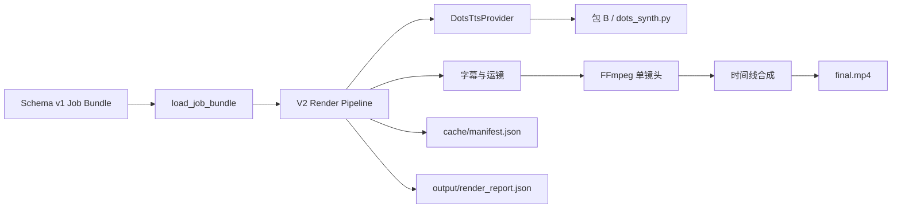

# 短视频 V2 实施计划 03：包 A V2 核心管线

> 文档性质：可直接执行的阶段计划。
>
> 上位依据：`短视频V2规划文档/短视频V2总体目标与阶段规划.md`。
>
> 前置依据：`短视频V2规划文档/02-V2 Job Bundle、Schema与接口契约计划.md`、`短视频V2规划文档/执行记录/02-V2 Job Bundle、Schema与接口契约执行记录.md`、计划 01 的三镜头实机证据。
>
> 本计划只建立包 A V2 的首个正式本地核心管线：读取冻结的 Job Bundle，逐镜头调用包 B 生成语音，用 FFmpeg 完成基础动态化、字幕、镜头与整片合成，并提供缓存、选择性重渲、取消、原子产物和报告。它不建设 Web API/UI，不接高级图片动态化，不加入 BGM/SFX，也不重构包 B 或 V1。

---

## 1. 前置阶段验收结论

### 1.1 计划 02 判定

计划 02 判定为 **PASS**，可以进入本计划。执行记录已经给出最终 PASS；本轮又以当前工作区重新核验了关键证据：

- `test_v2_job_bundle_contract.py`：32/32 通过；
- `test_v2_phase1_sample.py`：10/10 通过；
- `valid_minimal` 经 CLI 校验退出 0，`ok=true`，1 个镜头；
- `phase1_migrated` 经 CLI 校验退出 0，`ok=true`，3 个镜头；
- `project.schema.json` SHA-256 为 `5eda9ab5bf6b577dd0ea64ff2dcffd273a6844c989041a300a28c40f8e25eeb0`；
- `storyboard.schema.json` SHA-256 为 `0ddf9a57546e579d1177000121699ef3bb3ada0ebc78332d12fa5b5190769a49`；
- 包 A 全量测试的 2 FAIL + 1 ERROR 仍为计划 01 已记录的 Windows 专用硬编码断言，没有计划 02 新增回归；
- 包 B、`kt_video.py`、`kt_web.py` 未被计划 02 修改，也未新增第三方依赖。

因此，计划 02 的 Schema v1、不可变模型、路径/哈希安全、只读加载器和 CLI 已具备成为本计划唯一输入边界的条件。

### 1.2 本计划必须继承的契约

本计划必须直接调用：

```python
load_job_bundle(job_dir) -> JobBundle
```

并直接消费已归一化的 `ProjectSpec`、`ShotSpec`。不得：

- 另写一套 JSON 解析或字段默认值；
- 绕过路径、符号链接、素材存在性和 SHA-256 校验；
- 改写 Schema v1、扩大枚举或添加输入字段以迁就内部实现；
- 让缓存、报告、FFmpeg 参数、服务 URL 或 Provider 私参反向进入公共任务契约；
- 继续把计划 01 的 `storyboard.sample.json` 当正式输入。

若实施中确实发现契约缺陷，先记录可复现证据并停止相关分支；不得悄然改变 v1 语义。

### 1.3 图片动态观感的阶段归属

计划 01 的图片动态化观感尚不理想，但本计划只须把八种基础预设和三档强度做成稳定、可测试、可回退的正式实现。2.5D 视差、分层动画、HyperFrames、DepthFlow 和本地 I2V 仍属于计划 04。只要本计划的基础运动可见、构图不过界、成片不是静止电子相册，便不因“尚未达到高级质感”阻塞验收。

---

## 2. 计划目标

### 2.1 核心目标

在包 A 的独立 `video_v2` 包中建立正式核心管线 v1：

1. 通过计划 02 的加载器读取并校验 Job Bundle；
2. 为每个镜头按需调用包 B，生成并缓存独立 WAV；
3. 以真实音频时长加头尾留白确定镜头时长；
4. 生成安全、可读、不会明显溢出的基础 ASS 字幕；
5. 用 FFmpeg 实现 8 种基础运镜 × 3 档强度，输出统一规格单镜头；
6. 按硬切或短叠化组成时间线，输出 `final.mp4`；
7. 支持内容寻址缓存、整片重渲和指定镜头重渲；
8. 支持可取消外部进程、失败清理、原子替换和旧有效产物保护；
9. 持续写入结构化 `render_report.json`，使 Codex/用户能定位问题镜头；
10. 扩展 `python -m video_v2`，提供稳定的本地 `render` 命令；
11. 用一条真实 6 镜头、约 30–45 秒的竖屏样片证明完整链路、缓存和选择性重渲确实可用；
12. 保持包 A V1、现有 Web 和包 B 行为不变。

### 2.2 本阶段“基本可用”的判定

同时满足以下条件，方可判定计划完成：

- 一份 Schema v1 Job Bundle 可从命令行稳定生成 6 镜头 `final.mp4`；
- 每镜头均有包 B 人声、可见基础运动和按契约决定的字幕；
- 成片为 1080x1920、30 FPS、H.264/yuv420p、AAC 48 kHz 双声道；
- 镜头和整片均可被 ffprobe 识别并完整解码；
- 实际镜头时长与“WAV 时长 + 头尾留白”误差不超过 0.15 秒；
- 整片时长与“镜头时长总和 - 叠化重叠”误差不超过 0.20 秒；
- 第二次相同输入渲染复用全部有效 TTS、镜头和整片缓存；
- 修改一个镜头的运镜强度后指定该镜头重渲，只重建该镜头和整片，全部音频继续复用；
- 取消或失败不覆盖已有有效产物，不留下被误认为完成的半成品；
- 报告能说明每镜头输入、时长、缓存命中、运镜、字幕、回退、输出哈希与错误；
- 新增测试通过，包 A 无本计划新增回归；
- 用户可用 QuickTime 从头至尾播放样片，能听到人声、看到字幕和镜头运动；
- 无 BGM、环境音、SFX、黑底字幕主画面或单图贯穿整片。

### 2.3 本阶段不是要完成什么

本计划不要求：

- `/api/v2/*`、任务上传、队列、进度轮询或 Web UI；
- `preview.mp4` 的独立低清预览规格；
- Image 2 自动出图、角色一致性工作流或图片质检；
- DepthFlow、HyperFrames、MFLUX、Draw Things、本地 I2V 或任意高级 Provider；
- BGM、环境音、SFX、响度母带或复杂混音；
- 高级逐字卡拉 OK、花字、复杂文字动画；
- 自动裁剪尾静音成为公共策略；
- 并发写入同一个 Job Bundle、任务锁、队列和长期清理策略；
- 认证、签名、公证、网络发布和完整发行包构建；
- 重构 `kt_video.py`、`kt_web.py` 或包 B；
- 修复不影响本阶段使用的旧 Windows 测试和低影响问题；
- 达到大片级动态效果。此阶段先求链路成形，锦上之花留待后续。

---

## 3. 当前工程事实与约束

### 3.1 工作树保护

当前仓库有前序计划与用户既有修改，执行前必须重新读取 `git status --short` 和相关 diff。至少需保护：

- 包 A `程序文件/config.ini`；
- 包 B `apps/gradio/service.py`、`macOS使用说明.md`、`tests/test_phase3_api_contract.py`；
- 计划 01 实验、测试和正式样片；
- 计划 02 的 `video_v2` 契约代码、Schema、fixtures、说明与测试；
- A/B 发布信息、服务状态、规划文档和执行记录。

只修改本计划列明的文件。不得回退、覆盖、删除或顺手整理无关改动。若测试会改动真实服务状态文件，须先记录现状，并按既有进程事实恢复。

### 3.2 已有可复用能力

- `程序文件/paths.py` 已统一解析 FFmpeg、ffprobe、字体和包 B 信息；
- 包 A 随包 FFmpeg/ffprobe 8.1.2 arm64 已实测支持 H.264/AAC、ASS/libass、`xfade`、`acrossfade`、`amix`、`loudnorm`、`blackdetect`、`silencedetect` 等；本计划只启用所需的最小集合；
- `程序文件/网站/dots_synth.py` 已作为包 A 调用包 B 的实机适配器，具备端点协商、中文文本切块、进度行协议和 WAV 输出；
- 计划 01 的 `render_sample.py` 已证明 FFmpeg 基础运镜、ASS、逐镜头 WAV、镜头渲染和最终合成在当前 Mac 可行；
- `video_v2.contract` 已提供正式 Job Bundle 加载边界；
- 包 A 发布脚本递归复制整个 `程序文件/引擎/`，新模块将自然进入未来发布树，本阶段无需改构建脚本。

### 3.3 不直接复用的实现

- 不导入或修改 V1 `kt_video.py`：其核心用途仍是黑底动态字幕视频，与 V2 镜头模型不同；
- 不导入计划 01 `experiments/short_video_v2_phase1/render_sample.py`：可提炼经验证的算法和命令形态，但正式代码须进入 `video_v2`；
- 不让核心管线通过包 A 自身 `/api/tts` 回调 Web 服务：这会形成自依赖、重复全局输出和服务启动前提；
- 不在本阶段重构 `kt_web.run_tts`，以免扩大 V1 风险；
- 不用 HyperFrames 代替正式编排器。其设计型镜头价值留给计划 04 实测，最终编码仍由包 A/FFmpeg 管控。

### 3.4 依赖原则

- 新增核心模块保持 Python 标准库；
- TTS 所需 `gradio_client` 仍由包 B Python 与既有 `dots_synth.py` 承担；
- 不新增 pip/npm 依赖；
- 所有外部命令均以参数数组执行，不使用 shell、字符串拼接命令或任务包注入参数；
- 当前只支持单进程写一个 Job Bundle；并发写同目录明确标为不支持，不为此过度设计锁服务。

---

## 4. 核心架构

### 4.1 数据流



### 4.2 公共入口与内部边界

建议核心入口：

```python
render_job(
    job_dir,
    *,
    selected_shot_ids=None,
    force=False,
    cancel_event=None,
    on_event=None,
) -> RenderResult
```

- `render_job` 始终先调用 `load_job_bundle`；
- `selected_shot_ids=None` 表示正常评估全部依赖，缓存有效者复用；
- 指定镜头只允许重建指定镜头，但仍需检查未选镜头的有效缓存，之后按需重组整片；
- `force=True` 关闭本次请求范围内的缓存复用，包括相关 TTS；
- `cancel_event` 为可选线程事件兼容对象；
- `on_event` 接收结构化进度事件，供 CLI 与未来 Web 共同复用；
- 核心不依赖 argparse、HTTP Handler 或全局 Web 状态。

### 4.3 推荐模块布局

```text
【包A】视频引擎包/程序文件/引擎/video_v2/
├── __init__.py                 # 导出稳定入口
├── __main__.py                 # validate + render CLI
├── models.py                   # 计划 02 冻结模型；只做兼容性最小扩展
├── contract.py                 # 计划 02 契约；不重写
├── errors.py                   # 运行期错误对象与专用异常
├── runtime.py                  # RuntimeContext、工具解析、可取消安全子进程
├── tts.py                      # DotsTtsProvider、TTS 缓存与输出校验
├── captions.py                 # 文本分卡、ASS 生成和转义
├── motion.py                   # 8×3 运镜参数映射
├── media.py                    # ffprobe、媒体校验、镜头/整片 FFmpeg 执行
├── timeline.py                 # cut/crossfade 时间线与时长计算
├── state.py                    # 原子 JSON、缓存 manifest、render report
├── pipeline.py                 # 编排、选择性重渲、回退、取消
└── schemas/                    # 计划 02 原样保留
```

若实际实现发现两个小模块合并更清楚，可以合并；但契约、外部进程、TTS、媒体、状态与编排职责不得重新堆入一个巨型文件，也不得塞回 V1。

---

## 5. 运行时与外部进程

### 5.1 `RuntimeContext`

运行时上下文由包 A 自身环境推导，至少包含：

- FFmpeg 与 ffprobe 绝对路径；
- 可用中文字体路径；
- 包 B Python、`dots_synth.py`、音色目录、服务 URL 与安装状态；
- Job Bundle 固定输出目录；
- 本次 `run_id`、取消事件和事件回调；
- 管线、TTS、运镜、字幕与合成器内部版本号。

工具和 URL 来自 `程序文件/paths.py` 与本机配置，不来自 Job Bundle。导入模块时不得探测网络、创建目录或启动进程；实际渲染预检时才解析与验证。

### 5.2 安全子进程执行器

建立一个统一、可注入测试替身的执行器：

- 只接受 `list[str]` 参数；
- `shell=False`；
- 明确 cwd、环境和 stdout/stderr 编码；
- 持续读取输出，避免管道阻塞；
- 周期检查取消事件；
- 取消时先 `terminate`，短暂等待后再 `kill`；
- 返回退出码、耗时、受限长度日志和取消状态；
- 日志与报告中不得泄漏无关环境变量；
- 测试覆盖含中文、空格和类 shell 字符的文本/路径，证明不会变成命令解释。

### 5.3 预检策略

渲染开始时：

1. 加载 Job Bundle；
2. 创建本次所需固定输出目录；
3. 校验 FFmpeg、ffprobe 和字体；
4. 探测版本并写入报告；
5. 读取缓存 manifest 并验证结构；
6. 计算每镜头依赖与缓存状态；
7. 仅当至少一段音频缓存缺失时，才要求包 B 安装且服务可用。

这意味着：若所有 WAV 与后续缓存都有效，包 B 暂时未启动也可完成纯缓存重组；若需要新 TTS，则在进入昂贵渲染前尽早失败。

---

## 6. 包 B TTS Provider

### 6.1 调用方式

正式 `DotsTtsProvider` 直接用包 B Python 启动既有：

```text
程序文件/网站/dots_synth.py
```

传入 `--text`、`--voice`、`--out`；参数使用列表，不通过 shell。继续沿用当前已证明的内部默认：步数 4、guidance 1.2、speed 1、max_pause 0.3、seed 42，以及适配器当前 normalize 行为。此组值属于 Provider 内部版本，不写入 Schema；一旦改变，须改变 TTS Provider 版本，从而自然失效相关缓存。

### 6.2 音色与可用性

- `ShotSpec.voice` 已由契约归一化为文件名；
- Provider 在真实调用前检查该音色是否存在；
- 包 B 未安装、服务未就绪、音色未知、端点不兼容和生成失败必须使用不同运行错误码；
- 不自动替换为另一音色，也不静默生成空音频；
- 只有明确的暂时性连接/服务错误可以重试一次；音色未知、契约不兼容等确定性错误不得重试；
- 重试次数、耗时和最终错误写入报告。

### 6.3 WAV 校验与缓存

每次 TTS 先写同目录临时文件，完成后至少验证：

- 文件存在、非空；
- ffprobe 可解析为音频；
- 时长为有限正数；
- 可完整解码；
- 计算 SHA-256；
- 验证通过后原子替换为 `audio/<shot-id>.wav`。

TTS 缓存键至少包括：

- `speech_text`；
- `voice`；
- Provider 名称和版本；
- 固定生成选项版本。

`speech_kind`、`speaker_id` 可写报告，但当前若不改变实际声音生成，不进入音频缓存键。若未来 Provider 真正消费它们，再随 Provider 版本纳入。

---

## 7. 音频时长与留白

### 7.1 权威时长

- 原始 WAV 时长以 ffprobe 结果为准；
- 目标镜头时长为 `raw_audio_duration + head_pad_sec + tail_pad_sec`；
- 不按 `target_duration_sec` 拉伸或压缩 TTS；
- 输出镜头音轨在开头加入 head pad、末尾补齐 tail pad，并统一到 AAC 48 kHz 双声道；
- 报告同时记录原始 WAV、头尾留白、目标镜头和实际输出时长。

### 7.2 尾静音策略

计划 01 已观察到包 B 自然尾音与配置留白叠加后可能出现较长尾静音。本阶段默认：

- 测量并报告 WAV 末端静音；
- 超过内部观察阈值时发出 warning；
- 不默认自动裁剪，以免误切尾字或改变语义；
- 不把裁剪阈值写进 Job Bundle；
- 若真实 6 镜头样片出现明显节奏问题，只允许一次有证据的有限比较；确需启用裁剪时，必须写成内部、版本化、可测试且保守的策略，并在执行记录说明前后差异。

不因轻微尾静音无限调参；若不明显损害成片，记录后留待后续。

---

## 8. 基础字幕

### 8.1 字幕语义

- `project.captions_enabled=false` 时，全片不生成可见字幕；
- `caption_mode=speech` 使用本镜头语音文本；
- `caption_mode=custom` 使用 `caption_text`；
- `caption_mode=none` 不显示该镜头字幕；
- 只支持 `default_lower_third`，不得接受任务包提供任意 ASS 样式或脚本。

### 8.2 文本分卡与换行

第一版使用句群级字幕卡，不做逐字卡拉 OK：

- 优先按 `。！？；，` 等中文标点分段；
- 每卡建议不超过约 28–32 个中文字符；
- 每卡最多 2 行，每行约 16 个中文字符；
- 卡片时长按文本长度在本镜头有效语音区内比例分配；
- 设置合理最短显示时长，必要时合并过短卡片；
- 对 ASS 的 `\`、`{`、`}`、换行等进行安全转义；
- 字幕放在下三分之一区域，留足安全边距，不长期覆盖中央主体；
- 字号、描边、阴影和背景保持清晰朴素，以可读为首要目标。

字幕算法必须是纯函数优先，可独立测试分卡、换行、时间分配与转义。真实样片需抽查首、中、尾字幕，不把高级美术包装纳入本计划。

---

## 9. FFmpeg 基础运镜

### 9.1 正式预设

实现计划 02 已冻结的 8 个预设：

- `static`；
- `slow_push_in`；
- `slow_pull_out`；
- `pan_left`；
- `pan_right`；
- `tilt_up`；
- `tilt_down`；
- `gentle_drift`。

每个预设支持 `low`、`medium`、`high` 三档。参数映射由包 A 固定维护；Job Bundle 不携带 filtergraph。

### 9.2 构图与实现原则

- 输入图先按 1080x1920 画布做足量缩放，运镜全过程不得暴露黑边；
- `focus_x/focus_y` 决定主体锚点，所有裁切位置限制在合法范围；
- 推拉使用缓慢、单调的缩放曲线；
- 平移/倾斜预留足够缩放余量，强度只改变幅度，不改变预设语义；
- `gentle_drift` 使用小幅二维漂移，不做随机抖动；
- 同一输入、时长和版本必须生成确定性命令；
- `motion_intent`、`purpose`、`hero` 进入报告，当前不直接变成任意滤镜；
- 所有参数映射必须在小尺寸/短时长集成测试中覆盖，并在真实竖屏样片中抽查边界。

### 9.3 回退

若非 `static` 运镜因可预期的滤镜/素材条件失败：

1. 记录原预设错误；
2. 只回退一次到 `static`；
3. 回退成功则镜头可继续，但报告标记 warning 和 `fallback_used=true`；
4. `static` 也失败则镜头失败，禁止输出伪成功成片。

未知预设不应到运行阶段才发现；契约校验已负责拒绝。

---

## 10. 单镜头渲染

### 10.1 ASCII 暂存

FFmpeg/libass 对中文、空格和特殊字符的处理不可依赖偶然转义。每个镜头在包 A 自有临时目录中，以 ASCII 名称暂存：

- `image.png` 或对应安全后缀；
- `voice.wav`；
- `caption.ass`；
- `font.ttf/ttc`；
- `shot.part-<run-id>.mp4`。

暂存可复制或安全链接，但不得引用 Bundle 外部任意路径；临时目录只归本次 run 所有。

### 10.2 输出规格

每个 `shots/<shot-id>.mp4`：

- 1080x1920；
- 30 FPS、恒定帧率；
- H.264；
- yuv420p；
- AAC 48 kHz 双声道；
- 时长由真实 WAV 与留白决定；
- 字幕烧录在画面中；
- 不含 BGM/SFX。

音频只做开头延迟、尾部补齐、采样率/声道标准化和 AAC 编码；本阶段不做复杂响度链。

### 10.3 产物验证

镜头写入最终路径前须：

- ffprobe 检查音视频流、编码、尺寸、帧率、像素格式、采样率和声道；
- 完整解码到 null；
- 检查时长误差；
- 计算文件哈希；
- 通过后 `os.replace` 原子提交；
- 失败时保留旧有效镜头，删除本次临时文件。

---

## 11. 时间线与最终合成

### 11.1 转场语义

- `cut`：无重叠，前后镜头直接连接；
- `crossfade`：视频使用 `xfade`，人声使用 `acrossfade`，重叠时长来自前一镜头 `transition_duration_sec`；
- 转场时长不得超过相邻镜头实际时长可承受范围；契约范围合法但运行素材过短时，以结构化错误失败，不暗改为任意值；
- 最后一个镜头没有后继者，其非 `cut` 的 `transition_out` 归一化为 `cut`，并记录 `timeline.last_transition_ignored` warning；不为此回改 Schema v1。

### 11.2 权威时间线

时间线完全以已验证镜头的实际时长构建：

```text
expected_final_duration
= sum(actual_shot_duration)
- sum(effective_crossfade_overlap)
```

实现必须生成可检查的 timeline 结构：镜头开始、结束、转场类型、重叠和累计偏移。纯时间数学先用单元测试锁定，再生成 FFmpeg filtergraph。

### 11.3 最终产物

最终输出固定为：

```text
output/final.mp4
```

同样先写 `.part-<run-id>`，通过 ffprobe、完整解码、规格和时长检查后原子替换。现阶段不额外生成 `preview.mp4`；不得用无验证的 concat 成功退出码代替产物检查。

---

## 12. 缓存与选择性重渲

### 12.1 缓存存储

内部缓存索引固定为：

```text
cache/manifest.json
```

它不是公共输入 Schema。至少记录 `manifest_version`、各层 key、产物相对路径、产物哈希、媒体摘要、创建时间和实现版本。manifest 以原子 JSON 写入；结构损坏时标记 `cache.invalid`，可安全重建，但不得把损坏缓存当命中。

### 12.2 分层缓存键

音频键至少包括：

- 文本、音色、Provider 名称/版本和固定选项版本。

镜头键至少包括：

- 关键帧实际 SHA-256；
- WAV 实际 SHA-256 与权威时长；
- `focus_x/focus_y`；
- motion preset/strength；
- 字幕可见文本、style preset 与字幕实现版本；
- head/tail pad；
- 画布、帧率、编码规格与镜头渲染器版本。

整片键至少包括：

- 有序镜头产物哈希；
- 有效转场序列与时长；
- 合成器版本与输出规格。

不改变像素/声音的元数据，如 `purpose`、`motion_intent`、`hero`、`target_duration_sec`，只写报告，不进入渲染缓存键。缓存命中时仍须比对产物路径、文件哈希和最小媒体规格。

### 12.3 普通重渲

不带 `--shot` 的 `render`：

1. 评估所有 TTS 键；
2. 复用有效 WAV，生成缺失/失效 WAV；
3. 评估所有镜头键；
4. 复用有效镜头，重建缺失/失效镜头；
5. 评估最终键并按需重组；
6. 报告每层 `hit/miss/rebuilt`。

### 12.4 指定镜头重渲

重复 `--shot shot-003` 可选择一个或多个镜头：

- 只允许对被选镜头生成新 TTS/镜头；
- 未选镜头必须已有哈希有效的缓存产物；
- 缺少未选依赖时以 `pipeline.dependency_missing` 失败，并提示先执行完整 render；
- 任一所选镜头改变后，最终成片按新镜头和旧有效镜头重新合成；
- `--force` 仅禁用本次所选范围的缓存，完整 render 时则禁用全范围缓存。

本阶段不增加 `--dry-run`、缓存清理或隐式“猜测最近镜头”等功能。

---

## 13. 取消、失败恢复与原子性

### 13.1 取消模型

- 核心通过 `cancel_event` 感知取消；
- CLI 捕获第一次 Ctrl+C 后设置事件，终止当前子进程并等待有序退出；
- 第二次中断可立即结束，但仍尽力清理本 run 临时文件；
- 取消结果状态为 `cancelled`，CLI 退出 130；
- 事件回调发出 `pipeline.cancel_requested` 与最终状态；
- 不实现跨进程后台任务取消 API。

### 13.2 原子写与清理边界

- 所有 WAV、ASS、镜头、final、manifest、report 先写同目录的 `.part-<run-id>` 或临时目录；
- 只有验证通过才 `os.replace`；
- 失败或取消只删除本次 `run_id` 明确拥有的临时文件；
- 不使用广泛 glob 删除，不清理其他 run、旧缓存、用户素材或前序有效输出；
- 若目标已有有效旧文件，失败时保持不变；
- 若首次运行失败，可留下明确的失败报告，但不能留下看似完整的 `final.mp4`。

### 13.3 当前并发限制

core v1 明确不支持两个进程同时写同一个 Bundle。CLI 开始时可以做最小同进程/文件标识提示，但不建设复杂锁服务；未来 Web 调度阶段再提供单任务串行与状态管理。若检测到明确活跃写入，返回可预期错误，不抢占或删除他人文件。

---

## 14. 报告与运行错误

### 14.1 `render_report.json`

固定路径：

```text
output/render_report.json
```

这是内部运行报告 v1，不是计划 02 的公共输入 Schema。建议至少包含：

- `report_version`、pipeline/renderer/provider 版本；
- `run_id`、`status`、开始/结束时间、总耗时；
- project_id、输入 Schema 版本与规范化输入哈希；
- FFmpeg/ffprobe、包 B API/Provider 与平台摘要；
- 请求范围：完整/指定镜头、force；
- 每镜头 TTS 文本哈希、音色、重试、WAV 路径/哈希/时长、尾静音观察；
- 每镜头字幕模式、卡片数、可见文本哈希；
- 每镜头运镜预设/强度/焦点、实际使用预设、回退；
- 每镜头目标/实际时长、缓存状态、镜头路径/哈希/媒体规格；
- 时间线开始/结束、转场与重叠；
- final 缓存状态、路径、哈希、规格和实际时长；
- warnings、errors 与最后完成阶段。

报告中的产物路径使用 Bundle 相对路径；工具安装路径只在确有诊断价值时记录，不复制无关系统信息。报告在预检、每镜头完成、最终完成及失败/取消时原子更新，使中断后的续接有据可循。

### 14.2 运行错误对象

运行错误与 `ContractIssue` 分离，最小字段：

```json
{
  "code": "render.shot_failed",
  "stage": "shot_render",
  "shot_id": "shot-003",
  "retryable": false,
  "message": "镜头渲染失败"
}
```

建议稳定码：

| 范围 | 错误码 |
| --- | --- |
| 运行时 | `runtime.tools_unavailable`、`runtime.font_unavailable`、`runtime.busy` |
| TTS | `tts.not_installed`、`tts.not_ready`、`tts.voice_unknown`、`tts.contract_incompatible`、`tts.failed`、`tts.timeout` |
| 媒体 | `media.probe_failed`、`media.spec_invalid`、`media.decode_failed` |
| 镜头 | `render.shot_failed`、`render.fallback_failed` |
| 时间线 | `timeline.invalid`、`compose.failed` |
| 缓存 | `cache.invalid`、`cache.artifact_missing`、`cache.artifact_mismatch` |
| 管线 | `pipeline.dependency_missing`、`pipeline.cancelled`、`pipeline.internal_error` |

预期错误不输出 Python traceback；内部异常可在 stderr 给出受控诊断，并在 JSON 中使用 `pipeline.internal_error`，不把任意异常文本当稳定 API。

---

## 15. CLI 契约

### 15.1 命令

扩展现有入口：

```bash
cd "/Users/yuh/Desktop/项目/文本视音屏生成器/【包A】视频引擎包/程序文件/引擎"
"../runtime/bin/python3" -B -m video_v2 render \
  --job-dir "/absolute/path/to/job" \
  --json
```

可选参数：

```text
--shot shot-003        # 可重复
--force                # 禁用本次范围的缓存
--json                 # stdout 只输出最终一个 JSON envelope
```

### 15.2 输出与退出码

- `0`：成功，包含 final 相对路径、哈希、时长、镜头数与缓存摘要；
- `2`：计划 02 契约错误，沿用其 errors；
- `3`：可预期运行失败；
- `130`：用户取消；
- `1`：未预期内部错误；
- JSON 模式 stdout 只输出最终一个对象；进度写 stderr；
- 非 JSON 模式可输出简洁人类进度；
- `validate` 原有行为、输出结构和 0/2/1 退出码保持不变。

CLI 只做参数解析、信号转换、事件展示和结果序列化，不复制管线逻辑。

---

## 16. 计划内文件

### 16.1 预计新增

```text
【包A】视频引擎包/
├── docs/short_video_v2/
│   └── core_pipeline_v1.md
├── 程序文件/引擎/video_v2/
│   ├── errors.py
│   ├── runtime.py
│   ├── tts.py
│   ├── captions.py
│   ├── motion.py
│   ├── media.py
│   ├── timeline.py
│   ├── state.py
│   └── pipeline.py
└── tests/
    ├── test_v2_core_runtime.py
    ├── test_v2_core_pipeline.py
    └── run_v2_core_e2e.py

短视频V2规划文档/执行记录/
└── 03-包A V2核心管线执行记录.md
```

### 16.2 允许按需修改

- `程序文件/引擎/video_v2/__init__.py`：导出稳定核心入口/结果类型；
- `程序文件/引擎/video_v2/__main__.py`：增加 `render`，保持 `validate` 兼容；
- `程序文件/引擎/video_v2/models.py`：只允许新增运行结果类型；不得改变计划 02 冻结输入模型语义；
- `【包A】视频引擎包/tests/README.md`：补充最小测试和 CLI 命令；
- 本计划文档：若实机证据迫使小幅调整，须同步执行记录。

### 16.3 不应修改

- 两份 Schema 与 `contract.py`，除非发现阻塞性契约缺陷并先形成证据；
- `程序文件/引擎/kt_video.py`；
- `程序文件/网站/kt_web.py`、`index.html` 与既有 V1 API；
- `程序文件/网站/dots_synth.py`，除非真实端到端暴露其既有契约的阻塞性缺陷，且修复可独立测试、影响极小；一般应在新 Provider 侧适配；
- 包 B 任意文件；
- 计划 01、02 的 fixtures、实验代码与既有样片产物；
- 用户现有改动与无关状态文件。

### 16.4 真实样片工作区

端到端样片使用可再生、应被忽略的工作目录：

```text
【包A】视频引擎包/成片/短视频V2样片/phase3-core-six-shot/
```

可复用计划 01 的三张高分辨率关键帧，各使用两次形成 6 镜头，但每镜头应有独立叙事文本、焦点或运镜。无需在本阶段再次调用 Image 2；图片重复与高级动态观感不作为计划 03 失败条件。

---

## 17. 分批实施步骤

### 批次 1：现场保护、架构收口与红灯测试

#### 目标

确认计划 02 已通过，冻结本计划边界，并先用测试表达核心运行契约。

#### 操作

1. 完整读取总体规划、计划 02 及执行记录、正式契约代码、计划 01 实机报告和本计划；
2. 记录 Git HEAD、分支、工作树、运行时版本、服务状态及负责/保护文件；
3. 创建或续写计划 03 执行记录；
4. 记录架构决定：直接 `dots_synth.py`、FFmpeg 唯一正式后端、CLI 先行、不接 Web、不改 V1；
5. 建立 `test_v2_core_runtime.py` 与 `test_v2_core_pipeline.py` 的首批预期测试；
6. 首次运行，保存实现尚缺失导致的合理红灯；
7. 不调用真实 TTS，不开始视频渲染。

#### 退出条件

- 计划 02 PASS 证据与冻结契约已记录；
- 模块边界、错误层级、缓存层级、取消与原子性决定明确；
- 测试因正式实现缺失而按预期失败；
- 未修改 V1、包 B、Schema 和既有样片。

### 批次 2：运行时、进程与媒体基础

#### 目标

建立后续 TTS/FFmpeg 共用的安全运行底座。

#### 操作

1. 实现运行错误、`RuntimeContext` 和版本常量；
2. 通过 `程序文件/paths.py` 解析工具、字体和包 B 信息；
3. 实现可注入、可取消、无 shell 的外部进程执行器；
4. 实现 ffprobe 媒体摘要、完整解码、规格检查与 SHA-256；
5. 实现同目录临时文件、原子替换和本 run 定向清理；
6. 使用合成小媒体验证 FFmpeg/ffprobe，不调用包 B；
7. 补足中文/空格/特殊字符参数、取消与旧产物保护测试。

#### 退出条件

- 工具与字体可在当前 Mac 解析；
- 子进程参数不可被 shell 解释；
- 取消会终止子进程；
- 媒体校验能区分缺失、规格错误与解码错误；
- 原子提交失败时旧文件不变；
- 新增基础测试通过。

### 批次 3：TTS Provider、音频缓存与时长

#### 目标

将包 B 正式接入镜头级音频生产，同时让缓存和测试不依赖真实模型。

#### 操作

1. 实现 `DotsTtsProvider` 和可替换 Provider/runner 接口；
2. 实现音色检查、错误分类、一次有限重试、行协议解析；
3. 实现 WAV 临时输出、探测、完整解码、时长与哈希；
4. 实现音频缓存键、manifest 记录和哈希复核；
5. 单元测试使用 fake Provider/runner，不启动模型；
6. 在包 B 已健康时做一次短文本真实 TTS smoke；若服务本轮不健康，先用现有诊断安全恢复，仍不可修改包 B 模型逻辑；
7. 测量尾端静音并写报告观察，不默认裁剪。

#### 退出条件

- fake 正向、重试、失败、取消、音色未知和缓存失效测试通过；
- 一段真实 WAV 可由指定音色生成并完整解码；
- 第二次相同请求命中音频缓存，不再调用包 B；
- 权威 WAV 时长、尾静音观察和 Provider 版本有记录；
- 包 B 源码未被本计划修改。

### 批次 4：字幕、八类运镜与标准单镜头

#### 目标

把“图片 + 人声 + 字幕”稳定渲染为统一单镜头。

#### 操作

1. 实现字幕分卡、换行、时间分配、ASS 转义与样式；
2. 实现 8 个 motion preset × 3 strength 的确定性参数映射；
3. 实现焦点约束、无黑边缩放和 `static` 回退；
4. 实现 ASCII 暂存与单镜头 FFmpeg 命令；
5. 实现头尾留白、AAC 48 kHz 双声道与镜头原子提交；
6. 用小图片/合成 WAV 对全部 24 种映射做短时集成测试；
7. 选一段真实包 B WAV 做 1080x1920 正式镜头 smoke，检查字幕与运动。

#### 退出条件

- 字幕长文本、标点、转义、关闭/自定义模式测试通过；
- 8×3 预设均能生成合法、无黑边、可完整解码镜头；
- 非静态失败只回退一次且报告清楚；
- 正式镜头规格和时长误差满足门槛；
- 未引入高级动态化或任意 filtergraph 输入。

### 批次 5：时间线、最终合成、缓存与报告

#### 目标

形成多镜头 final，并让重跑、审计和故障定位具备稳定依据。

#### 操作

1. 实现纯时间线计算，覆盖 cut、crossfade、连续叠化和最后镜头规则；
2. 实现 `xfade` + `acrossfade` 最终合成；
3. 实现镜头键、最终键和分层缓存命中/失效；
4. 实现原子 `cache/manifest.json` 与 `output/render_report.json`；
5. 用 fake TTS 和小媒体完成 3 镜头端到端；
6. 连跑两次证明全命中，再分别改变文本、图片哈希、运镜、字幕、转场，验证失效矩阵；
7. 检查报告路径、哈希、时长、回退和错误结构。

#### 退出条件

- cut/crossfade 时间数学与实际成片误差满足门槛；
- 第二次相同任务不调用 TTS、不重渲镜头、不重组 final；
- 各输入变化只失效正确层级；
- 损坏缓存不会被误命中；
- 报告可在失败/成功路径原子读取。

### 批次 6：CLI、选择性重渲、取消与恢复

#### 目标

把核心管线变成稳定可操作入口，并证明中断不会污染产物。

#### 操作

1. 扩展 `python -m video_v2 render`；
2. 实现 `--shot`、`--force`、`--json`；
3. 保持 validate CLI 完全兼容；
4. 实现 0/2/3/130/1 退出码和 stdout/stderr 分流；
5. 测试缺失未选依赖、未知 shot、重复 shot、force 范围；
6. 用可控慢进程测试 Ctrl+C/取消，验证 terminate/kill 和 `.part` 清理；
7. 验证失败/取消前后旧 WAV、镜头和 final 哈希不变；
8. 补 `core_pipeline_v1.md` 与 tests README。

#### 退出条件

- CLI JSON stdout 只有一个最终对象；
- 预期错误无 traceback；
- 指定镜头语义、退出码和缓存范围准确；
- 取消退出 130，报告状态 cancelled，旧有效产物保留；
- 公共文档足以独立运行与诊断。

### 批次 7：真实六镜头样片、复用证明与总验收

#### 目标

用真实包 A+B/FFmpeg 端到端证据判断核心管线能否交给后续计划。

#### 操作

1. 建立忽略的 `phase3-core-six-shot` Schema v1 Job Bundle；
2. 复用计划 01 三张关键帧各两次，组织 6 段连贯文本，时长约 30–45 秒；
3. 至少使用 narration，可按既有音色稳定性决定是否加入少量 dialogue；
4. 使用多种基础运镜并至少安排一个 crossfade；
5. 第一次完整 render：生成 6 WAV、6 镜头和 final；
6. ffprobe、完整解码、时长数学、报告、字幕和媒体规格全检；
7. 第二次完全相同 render：证明音频/镜头/final 全部命中；
8. 修改一个镜头的 `motion_strength`，用 `--shot` 重渲：证明只重建该镜头与 final，全部音频复用；
9. 用 QuickTime 从头到尾实际播放，检查人声、字幕、镜头切换和可见运动；
10. 运行计划 02、计划 01、本计划定向测试与包 A 全量测试，区分旧失败和新回归；
11. 检查包 B、V1、Schema 和用户既有改动未被侵入；
12. 更新执行记录，给出 PASS、CONDITIONAL 或 FAIL，并形成计划 04 输入。

#### 退出条件

- 本计划全部硬门通过；
- 真实六镜头成片可完整观看，基础质量达到“完整、稳定、可看、可改”；
- 两次缓存与一次指定镜头重渲证据成立；
- 新增回归为 0；
- 图片重复或高级动态感一般只作为计划 04 输入，不误判为本阶段失败；
- 已明确是否允许进入计划 04。

---

## 18. 测试矩阵

### 18.1 运行时与安全

- 工具/字体存在与缺失；
- 中文、空格、引号、分号、`$()` 等文本和路径只作为 argv；
- 外部进程成功、失败、超时、取消、terminate 后不退出再 kill；
- stdout/stderr 大输出不死锁；
- 原子替换成功/失败；
- 只清理本 run 临时文件；
- 旧有效产物不被失败覆盖。

### 18.2 TTS

- 项目默认 voice 与镜头 override；
- narration/dialogue 文本传递；
- 音色未知、包 B 未安装/未就绪、契约不兼容；
- 暂时错误重试一次，确定性错误不重试；
- 空/坏 WAV、probe 失败、完整解码失败；
- 时长和哈希；
- 相同请求缓存命中；
- 文本、音色、Provider 版本改变失效；
- 取消不提交半成品。

### 18.3 字幕

- 项目总开关；
- speech/custom/none；
- 中文长句、标点分段、无标点长文；
- 两行上限和 ASS 特殊字符；
- 卡片时长单调、无负值、覆盖有效语音区；
- 极短音频的合并策略；
- 字幕关闭不烧录空事件。

### 18.4 运镜与镜头

- 8 个 preset × 3 strength；
- 焦点四角、中心和边界值；
- 横图、竖图、不同尺寸；
- 全程无黑边；
- 非静态失败到 static 回退；
- static 失败为镜头失败；
- H.264/yuv420p/1080x1920/30 FPS；
- AAC 48 kHz 双声道；
- 时长误差 ≤0.15 秒；
- 完整解码与产物哈希。

### 18.5 时间线与最终合成

- 全 cut；
- 单个和多个 crossfade；
- cut/crossfade 混合；
- 最后镜头非 cut 被忽略并 warning；
- 过长转场失败；
- 时间线累计偏移；
- 最终时长误差 ≤0.20 秒；
- 最终规格、完整解码和原子提交。

### 18.6 缓存与选择性重渲

- 首次全 miss；
- 第二次全 hit；
- 文本变化：对应音频、镜头、final 失效；
- 图片哈希变化：对应镜头、final 失效，音频命中；
- motion/caption/pad 变化：对应镜头、final 失效；
- transition 变化：仅 final 失效；
- purpose/intent/hero/target duration 变化：渲染缓存不失效；
- 缓存文件缺失、哈希不符、manifest 损坏；
- `--shot` 只重建所选镜头；
- 未选镜头无有效依赖时稳定失败；
- `--force` 范围正确。

### 18.7 CLI 与回归

- validate 0/2/1 不变；
- render 0/2/3/130/1；
- JSON stdout 单对象，进度在 stderr；
- 预期错误无 traceback；
- 导入无网络、目录和进程副作用；
- 计划 01/02 测试继续通过；
- 包 A 全量无新增失败；
- 包 B、V1、Schema 和用户改动保持不变。

---

## 19. 推荐验证命令

先定义任务专用变量：

```bash
V2_PROJECT_ROOT="/Users/yuh/Desktop/项目/文本视音屏生成器"
V2_A_ROOT="$V2_PROJECT_ROOT/【包A】视频引擎包"
V2_A_PY="$V2_A_ROOT/程序文件/runtime/bin/python3"
V2_ENGINE="$V2_A_ROOT/程序文件/引擎"
V2_SAMPLE="$V2_A_ROOT/成片/短视频V2样片/phase3-core-six-shot"
```

### 19.1 编译与定向测试

```bash
"$V2_A_PY" -B -m compileall -q "$V2_ENGINE/video_v2"
"$V2_A_PY" -B -m unittest discover \
  -s "$V2_A_ROOT/tests" \
  -p 'test_v2_core_runtime.py' -v
"$V2_A_PY" -B -m unittest discover \
  -s "$V2_A_ROOT/tests" \
  -p 'test_v2_core_pipeline.py' -v
```

### 19.2 契约与历史样片回归

```bash
"$V2_A_PY" -B -m unittest discover \
  -s "$V2_A_ROOT/tests" \
  -p 'test_v2_job_bundle_contract.py' -v
"$V2_A_PY" -B -m unittest discover \
  -s "$V2_A_ROOT/tests" \
  -p 'test_v2_phase1_sample.py' -v
```

### 19.3 真实完整渲染

```bash
cd "$V2_ENGINE"
"$V2_A_PY" -B -m video_v2 validate \
  --job-dir "$V2_SAMPLE" --json
"$V2_A_PY" -B -m video_v2 render \
  --job-dir "$V2_SAMPLE" --json
```

相同命令再运行一次，报告应显示 TTS、6 镜头和 final 全命中。

### 19.4 指定镜头重渲

在修改一个镜头 `motion_strength` 并重新计算合法任务输入后：

```bash
cd "$V2_ENGINE"
"$V2_A_PY" -B -m video_v2 render \
  --job-dir "$V2_SAMPLE" \
  --shot shot-003 \
  --json
```

报告应证明全部音频命中，只有 `shot-003` 与 final 重建。

### 19.5 媒体验证与全量回归

```bash
"$V2_A_ROOT/程序文件/工具/ffprobe" -v error \
  -show_streams -show_format \
  "$V2_SAMPLE/output/final.mp4"
"$V2_A_ROOT/程序文件/工具/ffmpeg" -v error \
  -i "$V2_SAMPLE/output/final.mp4" \
  -f null -
"$V2_A_PY" -B -m unittest discover \
  -s "$V2_A_ROOT/tests" \
  -p 'test_*.py' -v
```

工具实际路径须以 `程序文件/paths.py` 当前解析结果为准；若上列文件布局与当前发布模式不同，使用解析出的绝对路径，不为迁就文档而硬编码新路径。

---

## 20. 验收标准

### 20.1 输入与架构硬门

- 只通过 `load_job_bundle` 读取输入；
- Schema v1 与计划 02 语义未被改写；
- 核心不依赖 Web，自身不回调包 A HTTP；
- 包 B 只通过既有适配器调用；
- V1 与高级动态化边界未被侵入。

### 20.2 媒体硬门

- 6 个镜头和 final 均可 probe、完整解码；
- 输出规格、时长误差满足第 2.2 节；
- 人声、字幕、基础运动和转场实际可见/可听；
- 无黑底主画面、无贯穿单图、无 BGM/SFX；
- QuickTime 全片播放通过。

### 20.3 可恢复性硬门

- 第二次运行全缓存命中；
- 单镜头变化只重建正确范围；
- 缓存用实际哈希复核；
- 失败/取消不覆盖旧有效产物；
- 取消能终止子进程并退出 130；
- 报告在成功、失败、取消后均可读。

### 20.4 接口与回归硬门

- CLI 退出码和 JSON envelope 通过测试；
- 运行错误结构稳定；
- 新增定向测试全部通过；
- 计划 01、02 测试继续通过；
- 包 A 全量无本计划新增失败；
- 包 B、V1、Schema 与用户既有修改未被覆盖。

### 20.5 结论等级

- **PASS**：全部硬门通过，可进入计划 04；
- **CONDITIONAL**：核心成片、缓存、重渲、取消与报告均成立，仅余不影响计划 04 的低影响媒体细节或旧基线问题；记录后可进入计划 04；
- **FAIL**：无法稳定生成完整成片、绕过契约、TTS/FFmpeg 主链不可用、缓存错误导致旧产物被污染、指定重渲范围不可信、取消破坏产物或出现 V1 新回归；不得进入计划 04。

---

## 21. 风险与应对

| 风险 | 预防 | 失败后处理 |
| --- | --- | --- |
| 核心通过包 A Web 回调自身 | Provider 直接调用既有 `dots_synth.py` | 删除自依赖，核心只保留文件/进程边界 |
| 复制 V1 或实验代码形成双重事实 | 只提炼算法，正式模块独立 | 以契约与定向测试为准，删除重复分支 |
| 中文路径/ASS 转义造成偶发失败 | ASCII 暂存、argv 数组、转义单测 | 固定最小复现后修暂存/转义层 |
| 包 B 暂时不可用拖累缓存重跑 | 仅音频 miss 时做 B 预检 | 缓存路径继续可用，新 TTS 给出结构化错误 |
| 尾静音导致节奏松散 | 测量、报告、一次有限比较 | 无明显影响则记录；明显影响才加保守内部策略 |
| 运镜裁切露黑边或主体越界 | 足量缩放、焦点 clamp、24 组集成测试 | 回退 static；基础算法失败则阻塞镜头 |
| crossfade 时间线漂移 | 先锁纯数学，再生成 filtergraph | 以 ffprobe 实际时长校正并补回归测试 |
| 缓存误命中 | 输入 key + 产物哈希 + 媒体摘要 | 标记失效并重建，不信任仅路径存在 |
| 取消留下半成品 | run-id 临时文件、原子替换、定向清理 | 保留旧产物，报告 cancelled |
| 为并发/清理过度设计 | 明确 core v1 单写者限制 | 交给 Web 调度阶段，不建锁服务 |
| 样片图片重复影响主观判断 | 验收聚焦管线、字幕、声音、缓存 | 视觉质量与新图片留给计划 04 |
| 低影响细节耗时 | 按成片、主链、恢复性和维护影响分级 | 无明显影响者记录后退出本阶段 |

---

## 22. 执行记录与完成报告

执行记录固定为：

```text
/Users/yuh/Desktop/项目/文本视音屏生成器/短视频V2规划文档/执行记录/03-包A V2核心管线执行记录.md
```

每批至少记录：

- 开始前读取的文档、代码、服务和工作树事实；
- 实际新增/修改文件；
- 与计划一致或偏离的设计决定及理由；
- 实际命令、退出码、测试数、媒体摘要与缓存证据；
- 真实 TTS 调用次数、耗时、音色、WAV 时长和尾静音观察；
- 失败、回退、取消与原子恢复证据；
- 未处理低影响问题；
- 工作树保护情况；
- 本批退出结论与下一批输入。

最终报告至少包括：

1. 计划 02 PASS 的复核；
2. 实际模块、公共入口和版本；
3. TTS Provider 调用路径与真实 smoke；
4. 8×3 运镜、字幕和单镜头规格；
5. 时间线、cut/crossfade 与时长误差；
6. 缓存 key/manifest、第二次全命中证据；
7. 指定镜头重渲的实际失效范围；
8. 取消/失败时旧产物保护证据；
9. CLI 命令、JSON envelope 与退出码；
10. 六镜头样片的 Job Bundle、WAV、镜头、final 和 report 路径/哈希；
11. ffprobe、完整解码和 QuickTime 实播结果；
12. 定向测试、计划 01/02 回归与包 A 全量结果；
13. 已知旧失败和本计划新增回归数；
14. 未触碰但原本已有修改的文件；
15. PASS / CONDITIONAL / FAIL；
16. 是否允许进入计划 04，以及计划 04 可替换和不得破坏的边界。

---

## 23. 进入计划 04 的输入

本计划通过后，《图片生成与高级动态化可行性计划》至少应收到：

- 已稳定的 `render_job` 与 CLI；
- 已冻结的单镜头输入语义：图片、真实音频时长、焦点、preset/strength、字幕与目标规格；
- 8×3 FFmpeg 基础运镜及 `static` 回退；
- 标准化单镜头产物规格；
- Provider/runner 可替换边界；
- 镜头缓存键、版本与报告结构；
- 六镜头真实样片和可单镜头重渲证据；
- 哪些镜头类型仅靠基础运镜效果不足的具体观察；
- 明确的高级 Provider 原则：只替换单镜头视觉生成，不接管整片时间线；失败时回退 FFmpeg；不改变 Job Bundle Schema v1；不破坏缓存、取消、原子输出和报告。

计划 04 可以研究更好的图片与动态化工具，但不得因实验性 Provider 重写本计划已验证的 TTS、字幕、时间线和最终合成主链。

---

## 24. 最短执行说明

> 先守住计划 02 的契约根基，再把包 B 人声、FFmpeg 基础运镜、ASS 字幕、镜头合成、缓存、取消与报告接成一条正式本地管线；以六镜头真片证明“能出、能重跑、能单改、失败不毁旧片”。此阶段不逐浮华，只筑舟楫——水路既通，后续图像与动效方有安稳落脚之处。
