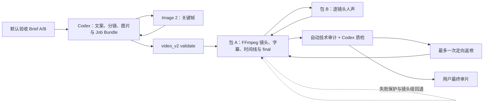

# 短视频 V2 计划 05：端到端质量验证与 MVP 验收计划

> 文档定位：本文件是短视频 V2 第五份直接实施计划。它承接计划 01–04 已通过的 Mac 基线、Job Bundle/Schema v1、包 A V2 核心管线，以及图片生成与动态化工具决策，用两个不同内容的真实任务验证“两阶段半自动”工作流是否已经达到 MVP 的“完整、稳定、可看、可改”。
>
> 本计划不是新的工具选型阶段，也不是高级动态化补考。计划 04 已确认正式高级动态候选为零；本计划以 Image 2 关键帧、包 B 人声、包 A 与 FFmpeg 默认动态完成验收。若最终视觉仍因缺少场景内或主体内运动而不被用户接受，应如实判定 MVP 未通过或条件通过，而不是临时接入未经验证的 I2V 掩盖问题。

---

## 1. 前置结论与阶段位置

### 1.1 计划 04 交接结论

计划 04 已按自身验收规则 PASS，可以进入计划 05；但它没有证明自然语义动态已经实现：

- Image 2 六镜头关键帧主路径通过，形成了角色/风格参考、小步编辑、生成账与质量门；
- FFmpeg 是普通人物、建筑和风景镜头的正式默认，优先 `slow_push_in`，谨慎使用 `gentle_drift`，避免无叙事依据的左右晃动；
- HyperFrames 仅保留信息设计型镜头的 `manual_only` 结论，不进入普通自然场景主线；
- DepthFlow 对正式与人工自然场景路线均已拒绝；
- MFLUX 因冷模型下载耗时失控归为 `research_only`；
- Draw Things/本地 I2V 因未获授权归为 `research_only`；
- 正式高级动态 `formal_candidate` 为零，这符合计划 04 原定“可为零”的决策门；
- 用户明确指出微放大、平移和晃动不等于真正动态，风景雨落、人物轻摆等仍是当前能力缺口。

权威交接依据：

- `短视频V2规划文档/执行记录/04-图片生成与高级动态化可行性执行记录.md:370-408`；
- `【包A】视频引擎包/docs/short_video_v2/image_workflow_v1.md:1-40`；
- `【包A】视频引擎包/docs/short_video_v2/motion_feasibility_v1.md:1-86`；
- `【包A】视频引擎包/成片/短视频V2样片/phase4-image-motion/`。

### 1.2 当前已经可用的正式主链

- CLI 已提供只读校验、完整渲染、`--shot` 镜头级重渲、`--force` 与 JSON 输出，见 `【包A】视频引擎包/程序文件/引擎/video_v2/__main__.py:12-22`、`:78-145`；
- `render_job` 已负责读取冻结 Job Bundle、调用包 B、逐镜头渲染、字幕、时间线、缓存、final 与报告，见 `video_v2/pipeline.py:327-409`；
- 正式报告包含状态、run id、项目、镜头、时间线、final、缓存命中、警告与错误，见 `video_v2/pipeline.py:59-86`、`:365-408`；
- 运动失败可回退 `static`，且不允许任务传入任意 filtergraph，见 `video_v2/pipeline.py:217-236`、`video_v2/motion.py:64-135`；
- Schema v1 已冻结 1080×1920、30 FPS、解说/对白、八种固定运镜、三档强度、ASS 字幕和 cut/crossfade，见 `video_v2/contract.py:22-49`、`:235-274`、`:330-424`；
- 计划 03 已证明六镜头真实 TTS、完整成片、重复渲染、缓存与单镜头重渲；
- 计划 04 已修复动态导入反模式，并形成当前 `15 + 10 + 32 + 12 + 25` 的定向回归矩阵。

### 1.3 本计划回答的问题

1. Codex 能否从两种不同形态的原始内容稳定得到可执行 Job Bundle，而非只复用“雨夜信使”一个案例；
2. 两个 30–45 秒、6–10 镜头任务能否依次完成 Image 2、包 B、包 A、字幕、合成和技术检查；
3. 当前 FFmpeg 基础动态能否在真实完整成片中达到“不是电子相册、基本可看”的最低线；
4. 文案、语音、字幕、镜头与画面是否在语义和节奏上基本一致；
5. 同一任务是否可重复渲染、命中缓存、只重做一个镜头，并在失败/取消时保护旧成片；
6. 用户是否愿意把两条成片判为第一版“基本可用”；
7. 若未通过，问题究竟属于内容、图片、语音、字幕、动态、合成、可靠性还是产品质量门，而不是含混归因。

---

## 2. 目标、成功定义与非目标

### 2.1 核心目标

完成两条不同内容的 9:16 中文短视频，从原始 Brief 一路走到可播放 `final.mp4`、镜头产物、字幕、报告和返修证据；两条任务都不得要求开发者为换故事临时修改核心源码。

### 2.2 本阶段“通过”的含义

计划 05 PASS 必须同时成立：

- 两条不同内容均以独立 Job Bundle 完成；
- 每条 30–45 秒、6–10 个镜头，所有镜头使用独立关键帧；
- 仅依靠包 B 人声与包 A/FFmpeg 正式路线生成，无 BGM、环境音、SFX；
- 媒体规格、音画时长、字幕、缓存、失败保护与报告达到本计划硬门；
- 两条视频均完成至少一次全片视觉/听觉审查；
- 用户完成最终审片，并明确接受两条视频达到“基本可用”，或对有限问题完成一次定向返修后接受；
- 已知没有真正自然语义动态，不被文档虚构成已解决；
- 没有为了通过而引入计划 04 已拒绝、未授权或仅研究保留的工具。

### 2.3 本阶段允许的结果

- **PASS**：两条样片技术、可靠性和用户质量门均通过，可进入计划 06 固化半自动工作流；
- **CONDITIONAL**：技术与可靠性成立，但用户审片尚未完成，或只有一条存在可由一次镜头级返修解决的问题；可保留产物继续修订，不得宣布 MVP 完成；
- **FAIL**：任一主链硬门持续失败，两个内容之一无法稳定成片，失败/取消会破坏旧产物，或用户明确认为当前基础动态下的成片整体不可用；不得用新增工具绕过失败结论。

### 2.4 明确不做

- 不重新开启 MFLUX、DepthFlow、自然场景 HyperFrames 或 Draw Things/I2V 实验；
- 不下载新模型、浏览器或大型运行时；
- 不把 HyperFrames 手工信息镜头接进 Schema 或正式 pipeline；
- 不改 Schema v1，不增加 Provider、命令、URL、模型路径或任意 filtergraph 字段；
- 不把 OpenAI 图片 API 嵌入包 A，也不写入 API key；
- 不新增 BGM、环境音、SFX、口型同步或复杂人物连续动作；
- 不建设 Web UI，不做签名、公证、发布打包；
- 不重构包 B，不重写包 A，不把 V2 合并回旧 `kt_video.py`；
- 不为低影响格式、命名或文档细节扩大实现范围；
- 不以滤镜、锐化、强投影或后期遮挡掩盖原始图片、字幕或动态问题。

---

## 3. 固定 MVP 路线与职责



### 3.1 Codex

- 把两种原始内容整理为 Brief、150–220 字左右中文成片文案和 6–10 镜分镜；
- 建立每条视频自己的风格板，人物案例另建角色参考；
- 使用 Image 2 生成关键帧，完成生成账与视觉检查；
- 生成严格 Schema v1 的 `project.json`、`storyboard.json` 与哈希；
- 选择焦点、基础运镜、强度、字幕模式和转场；
- 阅读报告、抽帧与媒体审计，只返修具体问题镜头。

### 3.2 包 B

- 使用已存在并预检通过的音色逐镜头生成 WAV；
- 至少一个镜头以 `speech.kind=dialogue` 和 `speaker_id` 验证少量角色对白契约；
- 不要求为了验收新增真人录音或音色训练；
- 音色不可用时先换成已验证音色，不修改包 B 核心实现。

### 3.3 包 A

- 只消费已落盘并通过哈希校验的 Job Bundle；
- 以包 B 实际 WAV 时长形成权威时间线；
- 全部普通镜头使用正式 FFmpeg 预设，不调用计划 04 实验 Provider；
- 输出镜头、ASS 字幕、final、缓存 manifest 和 render report；
- 支持重复运行、镜头级重渲、失败/取消报告和旧成片保护。

### 3.4 用户

- 本计划开始时不要求选择工具、参数、音色或模型；
- 若用户在执行前没有另行指定题材，直接采用第 4 节默认两个案例；
- 最终只需观看两条候选成片，判断是否基本可用以及指出问题镜头；
- 若用户要求一次有限返修，执行者完成后再提交最终版本；
- 用户无需运行命令或理解底层滤镜、缓存与编码参数。

---

## 4. 两个固定验收案例

两个案例必须在内容形态、视觉负担和镜头组织上明显不同；不得把同一故事只换名重做，也不得复用计划 04 的六张成图冒充新内容。

### 4.1 案例 A：人物连续性叙事

默认题目：**《暴雪前的最后一班山村邮车》**。

输入形态：用户只给一个简短故事梗概；Codex 将其改写为 30–45 秒叙事。

固定故事骨架：

1. 暴雪将封住山路，乡邮员准备最后一次发车；
2. 车内有一封迟到的录取通知；
3. 山路、旧桥或积雪形成阻力；
4. 邮员坚持抵达偏远村落；
5. 收件人出现，形成情绪转折；
6. 至少一行简短对白，例如“到了，这是你的信”；
7. 以风雪前亮起的村灯或驶离远景收束。

验收负担：

- 7–8 个镜头；
- 1 名主要人物跨至少 5 个镜头身份可辨；
- 允许 1 名次要人物；
- 以第三人称解说为主，恰有 1 个短对白镜头；
- 至少包含全景、中景、近景、物件特写和结尾远景；
- 包含 1 个故意测试 FFmpeg 局限的“人物/车辆正在行动”镜头，不得用纯静物案例回避动态质量门；
- 每张关键帧不同，不在图片中放文字。

推荐项目 ID：`phase5-story-mail-car`。

### 4.2 案例 B：知识解释型内容

默认题目：**《一滴雨水如何穿过海绵城市》**。

输入形态：给出一页简短事实提纲；Codex 只能依据提纲与必要的权威资料组织解释，不虚构数字或效果承诺。

固定知识骨架：

1. 雨水落到屋顶、道路与绿地；
2. 透水铺装和下凹绿地先减缓地表径流；
3. 植被与土壤承担滞留、渗透和部分净化；
4. 调蓄设施在强降雨时暂存一部分水量；
5. 多余雨水仍需通过安全排水路径进入水体；
6. 海绵设施不能被表述为“消灭所有内涝”；
7. 以城市水循环总览收束。

验收负担：

- 7–8 个镜头；
- 无必须持续出现的主要人物；
- 以环境、建筑、物件、剖面式插画和信息关系为主；
- 至少一个镜头使用 `caption.mode=custom`，验证字幕可以比语音更精炼；
- 至少一个“流水/降雨”镜头用于暴露当前基础动态能力的真实边界；
- 图片中不生成标签或文字，所有术语由 ASS 字幕呈现；
- 若执行者补充事实，必须在 `evidence/sources.md` 记录来源，优先使用政府、标准或研究机构一手资料。

推荐项目 ID：`phase5-explainer-sponge-city`。

### 4.3 为什么选择这两个案例

- A 验证故事改写、人物一致性、角色对白和情绪节奏；
- B 验证事实约束、无主角内容、抽象过程、定制字幕和非叙事镜头组织；
- 两者共同覆盖人物、建筑、环境、物件和信息关系；
- 两者都含一个当前静态运镜可能显得不足的压力镜头，避免只挑最适合微放大的题材而虚高 MVP 质量；
- 若两种任务都无需修改核心代码即可成片，才能证明流程不是单案例脚本。

---

## 5. 任务包与证据目录

### 5.1 验收根目录

```text
【包A】视频引擎包/成片/短视频V2样片/phase5-mvp-acceptance/
├── story-mail-car/
│   ├── brief.md
│   ├── project.json
│   ├── storyboard.json
│   ├── style_bible.json
│   ├── characters.json
│   ├── references/
│   ├── assets/keyframes/
│   ├── audio/
│   ├── shots/
│   ├── captions/
│   ├── cache/
│   ├── output/
│   └── evidence/
├── explainer-sponge-city/
│   └── ...同等结构...
├── reliability-copies/
│   ├── selected-rerender/
│   ├── invalid-contract/
│   ├── corrupted-cache/
│   ├── tts-unavailable/
│   └── cancellation/
└── final-review/
    ├── manifest.json
    ├── technical-summary.md
    ├── story-mail-car-contact-sheet.png
    ├── explainer-sponge-city-contact-sheet.png
    └── user-review.md
```

### 5.2 每个 Job Bundle 必须自包含

- Schema 只读取获批的 `project.json` 与 `storyboard.json` 字段；
- 所有关键帧使用 POSIX 相对路径，位于本任务包内；
- 每张关键帧写入真实 SHA-256；
- 包 B 音频、单镜头、字幕、缓存和 final 均保存在各自任务包内；
- `brief.md`、风格板、角色表、来源和生成账属于制作证据，不进入公共 Schema；
- 两个任务包之间不得共享可变输出目录、缓存 manifest 或临时文件；
- 计划 04 的图片和视频只作方法参考，不直接复制成计划 05 正片资产。

### 5.3 计划 05 执行记录

固定路径：

`短视频V2规划文档/执行记录/05-端到端质量验证与MVP验收执行记录.md`

每批记录：执行目标、实际完成、关键文件、命令与退出码、媒体/哈希、测试结果、主观问题、处理、剩余风险、下一批门和当前 PASS/CONDITIONAL/FAIL。

---

## 6. 内容、图片与任务包硬门

### 6.1 文案

每条视频：

- 正文以约 150–220 个中文字符为初始范围，以包 B 实际时长为准；
- 7–8 个镜头优先，允许在 6–10 内调整；
- 单镜头语音原则上 2–35 个中文字符，不将整段文案塞入一个镜头；
- 开头 3 秒内应有人物处境、明确问题或视觉主题；
- 每镜 `purpose`、语音、关键帧和运镜意图必须属于同一语义；
- 案例 A 只保留 1 个短对白镜头，其余为解说；
- 案例 B 不使用未经来源支持的数字、百分比或绝对化结论；
- 不为凑时长重复句意。

### 6.2 图片

- 每条至少一张风格参考；案例 A 另有一张角色参考；
- 所有正片镜头关键帧哈希不同；
- 案例 A 至少 5 个主要人物镜头身份、发型、服装与配件基本一致；
- 案例 B 同项目的色板、材质与图解语言一致；
- 6/6 或更多镜头无严重脸手畸形、错误文字、水印、现代/时代冲突；
- 下方约 18% 字幕区不长期压住核心主体；
- 焦点附近与运镜方向留有足够余量；
- 单图平均生成/编辑循环不超过 3 次；
- 每条最多允许 2 张图在后续质量批次定向重生成，防止无限抽卡。

### 6.3 Job Bundle

- `python -m video_v2 validate --json` 对两包均返回 `ok=true`、0 error；
- 项目 ID、镜头顺序、图片哈希、焦点、语音、字幕和转场均可解释；
- 案例 A 至少一镜 `speech.kind=dialogue` 且包含安全的 `speaker_id`；
- 案例 B 至少一镜 `caption.mode=custom`；
- 两包在高级工具完全缺失时仍可渲染；
- 不增加 Schema 字段，不写命令、URL、模型或 Provider 私参。

---

## 7. 首次端到端渲染门

### 7.1 执行顺序

1. 记录包 A `/api/health` 与 `/api/dots_status`；
2. 先校验两个 Job Bundle；
3. 顺序渲染案例 A，再渲染案例 B，避免并发争用统一内存和包 B；
4. 使用当前包 A runtime/FFmpeg/ffprobe 与已验证包 B，不启动新的模型服务；
5. 每次保存 stdout、stderr/event、外层墙钟、最大 RSS、memory pressure 与磁盘变化；
6. 成功后立即保存 report、manifest、final 哈希和完整媒体摘要；
7. 第一次运行不得预填伪缓存或复制计划 03 音频。

### 7.2 单条成片技术规格

- 时长：30.000–45.000 秒；
- 视频：H.264、1080×1920、30 FPS、yuv420p；
- 音频：AAC、48 kHz、双声道；
- `ffprobe` 可解析；
- FFmpeg 完整解码退出码 0；
- 报告预期 final 时长与实测误差绝对值 ≤0.20 秒；
- 音频流与视频流时长差绝对值 ≤0.10 秒，若封装尾差超过但不影响播放，须给出证据并由用户审片决定是否接受；
- 没有非预期长黑帧、花屏、断帧、损坏流或持续主体出界；
- 每镜输出均符合标准镜头规格，报告 `status=success`、`errors=[]`。

### 7.3 性能记录

- 图片生成时间与本地渲染时间分开记录；
- 本地首次完整渲染目标不超过每条 20 分钟；超过不自动 FAIL，但必须定位是 TTS、镜头、final 还是环境等待；
- 第二条不得因第一条缓存、目录或进程残留而异常；
- 单条渲染过程中不应持续 swap；若产生 swap，记录峰值和是否影响服务；
- 两条任务完成后磁盘增量可解释，无未知大文件、`.part-*` 或孤儿子进程。

---

## 8. 音频、字幕与节奏检查

### 8.1 包 B 人声

- 所有镜头均由包 B 实际生成，不使用合成的测试静音或 fake WAV；
- WAV 可 probe、完整解码、非空；
- 语音与字幕文字一致，只有案例 B 的 custom 字幕允许更精炼；
- 无明显削波、突发爆音、句首句尾截断、异常音量跳变；
- `ebur128` 记录综合响度、LRA 和 true peak；不为数字好看擅自引入全局响度处理；
- 建议观察区间为综合响度约 -20 至 -14 LUFS、true peak 不高于 -1 dBFS；超出不机械失败，以是否削波、过轻、视频间差异和用户听感为最终依据；
- 两条成片综合响度差建议 ≤3 LU；若超过且明显影响观看，优先从包 B/已有音频处理路径做最小修正；
- `silencedetect` 只把非预期的长断音作为问题，正常头尾留白和自然停顿不得误报。

### 8.2 字幕

- ASS 源文件保留且可编辑；
- 字幕与语音顺序一致，不提前跨镜、不延后到下一镜；
- 每张字幕卡持续时间 ≥0.6 秒；
- 每卡不超过 2 行，行长和分句易读；
- 不长期遮住主要人物脸、重要物件和信息焦点；
- 不出现乱码、空卡、残留模板词或图片内重复文字；
- 案例 A 对话可以通过文本内容和 speaker metadata区分，不要求首版新增花哨字幕样式；
- 案例 B custom 字幕必须准确、比旁白更短，且不能改变事实含义。

### 8.3 节奏与转场

- 开头 3 秒内主题明确；
- 语音结束后不应有无意的长停顿；
- cut 用于动作或信息推进，crossfade 只在空间/情绪转换时少量使用；
- 不让所有镜头都以同一速度推近；
- 同一镜头内基础运动应连续、克制、无突然反向；
- 压力镜头若无法形成真正动态，应在报告中明确能力缺口，不用晃动冒充。

---

## 9. 视觉与内容质量门

### 9.1 自动/静态检查

每条生成：

- 关键帧联系表；
- 每个镜头首/中/尾帧时间条；
- final 等间隔联系表；
- 人脸/手、字幕区、建筑边缘或信息细部裁切；
- `blackdetect`、`silencedetect`、`signalstats`/等价媒体摘要；
- final 与所有镜头的 ffprobe/完整解码结果；
- 图片、音频、镜头、字幕、final 和报告的 SHA-256 清单。

自动探测只提供线索，不直接替代视觉判断：暗夜画面可能触发 blackdetect，中文自然停顿可能触发 silencedetect；执行者必须结合帧和音频解释。

### 9.2 Codex 质量评分

每项 0–3 分：

| 维度 | 0 | 1 | 2 | 3 |
| --- | --- | --- | --- | --- |
| 内容完整 | 无法理解 | 缺关键因果 | 基本完整 | 紧凑清楚 |
| 开头抓点 | 空白/无主题 | 进入太慢 | 主题明确 | 立即建立问题或兴趣 |
| 图像一致 | 严重漂移 | 多处冲突 | 基本统一 | 角色/风格稳定 |
| 镜头语义 | 画面错位 | 多处牵强 | 大体匹配 | 每镜支持文案推进 |
| 基础运动 | 眩晕/主体出界 | 机械或无意义 | 可接受 | 构图与意图自然 |
| 字幕 | 乱码/错序 | 难读或遮挡 | 清楚可读 | 节奏与画面协调 |
| 人声 | 削波/断句严重 | 明显影响观看 | 清楚可用 | 音量、断句、语气自然 |
| 整体可看性 | 无法看完 | 明显电子相册 | 基本成立 | 可直接作为首版样片 |

硬失败：损坏文件、明显黑屏、关键内容错误、严重脸手畸形、错误文字/水印、字幕错序、语音缺失、主角持续出界、任一镜头重复占位或成片无法完整播放。

### 9.3 返修边界

在提交用户审片前，每条最多一次内部定向返修：

- 最多改 2 个镜头的图片；
- 最多改 2 个镜头的文案/字幕；
- 可改焦点、预设、强度或转场；
- 只重渲受影响镜头和 final；
- 不重新设计整条故事，不换工具，不下载模型；
- 若发现真正核心缺陷，先写回归测试再做最小修复；
- 若问题只是当前 FFmpeg 无法生成语义运动，保留证据，不把计划扩大成 I2V 开发。

---

## 10. 重复性、缓存、返修与故障注入

### 10.1 相同任务重复渲染

两条首次成功后各再运行一次：

- 所有音频、镜头和 final 均应命中缓存；
- final SHA-256 与首次成功版本一致；
- 不应重新调用包 B；
- report 正确记录 `audio_hit`、`shot_hit`、`final_hit`；
- 没有新 `.part-*`、错误 run 或目录污染。

### 10.2 单镜头返修

在 `reliability-copies/selected-rerender/` 的一次性副本中：

1. 只改变一个镜头的非语音字段，例如 `motion.strength` 或焦点；
2. 更新必要文件与哈希后用 `--shot shot-xxx` 执行；
3. 该镜头与 final 重建；
4. 所有音频命中；
5. 其余镜头命中且哈希不变；
6. 新 final 可 probe/解码，报告范围正确；
7. 原始验收任务包和 final 不被覆盖。

### 10.3 契约失败

在一次性副本中分别制造：

- 错误图片 SHA-256；
- 越界/绝对素材路径；
- 未知镜头 ID 或非法运镜字段。

预期：validate/render 在渲染前失败，错误码稳定，不运行 TTS/FFmpeg，不覆盖已有 final。

### 10.4 缓存损坏

在一次性副本中破坏一个缓存条目的哈希或对应文件：

- pipeline 应把它识别为 invalid/miss，而非盲用；
- 只重建受影响层及必要下游；
- 报告留下 `cache.invalid` 或等价可解释证据；
- 原始素材不删除，其他有效缓存不无差别重做。

### 10.5 TTS 不可用

- 不停止用户当前包 B 服务；
- 通过测试注入 fake unavailable Provider、隔离 RuntimeContext 或无缓存副本触发；
- 预期错误属于 `tts.not_installed`、`tts.not_ready`、`tts.contract_incompatible` 或等价稳定分类；
- 失败 report 指明 stage/shot/retryable；
- 旧 final 与有效缓存不受损；
- 服务恢复/真实任务不需要手工清理残留状态。

### 10.6 运镜失败与回退

- 使用测试 runner 对非 static 运镜注入一次命令失败；
- 证明该镜头回退 static、`fallback_used=true`、整片仍可继续；
- static 也失败时返回 `render.fallback_failed`；
- 不能通过修改正式 FFmpeg 或写入任意命令实现注入。

### 10.7 取消

- 通过受控测试或一次性副本在 TTS/命令执行期间触发取消；
- CLI/管线返回 cancelled/130 或对应结构化状态；
- 子进程在既有 terminate→kill 门内收束；
- 旧 final、旧 manifest 有效内容和用户素材受保护；
- 失败/取消报告保留，临时 `.part-*` 精准清理；
- 不为形式验收停止正在提供服务的包 A/B。

---

## 11. 计划新增的测试/验收工具

### 11.1 推荐文件

- `【包A】视频引擎包/tests/test_v2_mvp_acceptance.py`：纯 Python/短媒体的验收规则、缓存/失败/取消回归；
- `【包A】视频引擎包/tests/run_v2_mvp_acceptance.py`：真实两任务 validate/render/audit/contact-sheet 入口；
- `【包A】视频引擎包/docs/short_video_v2/mvp_acceptance_v1.md`：最终操作、产物、已知边界和计划 06 交接；
- `【包A】视频引擎包/成片/短视频V2样片/phase5-mvp-acceptance/`：大媒体、真实 Job Bundle 和证据；
- `短视频V2规划文档/执行记录/05-端到端质量验证与MVP验收执行记录.md`：逐批事实。

### 11.2 验收 runner 原则

- 使用标准库、现有包 A runtime、FFmpeg、ffprobe，不新增 PyPI/npm 依赖；
- 所有外部命令为 list argv、`shell=False`、有限超时；
- 默认只读审计，渲染/生成联系表必须显式子命令；
- 不硬编码两个案例的最终哈希作为通用程序逻辑，哈希写入各案例 evidence manifest；
- 不把 QA 字段加进 Job Bundle Schema；
- 不用 runner 重新实现 pipeline；
- 长时真实渲染不放进普通 unittest discover；
- 任何临时副本必须位于 `phase5-mvp-acceptance/reliability-copies/` 并可精准清理；
- 不递归删除工作区、成片根或用户缓存。

### 11.3 机器可读验收 manifest

`final-review/manifest.json` 至少记录：

- 两个 project id 与 Job Bundle 根；
- 输入 brief、关键帧、project/storyboard 哈希；
- image generation ledger 路径；
- 第一次/第二次/返修 run id；
- 冷/热墙钟、峰值资源与磁盘；
- 镜头、音频、字幕、final/report/manifest 哈希；
- 媒体规格、音视频时长差、报告时长误差；
- black/silence/loudness 摘要；
- 缓存、单镜头、失败、回退、取消结果；
- Codex 评分；
- 用户审片状态、反馈和最终 verdict；
- 已知自然语义动态缺口。

---

## 12. 分批实施

### 批次 1：冻结基线、验收协议与安全 runner

#### 目标

确认计划 01–04 前置仍成立，建立不重复实现 pipeline 的计划 05 验收工具、测试和目录协议。

#### 操作

1. 读取总体规划、计划 01–04 最终执行记录、计划 04 两份交接文档；
2. 记录 HEAD、脏工作树、服务 PID/端口、计划 03 final 哈希和计划 04 final 分类；
3. fresh 运行 phase4、phase1、contract、runtime、pipeline 五组定向测试；
4. 校验计划 03 六镜头 validate、final ffprobe/完整解码与哈希；
5. 建立计划 05 执行记录与验收根目录约定；
6. 先写 `test_v2_mvp_acceptance.py` 的红灯测试，再实现最小 audit/manifest/contact-sheet helper；
7. 建立 `run_v2_mvp_acceptance.py`，只编排已有 CLI/FFmpeg，不复制核心管线；
8. 固化两个默认案例、评分表、返修上限和用户终审问题；
9. 不生成图片、不运行长 TTS、不改正式 Schema/pipeline，除非发现前置回归；
10. 更新执行记录。

#### 退出条件

- 前置回归新增失败 0；
- 验收测试和短媒体 smoke 通过；
- runner 边界、目录、超时和证据格式可复核；
- 两个案例与质量门冻结；
- 不需要用户参与即可进入批次 2。

### 批次 2：两条内容、Image 2 关键帧与 Job Bundle

#### 目标

把两种原始内容转成真正不同、可执行的两个 Job Bundle。

#### 操作

1. 为案例 A/B分别写 `brief.md`、文案、镜头表和必要来源；
2. 检查每条 150–220 字、7–8 镜、开头抓点、压力镜头和结尾；
3. 按 `image_workflow_v1.md` 使用 Image 2：A 生成角色/风格参考与 7–8 图，B 生成风格参考与 7–8 图；
4. 每图保存提示词、引用顺序、循环、拒绝原因、尺寸和哈希；
5. 做逐图与联系表审查，不合格图最多一次有针对性的局部/单图修订；
6. 生成 `project.json`、`storyboard.json`、style/character/source evidence；
7. A 写入一个 dialogue/speaker_id，B 写入一个 custom caption；
8. 两包执行 validate，修复契约问题；
9. 不启动高级工具、不复用计划 04 成图；
10. 更新执行记录。

#### 退出条件

- 两条内容明显不同；
- 每条 6–10 张独立图，视觉与内容硬门通过；
- 两个 Job Bundle validate `ok=true`；
- 无新增 Schema 字段；
- 可进入批次 3。

### 批次 3：两条首次真实端到端渲染

#### 目标

用真实包 B 和包 A/FFmpeg 顺序渲染两条完整视频，并建立第一轮技术证据。

#### 操作

1. 确认包 A health 与包 B ready/compatible；
2. 记录运行前磁盘、memory pressure 与无孤儿进程；
3. 顺序渲染案例 A/B，采集 event/stdout/stderr、时间和资源；
4. 对所有音频、镜头和 final 做 probe/完整解码；
5. 校验 30–45 秒、1080×1920/30/H.264/yuv420p + AAC 48k stereo、时长误差；
6. 生成联系表、时间条、字幕区和关键细部证据；
7. 运行 black/silence/loudness 等审计并解释误报；
8. 使用 macOS 常见播放器或等价 UI 从头播放至结尾，记录可见错误，不虚构扬声器听感；
9. 若只是文案长度导致时长越界，可做一次最小文案修正后重渲相关镜头；
10. 更新执行记录。

#### 退出条件

- 两条 `status=success` 且 final 可完整播放/解码；
- 技术规格和报告时长门通过；
- 包 B/包 A 仍健康；
- 可进入批次 4；任一无法成片则先定位并最小修复，不跳过。

### 批次 4：重复渲染、镜头返修与故障注入

#### 目标

证明流程不但能跑一次，还能重复、局部修改、正确失败和安全取消。

#### 操作

1. 两条原任务各重复渲染，验证全缓存命中和 final 哈希不变；
2. 在副本完成一次 `--shot` 非语音字段返修；
3. 完成错误哈希/越界路径/未知镜头契约失败；
4. 完成一项缓存损坏与最小重建；
5. 用测试注入 TTS unavailable，不停止真实服务；
6. 用测试注入运镜失败，验证 static 回退与双失败分类；
7. 完成受控取消，验证报告、子进程和旧 final 保护；
8. 检查原两个候选 final 未被故障副本覆盖；
9. fresh 运行 Plan05 与计划 01–04 定向测试；
10. 更新执行记录。

#### 退出条件

- 重复运行确定；
- 单镜头重渲范围准确；
- 失败/回退/取消状态可解释；
- 旧产物和服务受保护；
- 新增回归 0；
- 可进入批次 5。

### 批次 5：综合质量审查与一次内部返修

#### 目标

在不换工具的前提下，把明显可修的问题收束，冻结提交用户审片的两个候选版本。

#### 操作

1. Codex 按 8 项 0–3 量表独立评审两片；
2. 逐镜检查内容、图像、语音、字幕、运动、转场与节奏；
3. 区分硬失败、有限可修问题和当前能力边界；
4. 每条最多一次内部返修，遵守最多 2 图、2 文案/字幕和局部参数边界；
5. 只重渲受影响镜头和 final，验证缓存范围；
6. 重做 final audit、完整播放、联系表和哈希；
7. 冻结 `final-review/manifest.json` 与技术简报；
8. 不把“缺少真正动态”自动判为技术失败，也不宣称已经解决；
9. 若核心缺陷无法在本计划内修复，停止并给 CONDITIONAL/FAIL，不临时拉取新工具；
10. 更新执行记录。

#### 退出条件

- 两个候选版本技术硬门通过；
- 没有未处理硬失败；
- Codex 评分、已知缺口与是否推荐用户审片写清；
- 可进入批次 6。

### 批次 6：用户终审、必要返修与 MVP 最终判定

#### 目标

由用户判断两条视频是否达到“基本可用”，形成计划 05 最终结论和计划 06 输入。

#### 操作

1. 向用户呈现两条 final、本地可点击路径、时长/镜头/技术摘要和已知动态边界；
2. 只询问每条 PASS/需返修/不可接受、最明显问题镜头，以及内容、人声、字幕、图片、基础运动与整体可看性；
3. 用户未回复时记录 `awaiting_user_review`，计划只能 CONDITIONAL并暂停；
4. 若用户提出有限返修，每条只允许一次用户定向返修，返回批次 5 的局部流程；
5. 返修后重新技术审计并再次呈现受影响视频；
6. 用户若明确因基础动态整体不可接受，应如实 FAIL 或 CONDITIONAL，不把计划 04 PASS 当作质量豁免；
7. 若两条均接受，运行最终回归、服务/进程/磁盘/工作树检查；
8. 完成 `mvp_acceptance_v1.md`、manifest 和执行记录；
9. 给出 PASS/CONDITIONAL/FAIL 与是否进入计划 06；
10. 不在此批实施计划 06 的工作流模板、UI 或 Skill。

#### 退出条件

- 用户审片状态已落账；
- 两片结论与返修次数清楚；
- 技术、可靠性、产品三层 verdict 均明确；
- PASS 才允许进入计划 06；CONDITIONAL 仅允许继续有限返修；FAIL 必须先处理被用户或硬门证实的核心缺口。

---

## 13. 用户参与点

### 13.1 当前无需用户先回答

两个默认题材、音频范围、工具和验收阈值已经足够开始执行。用户若无新偏好，执行会直接采用第 4 节案例，不需要先选题、选模型或选运镜。

### 13.2 唯一强制参与门：最终审片

用户需要观看两条最终候选并回答：

1. 案例 A：通过、需要有限返修，还是整体不可接受；
2. 案例 B：通过、需要有限返修，还是整体不可接受；
3. 每条最明显的问题镜头或时间点；
4. 人声是否清楚，有无明显错读、断句或音量问题；
5. 字幕是否清楚、同步并避开主体；
6. 图片是否统一，人物身份是否可辨；
7. 基础运镜是否足以让成片基本可看，还是仍像电子相册；
8. 在明确知道“真正语义动态尚未实现”的前提下，是否接受它作为 MVP 第一版。

该判断不能由 Codex、自动评分或子代理替代。用户未审时最多 CONDITIONAL。

### 13.3 无新增资源授权门

本计划不需要新模型或新工具下载，不应再次请求 MFLUX、DepthFlow、HyperFrames Chrome、Draw Things 或 I2V 授权。若执行中有人主张必须新下载才能通过，应停止并说明为何原定 MVP 主链不足，而不是直接扩张。

---

## 14. 测试与验证矩阵

### 14.1 前置回归

```bash
cd '/Users/yuh/Desktop/项目/文本视音屏生成器/【包A】视频引擎包'
程序文件/runtime/bin/python3 -B -m unittest discover -s tests -p 'test_v2_phase4_feasibility.py' -v
程序文件/runtime/bin/python3 -B -m unittest discover -s tests -p 'test_v2_phase1_sample.py' -v
程序文件/runtime/bin/python3 -B -m unittest discover -s tests -p 'test_v2_job_bundle_contract.py' -v
程序文件/runtime/bin/python3 -B -m unittest discover -s tests -p 'test_v2_core_runtime.py' -v
程序文件/runtime/bin/python3 -B -m unittest discover -s tests -p 'test_v2_core_pipeline.py' -v
```

### 14.2 新增定向测试

```bash
程序文件/runtime/bin/python3 -B -m unittest discover -s tests -p 'test_v2_mvp_acceptance.py' -v
```

至少覆盖：

- acceptance manifest 必需字段与路径安全；
- 媒体规格/时长差/流数量审计；
- 联系表命令 argv 与输出隔离；
- 相同运行缓存统计判断；
- 单镜头重渲统计判断；
- 契约错误、TTS unavailable、motion fallback、缓存 invalid 和 cancel；
- 旧 final 哈希保护；
- 不把真实长渲染放入普通单元测试。

### 14.3 两包真实命令形态

```bash
PYTHONPATH='程序文件/引擎' 程序文件/runtime/bin/python3 -B -m video_v2 validate --job-dir '<job-dir>' --json
PYTHONPATH='程序文件/引擎' 程序文件/runtime/bin/python3 -B -m video_v2 render --job-dir '<job-dir>' --json
PYTHONPATH='程序文件/引擎' 程序文件/runtime/bin/python3 -B -m video_v2 render --job-dir '<job-dir>' --shot shot-xxx --json
```

实际执行前以项目现有 runtime 路径和工作目录核对，命令不得把示例尖括号原样运行。

### 14.4 媒体审计

- final 与全部 shot：ffprobe；
- final 与全部 shot/WAV：完整解码；
- final：流规格、时长、帧率、像素格式、采样率、声道；
- final：blackdetect、silencedetect、ebur128/peak；
- 字幕：ASS 文件、首/中/尾截图和主体避让；
- 图片：哈希、尺寸、联系表与关键细部；
- 报告：status/run/cache/timeline/final/errors/warnings；
- 实际播放器：至少一次从头到尾播放。

### 14.5 全量测试

计划 05 先以 V2 定向矩阵为硬门。只有确认不会破坏现有服务 state/port、能够记录并恢复现场时，才运行包 A 全量测试；既有 Windows 专属失败、端口隔离问题与新增回归必须分开记录，不因全量旧失败误判 V2，也不能把新增失败归给旧基线。

---

## 15. 验收标准

### 15.1 功能硬门

- 两个不同内容 Job Bundle 均 validate/render 成功；
- 每条 6–10 镜、30–45 秒；
- A 含人物连续性和 1 个对白镜头；
- B 含知识解释与 1 个 custom 字幕镜头；
- 所有镜头有独立图片和包 B 真实音频；
- final、shots、audio、captions、manifest、report 齐全；
- 无 BGM/SFX/环境音；
- 高级工具全部缺失时仍能出片。

### 15.2 技术硬门

- 两片 H.264 1080×1920 30 FPS yuv420p + AAC 48kHz stereo；
- ffprobe/完整解码通过；
- 报告时长误差 ≤0.20 秒；
- 音视频时长差目标 ≤0.10 秒，超出须有明确无害证据与用户接受；
- 无损坏、花屏、非预期长黑帧；
- report 成功且 errors 空；
- 工作树、服务、Schema、V1、计划 03/04 产物未被覆盖。

### 15.3 可靠性硬门

- 两片第二次运行全缓存命中、final 哈希不变；
- 单镜头变更只重建该镜头和 final；
- 错误输入在渲染前拒绝；
- 缓存损坏可识别并最小重建；
- TTS unavailable、motion fallback、取消均有稳定分类；
- 失败/取消不破坏旧 final；
- 无孤儿进程、未知大文件和残留 `.part-*`；
- Plan01–05 定向测试新增失败 0。

### 15.4 内容与视觉硬门

- 两条均不是黑底字幕或单图到底；
- 开头数秒主题明确；
- 镜头、文案、图片、字幕和语音基本一致；
- 案例 A 主要人物身份基本稳定；
- 案例 B 事实无明显错误/绝对化；
- 无严重脸手畸形、错误文字、水印；
- 字幕清楚、同步并避免长期遮挡主体；
- 运镜不持续切掉主体，不全部同速推近；
- 已知语义动态缺口诚实呈现。

### 15.5 用户质量硬门

- 用户完成两片审看；
- 用户对每片给出通过/返修/不可接受；
- 用户确认内容、人声、字幕、图片和整体节奏基本可用；
- 用户确认当前基础动态不会使整片整体沦为不可接受的电子相册；
- 若返修，限定次数后再次获得接受；
- 任何自动评分都不能覆盖用户明确的不可接受反馈。

### 15.6 最终等级

- **PASS**：15.1–15.5 全部通过，两条视频被用户接受，进入计划 06；
- **CONDITIONAL**：技术/可靠性通过但用户未审，或恰有一条尚待一次有限返修；不宣布 MVP 完成；
- **FAIL**：任一内容持续无法成片、核心可靠性不成立、两片之一无法达到基本观看线，或用户明确拒绝当前基础动态下的整体产品质量。

---

## 16. 风险与控制

| 风险 | 影响 | 控制 |
| --- | --- | --- |
| 只选适合推拉的静态题材 | 虚高 FFmpeg 质量 | 两案例各保留一个行动/流水压力镜头 |
| 人物跨图漂移 | 案例 A 叙事破裂 | 角色参考、固定不变量、最多一次局部修订，失败则改物件/环境镜头但不得全部回避人物 |
| 知识内容失真 | 案例 B 不可信 | 事实提纲、必要一手来源、禁用无依据数字与绝对化 |
| 两片文案过长或过短 | 超出 30–45 秒 | 先估算，首次真实 TTS 后只做一次局部长度修正 |
| 包 B 音色/断句问题 | 成片听感下降 | 逐镜短文本、使用已验证音色、保存 WAV、用户听审 |
| 字幕遮挡主体 | 视觉失败 | 图片预留 18% 安全区、抽帧检查、必要时只改图焦点/字幕分句 |
| 为过关临时引入高级工具 | 破坏计划 04 决策 | 明确禁止新下载/新 Provider；未达标即记录 FAIL/CONDITIONAL |
| 故障注入破坏真实任务 | 丢失验收成片 | 全部在 reliability-copies，先记旧 final 哈希，绝不停止真实包 B |
| 长测试触发服务状态副作用 | 影响当前使用 | 定向测试优先，全量前记录并可恢复，不为形式覆盖服务 state |
| 视觉问题无限返修 | 阶段失控 | 每条内部一次、用户定向一次；每轮最多 2 图/2 文案 |
| 把计划 04 PASS误写成动态能力 PASS | 产品预期错位 | 三层 verdict 分开：技术、可靠性、用户质量 |
| 低影响问题消耗时间 | MVP 延迟 | 对成片和主链几乎无影响的问题只记录 |

---

## 17. 产物清单

计划完成后至少存在：

1. 两个完整 Job Bundle；
2. 两条 30–45 秒 final；
3. 每条全部关键帧、音频、镜头、ASS 字幕、manifest 与 report；
4. 两套 Image 2 生成账与联系表；
5. 两套首/中/尾帧、final 联系表和媒体审计；
6. 冷/热运行、缓存与单镜头重渲证据；
7. 契约失败、缓存损坏、TTS unavailable、motion fallback 和取消证据；
8. `final-review/manifest.json`；
9. 用户审片反馈；
10. `docs/short_video_v2/mvp_acceptance_v1.md`；
11. 完整计划 05 执行记录；
12. PASS/CONDITIONAL/FAIL 与计划 06 进入决定。

---

## 18. 计划 06 交接

只有计划 05 PASS，计划 06《半自动工作流固化与后续自动化计划》才接收：

- 两种原始输入到 Brief/文案/分镜的已验证模板；
- Image 2 角色/风格/镜头生成模板；
- 两个可复用 Job Bundle 示例，但不得把案例具体内容硬编码进工具；
- 包 A/B 启动、校验、渲染、状态读取与产物检查方法；
- 镜头级返修、缓存、失败与取消方法；
- 用户审片表和基本质量门；
- 当前正式路线 `Image 2 + FFmpeg + 包 B + 包 A`；
- `hyperframes_design_manual` 仍仅为非主链人工选项；
- 真正自然语义动态未实现的产品边界；
- 哪些步骤适合封装成 Codex `short-video-director` Skill，哪些仍需用户决定。

若计划 05 因视觉动态整体不可接受而 FAIL，计划 06 不应通过模板化掩盖失败；应先决定是否单立云端/本地 I2V 有界计划，并重新取得下载/API/费用授权。

---

## 19. 最短执行说明

> 两题试锋，一叙一解；先让 Image 2 立住画面，再让包 B 发声、包 A 成片。缓存、故障与返修逐一过门，最后把两条真实成片交给用户判断。能看、能改、能再做，方称 MVP；若只是技术跑通而观感不受，仍须如实止步。
