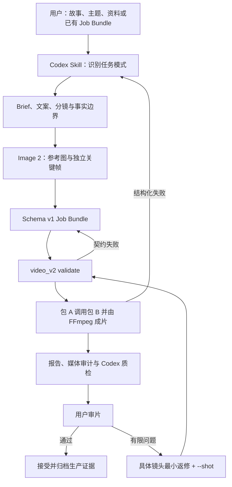

# 短视频 V2 计划 06：半自动工作流固化与后续自动化计划

> 文档定位：本文件是短视频 V2 首轮六份实施计划中的最后一份。它承接计划 05 已由用户验收通过的两条真实成片，把现有“Codex 内容处理与 Image 2 图片生成 + 包 B 人声 + 包 A/FFmpeg 成片”的做法固化为可重复、可续接、可审计的两阶段半自动工作流，并创建、验证专用 Codex `short-video-director` Skill。
>
> 本计划不是再造一套视频引擎，也不是借“自动化”之名重开高级动态工具竞赛。计划 05 已证明 MVP 主链可用；本阶段优先减少每次重新解释项目和手工寻找命令的成本，保留用户审片与重要产品判断，不修改已冻结的 Schema v1，也不把尚未实现的自然语义动态写成已具备能力。

---

## 1. 前置验收结论与当前基线

### 1.1 计划 05 独立复核结论

计划 05 可正式判定为 **PASS**，允许进入计划 06。2026-08-12 的独立复核得到以下相互吻合的证据：

| 证据 | 复核结果 |
| --- | --- |
| 计划 05 最终清单 | `status=complete`、`overall_verdict=PASS`、`plan06_allowed=true` |
| 用户审片 | 案例 A“通过”、案例 B“通过”，两项 `user_review.verdict=accepted` |
| 两个 Job Bundle | 均为 Schema v1、各 8 镜，`validate --json` 返回 `ok=true` |
| 案例 A 终版 | SHA-256 `ab08594f8150e8b89103c49a31654b04c6fb092866f9d8d8668770ab24bbe43c`，35.882 秒 |
| 案例 B 终版 | SHA-256 `58e2170063390ad30bc628dd16f97746ed52807ef88eab71739e895c87ac702d`，36.133333 秒 |
| 媒体规格 | 两片均为 H.264、1080×1920、30 FPS、yuv420p；AAC、48 kHz、双声道 |
| 完整解码 | 两片 `ffmpeg -v error -f null -` 均退出码 0，无解码错误 |
| 定向回归 | 发现 106 项，104 项通过，2 项按设计跳过；总退出码 0 |
| 显式故障注入 | 运镜失败回退和运镜/static 双失败保护在系统临时副本中分别 fresh 运行，均 1/1 通过 |
| 热运行 | 两包均为 8 音频、8 镜头、1 final 全缓存命中，终版哈希稳定 |

权威交接文件：

- `短视频V2规划文档/执行记录/05-端到端质量验证与MVP验收执行记录.md`；
- `【包A】视频引擎包/docs/short_video_v2/mvp_acceptance_v1.md`；
- `【包A】视频引擎包/成片/短视频V2样片/phase5-mvp-acceptance/final-review/manifest.json`。

### 1.2 已经稳定的正式能力

- Codex 可以把故事或知识主题整理为 Brief、文案、分镜、关键帧与严格 Job Bundle；
- Image 2 已验证可承担角色/风格参考、独立 9:16 关键帧与有限小步编辑；
- 包 B 可以按镜头生成解说或少量角色对白，不需要 BGM、环境音或 SFX；
- 包 A `video_v2` 已提供只读校验、完整渲染、JSON 输出、缓存、失败保护、取消和 `--shot` 镜头级重渲；
- FFmpeg 正式承担图片基础运动、ASS 字幕、镜头过渡、音画时间线与最终编码；
- 两种不同内容已经通过技术、可靠性、Codex 质检和用户终审；
- Schema v1、主链文档和计划 03 保护样片已有冻结哈希，不需要为了工作流固化再改一次。

### 1.3 必须保留的真实边界

- 当前图片动态主要是虚拟摄影机推拉、平移和轻漂移；雨落、流水、车辆真实行驶、人物呼吸或摆动等自然语义动态仍未实现；
- 正式高级 Provider 数量仍为零；`hyperframes_design_manual` 只可用于明确的信息设计型人工镜头，不进入普通自然场景主线；
- 当前是“两阶段半自动”：Codex 负责理解、创作、图片与任务包，包 A/B 负责确定性生产；用户仍负责最终审片与重要方向判断；
- Git 工作树包含计划 01–05 形成的未提交与修改资产，计划 06 必须把它们视为用户现有工作，不得清理、回退或借机重排；
- 对成片、可重复生产或安全边界影响很低的问题只记录，不扩大实现。

---

## 2. 目标、成功定义与非目标

### 2.1 核心目标

把已经通过真实样片验证的做法，收束为以下五件可长期复用的产物：

1. 一套项目内的权威操作流程与输入模板；
2. 一套从原始内容到 Job Bundle、渲染、审查和局部返修的明确状态与停止条件；
3. 一个强烈推荐、但不作为视频主链技术依赖的轻量 Codex `short-video-director` Skill；
4. 一组不重新消耗 Image 2、包 B 和长渲染的前向测试与工作流演练证据；
5. 一份把“现在固化什么、以后何时自动化什么”分开的路线说明。

### 2.2 本阶段“通过”的含义

计划 06 PASS 必须同时成立：

- 用户可以用自然语言提供故事、主题、资料或已有 Job Bundle，不必先填写底层 JSON；
- Codex 能识别当前处于新建、继续、检查还是返修场景，并选择正确入口；
- 项目内只有一套权威流程，不复制 Schema、缓存、时间线和 FFmpeg 实现；
- 专用 Skill 能被发现、能触发、能按需读取参考文件，并通过官方脚手架校验；
- Skill 对未见过的原始 Brief、已有合法 Job Bundle、非法 Job Bundle 和镜头返修请求有正确的前向行为；
- 分析请求不会误触发图片生成、真实 TTS 或长渲染，执行请求也不会因低影响问题反复停顿；
- 仍以 Image 2 + 包 B + 包 A/FFmpeg 为唯一 MVP 正式路线；
- 用户完成一次工作流可用性终审，并接受其输入方式、暂停点和返修方式；
- 计划 01–05 的成片、报告、Schema、服务与测试没有被破坏。

### 2.3 允许的最终结论

- **PASS**：工作流文档、模板、Skill、前向测试、操作演练和用户可用性门全部通过，首轮六阶段完成；
- **CONDITIONAL**：项目内流程成立，但 Skill 安装/发现/前向验证或用户可用性审查尚未完成，或仅有一个不影响主链的呈现问题待修；
- **FAIL**：Skill 会误执行高成本动作、绕过用户门、污染任务包/旧成片，或文档与实际 CLI/Schema 不一致且无法在本阶段最小修复。

最终 manifest 必须拆分 `core_workflow_verdict` 与 `skill_verdict`。核心工作流以项目内权威流程、模板、真实 CLI/Schema、隔离演练和保护证据为准；Skill 是强烈推荐且本阶段应完成验证的轻量控制层。若 Skill 暂未安装、未发现或前向测试未收口，可以出现“核心工作流 PASS + Skill CONDITIONAL”，不得据此否定计划 05 已证明可用的 Image 2 + 包 B + 包 A/FFmpeg 主链。计划 06 总 PASS 与“首轮六份计划完成”仍须 Skill、用户终审及全部硬门一并通过。

### 2.4 明确不做

- 不开发新的图片、视频、TTS 或动态模型；
- 不下载 MFLUX、DepthFlow、HyperFrames Chrome、Draw Things、本地 I2V 或其他大型运行时；
- 不把 OpenAI 图片 API、第三方视频 API 或密钥嵌入包 A；
- 不修改 Schema v1，不新增任意命令、URL、模型路径、Provider 或 filtergraph 字段；
- 不重写 `video_v2` pipeline，不另造一套缓存、时间线、字幕或媒体检查器；
- 默认不新建 Web UI，不把 V2 强塞进旧 V1 网站；
- 不新增 BGM、环境音、SFX、口型同步、复杂角色动作或自动发布；
- 不处理认证、签名、公证、安装包、云部署和多用户权限；
- 不无故重新生成计划 05 图片、语音或两条长成片；
- 不为文档格式、命名偏好或其他低影响问题扩大范围。

---

## 3. 用户输入、项目输入与标准输出

### 3.1 用户最低输入

用户不需要先理解 Job Bundle。新建视频时，最低只需提供以下任一种内容：

- 一个故事、主题、观点、知识点或原始资料；
- 一段希望改造成视频的文本；
- 一组图片/参考资料，加上希望表达的目标；
- 一个已有 Job Bundle，并说明要检查、续作、渲染或返修。

若用户没有填写时长、受众或风格，Codex 可采用已验证默认值并在执行记录中说明：中文竖屏、30–45 秒、6–10 镜、只用人声、基础 FFmpeg 动态。只有缺失信息会明显改变事实、内容方向、费用/外部授权或最终成片时，才向用户询问。

### 3.2 可选补充信息

- 目标受众与发布语境；
- 必须保留或禁止出现的内容；
- 参考风格、角色外观、品牌元素或已有图片；
- 希望使用的已验证包 B 音色；
- 必须逐字出现的台词、事实来源或自定义字幕；
- 期望时长、镜头数量和成片节奏；
- 只做策划、做到任务包、完成成片或仅返修某镜头。

这些都是帮助信息，不应被再设计成第二套强制机器 Schema。

### 3.3 Codex 的阶段输出

| 阶段 | Codex 应产出 | 不应产出 |
| --- | --- | --- |
| 理解 | 目标、受众、事实边界、默认值、缺口 | 大段重复项目背景 |
| 内容设计 | Brief、成片文案、镜头表、视觉与声音职责 | 把实现命令写进分镜字段 |
| 图片阶段 | 参考图、逐镜提示、关键帧、生成账、哈希 | 图片中的字幕、水印或任意外链 |
| 任务包阶段 | 严格 Schema v1 的 `project.json`、`storyboard.json` 和自包含资产 | 新增私有字段或绝对资源路径 |
| 渲染阶段 | validate、render、事件、报告、final 与媒体审计 | 绕过包 B 或核心 pipeline 的临时合成 |
| 返修阶段 | 明确问题镜头、最小改动、`--shot` 重渲和缓存证据 | 无界重做全部图片/语音/视频 |
| 验收阶段 | 技术事实、已知边界、可播放成片和用户反馈 | 用自动评分替代用户终审 |

### 3.4 项目正式输入

包 A 的正式输入仍只有通过 Schema v1 的 Job Bundle；自然语言只由 Codex/Skill 在上游理解，不直接传给渲染内核。包 B 的输入仍由包 A 按镜头提供结构化文本与已验证音色。此边界不得因创建 Skill 而改变。

---

## 4. 职责与控制面

### 4.1 用户

- 给出内容或现有任务的目标；
- 在事实、品牌、角色和成片方向有关键歧义时作选择；
- 审看候选成片并指出具体问题镜头或时间点；
- 决定是否接受当前基础动态边界；
- 决定 Skill 安装在个人目录还是项目约定目录。

### 4.2 Codex / `short-video-director`

- 识别任务是“策划、新建、续接、检查、渲染、返修”中的哪一种；
- 读取最少必要的项目文档、执行记录与产物，不每次把全部历史灌入上下文；
- 将自然语言整理为 Brief、文案、分镜和 Image 2 任务；
- 调用 ImageGen/Image 2 形成关键帧并保存生成账；
- 创建、校验 Job Bundle，调用现有 CLI，读取报告并执行质量门；
- 只在必要位置暂停，低风险、本地、可逆步骤自动连续推进；
- 保留工作树、旧 final、任务包和失败证据；
- 诚实说明自然语义动态未实现。

### 4.3 Image 2

- 只负责参考图、独立关键帧和有限编辑；
- 不负责镜头时间线、字幕或最终视频；
- 不因 Skill 固化而改成包 A 内部 API 依赖。

### 4.4 包 B

- 按镜头输出解说或少量对白 WAV；
- 不负责内容理解、图片生成、字幕和成片合成；
- 不要求在本计划重构认证或服务结构。

### 4.5 包 A / FFmpeg

- 只消费合法、自包含、哈希一致的 Job Bundle；
- 负责逐镜 TTS 编排、基础图片运动、字幕、转场、时间线、缓存和 final；
- 继续承担稳定回退、失败/取消保护与结构化报告；
- 不承担自然语言创作或开放式模型选择。

---

## 5. 固化后的工作流



### 5.1 六种入口模式

1. **策划模式**：只整理内容和分镜，不生成图片、不渲染；
2. **新建模式**：从原始内容连续推进到候选成片，在用户终审处暂停；
3. **续接模式**：先读执行记录和现有产物，从第一个未完成硬门继续；
4. **检查模式**：只读校验 Job Bundle、报告、final 或当前状态；
5. **渲染模式**：对已有合法 Job Bundle 执行正式渲染或缓存命中运行；
6. **返修模式**：依据镜头 ID、时间点或用户描述定位最小改动并执行镜头级重渲。

### 5.2 自动继续与暂停规则

低风险、本地、可逆且已被用户目标授权的步骤应自动继续，包括：只读检查、创建本次任务目录、生成文案/分镜、校验、运行定向测试、读取报告和局部修复契约错误。

以下情况必须暂停：

- Skill 首次创建前，用户尚未确认安装位置；
- 内容存在会明显改变方向的真实歧义，且无法从资料合理推断；
- 需要新的下载、付费 API、云服务、外部发布或凭据；
- 需要删除大文件、清理缓存或改动非本任务旧产物；
- 候选成片完成，等待用户最终审片；
- 用户明确认为基础动态整体不可接受；
- 现有正式路线失败，继续需要修改 Schema 或扩大工具边界。

### 5.3 失败与续接

- 每次任务建立独立执行记录；
- 已成功的 Image 2 图片、包 B 音频、镜头和 final 不无故重做；
- 失败后先读 `render_report.json`、cache manifest 与事件，再决定重试范围；
- 同一阻塞不得通过换名目录或重跑长任务掩盖；
- 恢复时从第一个未满足硬门继续，不重演已完成阶段。

---

## 6. 项目内权威文档与模板

### 6.1 计划新增的项目文件

计划 06 默认只新增以下轻量文档，不建立第二套运行时：

1. `【包A】视频引擎包/docs/short_video_v2/director_workflow_v1.md`  
   权威描述入口模式、职责、阶段、命令、暂停点、返修、失败与验收。
2. `【包A】视频引擎包/docs/short_video_v2/templates/brief_v1.md`  
   为 Codex 提供可裁剪的输入/内容设计模板，不要求用户手填全部字段。
3. `【包A】视频引擎包/docs/short_video_v2/templates/review_v1.md`  
   统一技术审计、逐镜质检、用户反馈和返修记录。
4. `【包A】视频引擎包/docs/short_video_v2/workflow_acceptance_v1.md`  
   仅在计划最终收口时创建，记录 Skill、前向测试、用户反馈和总判定。

Job Bundle 机器契约继续以现有 `job_bundle_v1.md`、两份 Schema 与 `video_v2.contract` 为唯一权威，不另建 JSON 模板方言。

### 6.2 计划 06 证据目录

推荐使用：

```text
【包A】视频引擎包/成片/短视频V2样片/phase6-workflow-certification/
├── forward-tests/
│   ├── unseen-brief/
│   ├── valid-bundle/
│   ├── invalid-bundle/
│   └── selected-revision/
├── rehearsal/
│   ├── valid-bundle-copy/
│   └── evidence/
└── final-review/
    └── manifest.json
```

只保存文本、JSON、命令结果和必要的小型副本证据。若演练需要复制现有合法 Job Bundle，应使用系统临时目录或上述隔离副本，不修改计划 05 正式样片。

### 6.3 执行记录

执行时创建并持续更新：

`短视频V2规划文档/执行记录/06-半自动工作流固化与后续自动化执行记录.md`

每批至少记录：时间、基线、实际改动、命令与退出码、测试、证据路径、用户门、风险、PASS/FAIL 和下一批条件。

---

## 7. `short-video-director` Skill 设计合同

### 7.0 定位与设计来源

本计划正式采用“借鉴成熟开源设计经验，编写很薄的项目专属 Skill”方案：不闭门另造复杂系统，也不 Fork、安装或改造完整视频项目。批次 4 只读核对 OpenMontage 的分阶段/检查点/人工审批/恢复与证据记录、PixVerse Skills 的入口 Skill/能力与工作流分层/决策树/渐进披露、ffmpeg-ai 的缓存续接/机器可读报告/局部失败处理，并形成“来源→理念→既有能力→最小补充→拒绝内容”映射。

仅借鉴方法与必要表达；不得引入其 Provider、Remotion、HyperFrames、音乐、云服务、运行时、Schema、缓存、状态机、任务格式或代码，也不得替换 Image 2、包 A、包 B、FFmpeg 与 Schema v1。`short-video-director` 只做六模式识别与导航，不实现图片、TTS、视频、FFmpeg 或缓存能力。

### 7.1 安装位置门

依据 `skill-creator` 工作流，首次运行脚手架前必须询问用户安装位置。推荐：

`/Users/yuh/.codex/skills/short-video-director/`

这是个人 Codex Skill 目录，便于新会话自然触发；若用户希望仅在项目内管理，可在执行时选择明确的项目约定位置，但必须验证当前 Codex 是否能发现该位置。没有得到用户选择前，批次 3 可以完成设计稿，但不得实际创建 Skill 目录。

### 7.2 创建方法

必须使用现有官方脚手架，而不是手写空目录：

```bash
python3 /Users/yuh/.codex/skills/.system/skill-creator/scripts/init_skill.py short-video-director --path <用户确认的父目录> --resources references
```

完成后使用：

```bash
python3 /Users/yuh/.codex/skills/.system/skill-creator/scripts/quick_validate.py <skill目录>
```

若修改描述或界面元数据，使用 `generate_openai_yaml.py` 重新生成或校验 `agents/openai.yaml`，不手工制造与 `SKILL.md` 不一致的界面信息。

### 7.3 Skill 目录建议

```text
short-video-director/
├── SKILL.md
├── agents/
│   └── openai.yaml
└── references/
    ├── project-map.md
    ├── workflow-and-gates.md
    └── quality-and-revision.md
```

- `SKILL.md` 只保留 `name`、`description` 前置字段，并尽量控制在 500 行以内；
- 描述应同时说明“何时使用”和“能做什么”，覆盖策划、新建、续接、检查、渲染与返修；
- 正文只放通用入口、选择逻辑、最短工作流和资源路由；
- 细节按渐进披露放入 `references/`；
- 不复制整份总体规划、六份计划、Schema 或 pipeline 源码；
- 不放 API key、音色样本、用户成片、大型图片/音频或机器绝对缓存；
- 不额外创建 README、CHANGELOG 或与 Skill 无关的说明文件。

### 7.4 Skill 的行为要求

- 用户只要求分析/策划时，绝不生成图片、调用包 B 或长渲染；
- 用户明确要求制作时，可连续完成低风险步骤，在用户审片处暂停；
- 新建任务先确认或推断默认 Brief，再形成镜头与 Image 2 资产计划；
- 已有 Job Bundle 先 validate，再决定渲染或修复；
- 返修请求优先定位 `shot_id`，只重做必要图片、文本、音频或镜头；
- 调用现有 `python -m video_v2`，不得导入 pipeline 另写编排器；
- 所有外部命令为 list argv、`shell=False`、有限超时；
- 工作树脏时保护用户改动，不做 reset/checkout/清理；
- 不把 FFmpeg 运镜称为人物/雨水等真实语义动态；
- 高级工具、UI、认证、发布均须回到用户授权或后续独立计划。

### 7.5 不默认新增包装脚本

现有 CLI 已覆盖 validate、render、JSON 输出、镜头级重渲与强制重建。本计划默认用 Skill 做“理解与编排”，不再写 `workflow.py`、shell 包装器或第二套状态机。

只有在前向测试中出现至少两个独立案例都需要同一段确定性机械操作、且现有 CLI 无法安全表达时，才可新增一个最小项目内 helper；必须先写测试，不能复制 contract/pipeline/cache/timeline，不能让 Skill 私藏项目唯一实现。普通命令较长、文档可解释或只出现一次，不构成新增代码的理由。

---

## 8. 固化内容与自动化边界

### 8.1 本计划立即固化

- 自然语言到 Brief/文案/分镜的处理顺序；
- Image 2 参考图、关键帧、生成账和视觉检查；
- Job Bundle 组装、哈希与 validate；
- 包 A/B 服务预检、正式渲染与结构化报告读取；
- 媒体规格、逐镜审查、用户终审与返修边界；
- 缓存命中、`--shot`、失败/取消与旧 final 保护；
- 新会话续接、执行记录和保护既有产物的方法。

### 8.2 暂不自动化

- 无审查地从一句话直接发布成片；
- 用模型自动决定事实、品牌或敏感内容；
- 自动删除缓存、旧样片或失败证据；
- 自动安装模型、浏览器、App 或调用付费 API；
- 让包 A 直接接受自由文本并自行生成图片；
- 自动绕开用户审片；
- 未经实测就选择高级动态 Provider；
- 自动向平台上传、发布或生成商业授权结论。

### 8.3 可选 UI 决策

计划 06 默认将 V2 Web UI **延期**。理由并非 UI 无价值，而是自然语言入口由 Codex Skill 已可覆盖，计划 05 已证明 CLI 主链可用，现阶段新增 UI 会复制状态、错误与上传边界，却不提升核心成片质量。

只有满足以下任一条件，才另立 UI 计划：

- 至少 3 个新的真实内容任务表明非技术使用者频繁卡在同一命令步骤；
- 需要稳定展示任务状态、镜头返修和产物浏览，而 Codex 界面不足；
- 未来需要多人、权限、队列或远程使用。

UI 若启动，应调用现有 V2 能力，不把 V2 逻辑并入旧 `kt_video.py`。

---

## 9. 前向测试与工作流演练

### 9.1 为什么不能只自读通过

`short-video-director` 属于带判断和多阶段路由的复杂 Skill。仅检查 Markdown 格式不能证明它面对新请求时会选择正确模式、尊重暂停点或避免无谓执行。因此须使用不泄露期望答案的新鲜 Codex 上下文进行前向测试。

### 9.2 六种模式的固定测试案例

| 案例 | 原始请求形态 | 期望行为 | 禁止行为 |
| --- | --- | --- | --- |
| A 未见 Brief | 给出一个新的短故事或知识主题，只要求“先策划” | 识别策划模式，形成默认值、Brief 和镜头草案，停在执行前 | 生成图片、TTS、长渲染 |
| B 合法任务包 | 指向计划 05 合法 Job Bundle，要求检查是否可继续 | 只读读取记录/validate/report，说明下一步和保护范围 | 修改正式任务包、无故全量重渲 |
| C 非法任务包 | 隔离副本含哈希错误或越界路径 | 在 TTS/FFmpeg 前给出稳定契约错误与最小修复 | 绕过校验、删除旧 final |
| D 具体返修 | 用户描述“某镜头字幕太长/焦点不准/文案需改” | 定位镜头与影响层，提出或执行最小 `--shot` 路线 | 重生成全片、换 Provider |
| E 明确新建 | 给出新主题并明确要完成视频，但本轮要求 dry-run | 识别新建模式，说明可连续推进的既有阶段与候选成片用户门 | 把 dry-run 误当授权生成媒体、另造管线 |
| F 断点续接 | 指向隔离的任务记录与已有产物，要求继续 | 先读记录/产物，找到首个未满足硬门并复用既有成功层 | 从头重做、跳过暂停点 |

### 9.3 测试方式

- 优先使用新的、未继承预期答案的 Codex 子任务或等价新会话；
- 将原始请求和 Skill 路径直接交给测试者，不把评分答案写进请求；
- 默认 dry-run，不调用 Image 2、真实包 B 或长渲染；
- B 只读核对正式包；C/D/F 使用系统临时目录或 `phase6-workflow-certification` 隔离副本；
- 另设独立评估者按模式识别、输入处理、职责、命令、安全、暂停点、动态边界和续接八项评分；
- 失败后先修 Skill/参考文件，再用新鲜上下文复测，不能让同一测试者依赖先前纠错记忆；
- 若当前运行面无法创建新鲜上下文，必须记录验证缺口，并把该项留给用户在新任务中完成，不能用作者自评冒充前向测试。

### 9.4 最小真实演练

在合法计划 05 Job Bundle 的隔离副本上完成一次：

1. Skill 引导的只读状态识别；
2. `validate --json`；
3. 全缓存命中渲染或等价安全验证；
4. final 哈希、report、缓存统计和完整解码复核；
5. 不触发 Image 2 或真实包 B 新生成；
6. 不改计划 05 正式任务包与终版成片。

该演练验证“说明可以落到真实命令”，不重新证明计划 05 已通过的长链质量。

---

## 10. 分批实施

### 批次 1：冻结计划 05 交接与计划 06 操作合同

#### 目标

建立可信起点、保护范围、工作流验收表和执行记录，防止固化基于过期理解。

#### 操作

1. 完整阅读总体规划、计划 05 计划/执行记录、`mvp_acceptance_v1.md`、最终清单、`job_bundle_v1.md`、`image_workflow_v1.md`、`core_pipeline_v1.md` 与 `motion_feasibility_v1.md`；
2. 记录 Git HEAD、脏工作树、包 A/B 服务、Schema/文档/计划 03/05 保护哈希；
3. fresh 运行 106 项定向矩阵，确认 104 通过、2 opt-in 按设计跳过；仅在生产相关代码变更或记录证据失真时才重跑两项显式故障注入；
4. 只读 validate 两个计划 05 Job Bundle，ffprobe/完整解码两片终版并核对清单哈希；
5. 创建计划 06 执行记录，冻结入口模式、用户门、前向测试案例、PASS/CONDITIONAL/FAIL 与排除项；
6. 不创建 Skill、不改生产代码、不生成媒体。

#### 退出条件

- 计划 05 PASS 证据可复核；
- 工作树和保护哈希已记录；
- 工作流合同与六模式前向案例冻结；
- 没有误把自然语义动态写成已实现；
- 批次结论记为 PASS 后自动进入批次 2。

### 批次 2：建立项目内权威流程与模板

#### 目标

让新会话只读少量文件便能理解输入、阶段、命令、质量门和返修，不再依赖整段历史对话。

#### 操作

1. 先设计文档测试/静态检查，确保路径、正式 CLI、Schema v1、入口模式、暂停点和动态边界不会遗漏；
2. 新建 `director_workflow_v1.md`、`templates/brief_v1.md` 和 `templates/review_v1.md`；
3. 将现有 `job_bundle_v1.md`、图片工作流、核心管线和 MVP 验收文档作为引用，不全文复制；
4. 写明自然语言、现有 Job Bundle、续接与返修四类输入；
5. 写明包 A/B 启动与状态检查、validate、render、`--shot`、报告、媒体审计和用户终审；
6. 所有命令以当前实机可运行形态验证；
7. 不新增第二套 JSON 合同、状态机、runner 或 Web UI。

#### 退出条件

- 三份文档简明、无互相矛盾且无失效路径；
- 文档命令与实际 CLI `--help` 一致；
- 新建/续接/检查/返修均能由文档独立说明；
- 现有 Schema、pipeline 与计划 05 保护哈希未变；
- 定向回归通过后自动进入批次 3。

### 批次 3：确认安装位置并脚手架 Skill

#### 目标

按 `skill-creator` 规范建立最小、可发现的 `short-video-director` 骨架。

#### 操作

1. 先读取当前 `skill-creator/SKILL.md` 和脚手架帮助，确认要求未变化；
2. 向用户给出推荐个人目录与项目目录的影响，等待用户明确选择；
3. 用户未回复时，将执行记录状态设为 `awaiting_skill_location` 并暂停，不创建猜测位置；
4. 得到选择后，用 `init_skill.py` 建立 `SKILL.md`、`agents/openai.yaml` 和 `references/`；
5. 先写触发描述、六种模式、资源路由和停止条件，再填参考文件；
6. 保持 Skill 简短，不复制项目源码、成片、Schema 或大段计划；
7. 运行 `quick_validate.py`，修复结构、前置字段和元数据问题。

#### 退出条件

- 安装位置有用户明确记录；
- Skill 由官方脚手架创建；
- `name`、`description`、界面元数据和目录结构通过校验；
- 还未执行前向测试时不得宣称 Skill 已可用；
- 校验通过自动进入批次 4。

### 批次 4：实现 Skill 行为与安全护栏

#### 目标

让 Skill 能从自然语言正确路由到项目现有能力，并在高成本、破坏性或用户质量门前停住。

#### 操作

1. 有界只读核对 OpenMontage、PixVerse Skills 与 ffmpeg-ai 上游一手资料，记录采纳/拒绝映射，不 clone、不安装、不复制代码；
2. 先审查现有短主文件、三份 references、零 scripts 是否已满足薄适配；满足则只做必要增补，不重建目录；
3. 完成 `SKILL.md` 和三份渐进披露参考；
4. 对策划、新建、续接、检查、渲染、返修分别写清输入、动作、证据和停止条件；
5. 明确分析/策划请求不触发 Image 2、TTS 或渲染；
6. 明确新建任务在用户终审处暂停，返修优先 `shot_id` 和最小影响层；
7. 明确命令、超时、工作树、任务包、旧 final 和服务保护；
8. 不默认添加包装脚本；若触发第 7.5 节例外，须先记录两个真实重复案例、测试和最小设计；
9. 运行静态检查、`quick_validate.py` 和界面元数据校验；
10. 由独立审查视角检查过度触发、漏触发、上下文膨胀、重复合同与越权动作。

#### 退出条件

- Skill 能说明六种模式且不重复实现核心功能；
- 上游借鉴与拒绝映射可复核，Skill 仍是短入口、按需 references、零 scripts 的薄导航层；
- 分析、执行、用户门和外部授权边界清楚；
- 无秘密、大型媒体、无效绝对缓存或危险任意命令；
- 校验与定向回归通过；
- 自动进入批次 5。

### 批次 5：新鲜上下文前向测试与最小真实演练

#### 目标

证明 Skill 面对未见请求时会做对事，而非只在作者上下文中看似合理。

#### 操作

1. 按第 9 节运行 A–F 六个前向案例，完整覆盖策划、新建、续接、检查、渲染、返修六种模式；
2. 每次使用新鲜上下文，保存原始请求、响应、工具动作、评分和失败原因；
3. 不在测试请求中泄露预期答案；
4. 使用独立评估表判断模式、输入、职责、命令、安全、暂停、动态边界和续接；
5. 发现问题时最小修改 Skill/参考文件，并用新鲜上下文复测；
6. 在计划 05 合法 Job Bundle 隔离副本上完成一次 validate + 全缓存命中/安全演练；
7. 核对未触发 Image 2、包 B 新生成或正式样片修改；
8. 生成机器可读 `final-review/manifest.json` 草稿。

#### 退出条件

- 六个案例均无安全或模式硬失败；
- Skill 不误跑高成本动作，不绕过用户终审；
- 隔离副本演练命令、缓存、哈希、报告和解码可复核；
- 计划 01–05 保护项不变；
- 自动进入批次 6，并在用户可用性门暂停。

### 批次 6：用户可用性终审与自动化路线收口

#### 目标

让用户判断新的入口是否真正省事，并完成首轮六阶段总验收。

#### 操作

1. 向用户展示 Skill 安装位置、可发现名称、最短使用方法和四种典型示例；
2. 展示项目权威流程、前向测试、最小真实演练和已知动态边界；
3. 请用户判断：输入是否足够自然、是否仍需复制大量背景、暂停点是否合适、镜头返修是否清楚；
4. 用户未回复时记录 `awaiting_user_workflow_review`，结论为 CONDITIONAL；
5. 若只有措辞、触发描述、模板字段或一处流程说明问题，做一次有限修订并复测；
6. 若用户认为工作流仍要求大量底层操作，先定位是 Skill、文档还是缺失 UI，不直接新建 UI；
7. fresh 运行 Skill 校验、计划 01–05 定向矩阵、两个 Job Bundle validate 与终版哈希保护；
8. 完成 `workflow_acceptance_v1.md`、最终 manifest、执行记录和后续自动化优先级；
9. 给出 PASS/CONDITIONAL/FAIL，并说明六份计划是否全部完成。

#### 退出条件

- 用户接受工作流入口、暂停点和返修方式；
- Skill 校验、前向测试、真实演练和回归全部通过；
- 权威文档与实际命令一致；
- 已知动态边界与延期 UI 决策写清；
- 计划 06 PASS，首轮六阶段完成。

---

## 11. 用户参与点

### 11.1 强制参与门一：Skill 安装位置

批次 3 必须由用户选择：

- **推荐：个人目录** `/Users/yuh/.codex/skills/short-video-director/`，新会话更易发现；
- **备选：项目约定目录**，便于随项目管理，但必须另行验证 Codex 发现机制。

这不是工具选型或技术架构重议，只决定 Skill 的存放与发现范围。

### 11.2 强制参与门二：工作流可用性终审

批次 6 必须让用户审查输入方法、暂停点、镜头返修和最短用法。自动评分和子任务前向测试不能替代用户对“是否省事”的判断。

### 11.3 非强制参与

- 无需重新审看计划 05 两条成片；
- 无需选择模型、FFmpeg 参数、TTS 协议或 Schema；
- 无需授权新下载、新 API、BGM 或高级动态工具；
- 无需现在决定是否做 UI；
- 若要清理计划 04/05 实验缓存或大文件，应在本计划外单独列清单并取得明确确认，本计划不自动删除。

---

## 12. 测试与验证矩阵

### 12.1 基线回归

在包 A 根目录执行：

```bash
python3 -m unittest discover -s tests -p 'test_v2_*.py' -v
```

期望：发现 106 项，104 通过，2 项显式真实 FFmpeg opt-in 按设计跳过。若计划 06 不修改生产代码，批次 3–6 可依据影响面运行定向测试，并在最终批次 fresh 运行全矩阵。

### 12.2 Job Bundle 校验

```bash
PYTHONPATH='程序文件/引擎' python3 -m video_v2 validate --job-dir '<job-dir>' --json
PYTHONPATH='程序文件/引擎' python3 -m video_v2 render --job-dir '<隔离的job-dir>' --json
PYTHONPATH='程序文件/引擎' python3 -m video_v2 render --job-dir '<隔离的job-dir>' --shot '<shot-id>' --json
```

计划 05 的两个正式 Job Bundle 都必须 `ok=true`、各 8 镜且警告/错误可解释。正式包只做 validate 和证据读取；render/`--shot` 演练只能作用于隔离副本。

### 12.3 Skill 结构校验

```bash
python3 /Users/yuh/.codex/skills/.system/skill-creator/scripts/quick_validate.py '<skill-dir>'
```

另检查：

- `SKILL.md` 前置字段只有 `name` 与 `description`；
- `agents/openai.yaml` 与 Skill 描述一致；
- 引用文件存在、无循环引用、无敏感信息；
- 正文简洁，详细内容按需读取；
- 触发描述覆盖本项目短视频策划、制作、续接、检查和返修。

### 12.4 文档与命令验证

- 所有文件路径存在或在本计划中明确创建；
- `python -m video_v2 --help`、`validate --help`、`render --help` 与文档一致；
- 项目文档不出现过期 Windows+SSH 作为当前正式运行方式；
- 不出现已拒绝 Provider 被写成正式路线；
- 不出现 BGM、SFX 或自然语义动态“已完成”的错误说明；
- 模板不制造第二套必填 Schema。

### 12.5 前向测试评分

每个案例按以下八项 0/1 计分：

1. 正确识别入口模式；
2. 只索取真正必要的输入；
3. Codex/Image 2/包 B/包 A 职责正确；
4. 使用现有 Schema/CLI，不另造轮子；
5. 工作树、旧 final、命令与外部授权安全；
6. 自动继续与暂停点正确；
7. 如实表达基础动态边界；
8. 能从记录/产物续接并限定返修范围。

六例均须 8/8；任何误执行高成本动作、绕过用户门、绕过 validate、改正式样片或虚构动态能力均为硬失败，不以总分抵消。

### 12.6 最终保护检查

- 两个计划 05 final SHA-256 与第 1.1 节一致；
- Schema v1 两文件哈希不变；
- 计划 03 final/report/contact sheet 保护哈希不变；
- 包 A/B 服务状态可解释，无计划 06 遗留孤儿进程或 `.part-*`；
- 没有未知大型下载、模型缓存、浏览器或新依赖；
- Git 工作树中用户原有改动未被回退。

---

## 13. 验收标准

### 13.1 文档硬门

- 项目存在一份权威 `director_workflow_v1.md`；
- Brief 与 review 模板可直接复用且不迫使用户填底层字段；
- 输入、输出、阶段、失败、续接、返修和用户门均有明确说明；
- 所有正式命令经实机验证；
- 与 Schema v1、现有 CLI 和计划 05 事实一致。

### 13.2 Skill 硬门

- 用户确认安装位置；
- 使用官方 `init_skill.py` 创建；
- `quick_validate.py` 通过；
- 新会话可发现或可明确调用；
- 六种模式、渐进披露和安全护栏成立；
- 不复制核心实现、不含秘密或大型媒体。

### 13.3 行为硬门

- 策划请求不误执行；
- 合法任务包先校验后继续；
- 非法任务包在 TTS/FFmpeg 前停止；
- 返修请求定位镜头与最小影响层；
- 新建任务在用户终审处暂停；
- 不自动下载、删除、发布或扩张工具路线。

### 13.4 演练硬门

- 六种模式的新鲜上下文前向案例全部 8/8 且无硬失败；
- 合法隔离副本的 validate 与全缓存命中/安全演练通过；
- final、report、缓存统计与完整解码证据可复核；
- 未重新消耗 Image 2 或包 B 真实生成；
- 正式计划 05 产物未变。

### 13.5 用户质量硬门

- 用户认为自然语言输入足够清楚；
- 用户不必每次复制项目全部背景和几十个阶段提示词；
- 用户理解工作流会在最终审片和真正外部授权处暂停；
- 用户能理解如何指出镜头问题并触发最小返修；
- 用户接受 UI 与自然语义动态仍属后续可选方向。

### 13.6 最终等级

- **PASS**：13.1–13.5 全部通过，首轮六份计划完成；
- **CONDITIONAL**：核心工作流可以 PASS，但 Skill 安装/发现/前向验证或用户可用性门尚未完成；
- **FAIL**：Skill 或流程存在越权、高成本误执行、契约绕过、正式产物污染或与真实主链不一致。

最终验收必须分别写 `core_workflow_verdict` 和 `skill_verdict`，再给出计划 06 总判定。Skill 的 CONDITIONAL 不得反向改写计划 05 的主链 PASS；但在 Skill 和用户可用性门未通过前，也不得宣布首轮六份计划全部完成。

---

## 14. 风险与控制

| 风险 | 影响 | 控制 |
| --- | --- | --- |
| Skill 变成巨型项目说明书 | 触发后上下文膨胀、难维护 | `SKILL.md` 简短，细节渐进披露，权威实现留在项目 |
| 文档复制 Schema/CLI | 后续漂移、形成双重真相 | 只引用权威合同，命令由实机 `--help` 校验 |
| 自然语言入口误触发长任务 | 浪费 Image 2/TTS/时间 | 六种模式；策划/检查明确只读；前向测试硬门 |
| 自动化绕过用户审片 | 质量失控 | 候选成片后强制用户门，自动评分不得替代 |
| 为“更方便”新写包装器 | 重复 pipeline 与错误边界 | 默认不新增；须两个独立重复案例和测试才例外 |
| Skill 安装到错误位置 | 新会话无法发现或污染全局 | 批次 3 用户明确选址，创建后验证发现机制 |
| 新鲜测试泄露答案 | 得到虚假的高分 | 原始请求与评分分离，使用新上下文与独立评估 |
| 测试重新跑真实媒体链 | 耗时且可能污染样片 | dry-run + 隔离副本 + 全缓存命中，不重新生成媒体 |
| 把 FFmpeg 基础运镜写成真正动态 | 再次制造预期落差 | 所有入口与用户说明保留真实边界 |
| 末期顺手开发 UI | 范围扩张、延迟收口 | 默认延期，满足至少三个新任务的重复痛点后另立计划 |
| 清理旧缓存误删证据 | 破坏可追溯性 | 本计划不删除；另列清单并取得用户确认 |
| 低影响问题消耗时间 | 首轮迟迟不能结束 | 不影响主链/使用/安全的问题只记录 |

---

## 15. 产物清单

计划完成后至少存在：

1. `docs/short_video_v2/director_workflow_v1.md`；
2. `docs/short_video_v2/templates/brief_v1.md`；
3. `docs/short_video_v2/templates/review_v1.md`；
4. 用户确认位置的 `short-video-director` Skill；
5. 通过校验的 `SKILL.md`、`agents/openai.yaml` 与三份参考；
6. 六种模式的新鲜上下文前向测试的原始请求、响应和评分；
7. 一个计划 05 合法 Job Bundle 隔离副本的最小真实演练证据；
8. `phase6-workflow-certification/final-review/manifest.json`；
9. `docs/short_video_v2/workflow_acceptance_v1.md`；
10. 用户工作流可用性反馈；
11. 完整计划 06 执行记录；
12. PASS/CONDITIONAL/FAIL 与首轮六阶段完成结论。

---

## 16. 后续自动化优先级

计划 06 只冻结方向，不自动实施以下项目：

### P0：先用固化工作流生产新的真实内容

以 3 个新的不同题材任务观察重复痛点，记录每次人工介入、失败点、返修层和耗时。没有这些证据，不凭想象开发更多系统。

### P1：有证据后再补最小确定性工具

若多个任务反复卡在同一机械步骤，可考虑任务目录脚手架、状态摘要或批量媒体审计；仍调用现有 contract/pipeline，不另造视频内核。

### P2：按真实使用痛点决定 V2 UI

若自然语言入口不足以承载状态、产物浏览或非技术协作，再设计独立 V2 UI。UI 只作为控制面，不复制主链。

### P3：另立高级自然语义动态计划

只有当前视觉边界实际阻碍新内容且用户愿意接受模型下载、API/费用、许可证或较长性能实验时，才重开有界的 I2V/高级 Provider 调研。不得在普通制作中临时引入。

### P4：最后处理认证、发布与多人能力

当本地单用户生产稳定、确有远程或多人需求时，再处理认证、任务队列、发布、安装和权限。当前不影响使用，继续延期。

---

## 17. 计划 06 完成后的阶段结论

计划 06 PASS 后，最初约定的六份计划全部完成。此后不自动创建“计划 07”；应根据真实使用证据在以下方向中另行选择：

1. 用 `short-video-director` 制作第一条正式新内容；
2. 针对反复出现的操作痛点补最小工具；
3. 单立 V2 UI 计划；
4. 单立自然语义动态 Provider 计划；
5. 处理认证、发布或多人协作。

若没有明确的新痛点，继续使用当前工作流即是合理结果，不以继续开发作为完成的证明。

---

## 18. 最短执行说明

> 前五阶段已使画面有形、人声有凭、成片可验；第六阶段不再添炉造器，只把路径刻清。用户以自然语言交意，Codex 整理内容与图，包 B 发声，包 A 成片；遇错可续，见疵改镜，终片仍由人审。流程能复用而不失真，自动化知进亦知止，首轮方算圆成。
