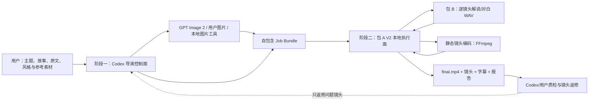

# 文本视音屏生成器：短视频 V2 总体目标与阶段规划

> 文档定位：本文件是短视频 V2 后续工作的长期总纲，用于统一产品目标、系统边界、总体流程、阶段目标、工具定位、验收原则与风险控制。
>
> 本文件不是直接实施清单，不规定某个类、函数或接口的最终写法。后续每一阶段应另建可执行计划，并在不偏离本总纲的前提下细化文件、任务、测试和验收步骤。

> **当前第一版执行基线（2026-08-13）**：经实际成片与动态专项验证，第一版现已收束为“多张静态分镜图 + 包 B 逐镜人声 + ASS 字幕 + 硬切 + 包 A/FFmpeg 合成”。所有新镜头统一使用 `motion=static/low` 与 `transition=cut/0`；不使用 FFmpeg 推拉/平移/漂移、DepthFlow、HyperFrames、本地 I2V、BGM、环境音或 SFX。本文后文关于动态提供器、运动预设和动态阶段的内容保留为历史架构构思与已完成研究记录，不覆盖此执行基线。若未来重开动态能力，应另立计划，不得悄然回到默认工作流。

---

## 1. 文档作用与依据

### 1.1 本文解决什么问题

本文用于回答并长期约束以下问题：

1. 项目最终要做成什么，而不只是当前能做什么；
2. 第一版应做到什么程度，哪些能力可以暂缓；
3. 用户、Codex、包 A、包 B、图片工具和动效工具分别负责什么；
4. 从原始内容到最终视频的完整流程如何衔接；
5. 哪些工具已确定，哪些只是候选，哪些仍须实机验证；
6. 开发应分成哪些阶段，每阶段何时可以退出；
7. 后续具体实施计划如何拆分，如何避免局部开发偏离总目标。

### 1.2 需求与文档优先级

后续发生歧义时，按以下顺序判断：

1. 用户在最新会话中明确确认的决定；
2. 本《短视频 V2 总体目标与阶段规划》；
3. 《短视频 V2 核心需求与完整方案》中的产品需求、架构分析和技术构思；
4. 《项目交接文档》中的迁移环境、工作树、历史验证和基线事实；
5. 各阶段的具体实施计划、测试规格与代码注释。

后续计划可以改变具体工具、模块命名和实施次序，但若要改变产品目标、Codex/包 A/包 B 的总体职责或两阶段架构，应先更新本文并留下决策记录。

### 1.3 当前已经确认的产品决定

- 全部开发、模型运行和媒体处理均在当前 Mac 上完成，不再采用 Windows 存储、SSH 连接 Mac 执行的方式。
- 第一版采用“两阶段半自动”模式：Codex 先完成内容与素材准备，包 A+B 再本地执行；以后再逐步提高自动化程度。
- 第一版音频只使用包 B 根据文本生成的解说或角色对白，不加入 BGM、环境音或 SFX。
- 第一版不做图片动态化，以多张高质量静态分镜图随叙事切换，先保证完整流程稳定、成片基本可用。
- 第一版不要求角色口型与语音精确同步。
- 本地生成式 I2V 不是 MVP 必需项；若后续实验，单个 3–4 秒镜头以约 20–30 分钟为初始容忍上限，一条视频最多使用 1–2 个。
- 首个视觉样片优先采用中文叙事插画或半写实插画风格，暂不以高难度写真人物连续性作为第一道门槛。
- 认证、签名、公证等不影响本机开发和使用的工作暂缓。
- 当前自动停止行为若未造成明显残留进程、任务误判或无法继续使用，则暂不作为 V2 前置工作。

---

## 2. 总体目标

### 2.1 产品总目标

将当前项目发展为一套由 Codex 伴随策划、Mac 本地确定性执行的短视频生产工作流：

> 用户提供主题、故事、事件、原始文案或参考材料；Codex 完成内容理解、文案改写、叙事结构、分镜、视觉规划和静态关键帧准备；包 B 按镜头生成解说或角色对白；包 A 按结构化任务将每张图片编码为与人声等长的静态镜头，完成字幕、硬切、音画同步、检查与输出，最终得到一条可以直接观看和继续返修的竖屏短视频。

### 2.2 目标成片

第一版目标成片应具备：

- 默认 `1080x1920`、`9:16`、30 FPS；
- 默认 30–45 秒、6–10 个镜头；
- 单条视频使用统一的主视觉风格；
- 以第三人称解说为主，也允许少量角色对白；
- 画面按叙事推进而切换，不是一张图承载整段音频；
- 每个镜头使用一张与叙事相符的静态图，镜头间随内容推进切换；
- 有清晰字幕，字幕不长期遮挡人物面部和核心内容；
- 画面、字幕和语音在语义与节奏上基本一致；
- 某个镜头失败或效果不佳时可以单独重做；
- 输出过程可追踪，能够说明每个镜头使用了什么素材、工具、参数等级和回退路径。

### 2.3 第一版“基本可用”的定义

第一版不以炫技为验收标准，而以“完整、稳定、可看、可改”为准：

1. 从原始内容到 `final.mp4` 的链路可重复完成；
2. 成片不是黑底字幕，也不是单张图片从头放到尾；
3. 只用高质量静态关键帧、合理分镜、硬切、字幕和包 B 人声，也能形成一条基本成立的叙事短视频；
4. 同一输入与相同素材可以稳定重渲，不因临时工具失效而整片失败；
5. 用户或 Codex 能根据报告定位问题镜头，并只返修该镜头。

### 2.4 长期目标

在 MVP 稳定后，项目可以逐步发展为：

- 支持更多视觉风格和镜头模板；
- 支持 DepthFlow、HyperFrames 和少量本地 I2V 等增强提供器；
- 支持网页中的分镜查看、素材替换和镜头级重渲；
- 将已经验证稳定的流程封装为 Codex 专用 Skill；
- 在不牺牲可控性和可恢复性的前提下，逐步减少人工交接步骤；
- 最终可评估“包 A 接收原始自然语言并自动编排”的更高自动化形态，但这不属于当前 MVP。

---

## 3. 明确不做的事情

为防止首版失控，当前不把以下事项纳入 MVP 必须范围：

- 不做完全脱离 Codex 的一句话无人值守生成；
- 不做精确口型同步；
- 不做复杂多人长对话或连续动作戏；
- 不要求每个镜头都运行生成式 I2V；
- 不以 ComfyUI 大型节点生态作为第一版架构根基；
- 不引入付费云图片或视频 API 作为核心依赖；
- 不加入 BGM、环境音和 SFX；
- 不先建设华丽网页再补渲染内核；
- 不重写包 B，也不整仓推倒包 A；
- 不把所有 V2 逻辑继续堆进旧 `kt_video.py`；
- 不在本机使用尚未受影响时优先处理签名、公证、认证和自动停止细节；
- 不因为某个高级工具偶尔能运行，就立即把它变成整条流程的强依赖。

---

## 4. 总体架构与职责

### 4.1 两阶段半自动架构



### 4.2 用户职责

用户是需求方和最终审片人，主要提供：

- 主题、故事、事件、原始文案或资料；
- 可选的时长、风格、情绪、受众和禁用内容；
- 可选的角色、场景、服装和画风参考；
- 解说或角色对白的音色偏好；
- 对样片与最终成片的主观取舍。

用户不应被要求理解 FFmpeg filtergraph、模型节点、编码器参数或底层缓存结构。

### 4.3 Codex 职责

Codex 是导演、编剧和制作控制面，负责：

- 整理 Brief；
- 改写短视频文案；
- 设计叙事节奏与镜头；
- 建立风格约束和必要的角色约束；
- 编写图片提示词并生成或组织关键帧；
- 为每镜指定静态关键帧、裁切焦点与硬切；
- 生成结构化 Job Bundle；
- 读取抽帧、日志与渲染报告；
- 判断问题属于文案、图片、语音、字幕、裁切还是合成，并发起镜头级返修。

Codex 不作为包 A 内部免费常驻 API，也不在每次任务中直接生成任意 shell、FFmpeg 或 GSAP 代码交给运行时执行。

### 4.4 包 B 职责

包 B 是本地语音提供器，负责：

- 按镜头或句群生成解说 WAV；
- 按角色生成独立对白 WAV；
- 返回或允许读取真实音频时长；
- 保留音色、语速、停顿、模型和必要参数信息；
- 单段失败时允许重试，不要求重做整片。

包 B 不负责理解故事、设计分镜、选择图片、生成字幕画面或合成视频。

### 4.5 包 A V2 职责

包 A V2 是本地生产执行面，负责：

- 校验 Job Bundle、Schema、素材路径和输出目录；
- 调用包 B 并以真实语音时长修正镜头时间；
- 将每张图片按真实人声时长编码为标准化静态单镜头；
- 组织静态镜头、硬切、ASS 字幕和人声音轨；
- 完成最终编码、技术检查、缓存、回退、取消和报告；
- 支持预览、最终渲染和镜头级重渲。

包 A V2 不负责自行理解任意自然语言，也不负责替代 Codex 进行开放式创意决策。

### 4.6 图片与历史动态研究边界

- 图片提供器只负责生成或提供关键帧，不承担整片时间线。
- 第一版不设动态提供器路由；FFmpeg 只负责把静态图规格化、编码和硬切合成。
- Schema 中的运动预设及既有实验适配器只为旧任务兼容与历史证据保留。
- 若未来重开动态能力，应另立专项计划；不得直接借旧实验改变第一版主链。

---

## 5. 从输入到成片的总体流程

### 5.1 阶段一：Codex 制作任务包

1. 接收用户主题、故事、原文或资料；
2. 整理 Brief，补充合理默认值；
3. 将原始内容改写为适合 30–45 秒短视频的文案；
4. 按视觉意图拆分 6–10 个镜头，而不是机械地一句一镜；
5. 建立统一风格约束，必要时建立角色参考表；
6. 为每个镜头准备关键帧提示词、参考图和构图安全区；
7. 通过 GPT Image 2、用户素材或本地图片工具获得关键帧；
8. 先检查图片的角色、服装、场景、时代、文字和明显畸形；
9. 为每个镜头指定旁白/对白、字幕、`static/low` 与 `cut/0`；
10. 输出可由包 A 独立读取的 Job Bundle。

### 5.2 阶段二：包 A+B 本地执行

1. 包 A 校验任务包和所有本地素材；
2. 包 A 按镜头将解说或对白交给包 B；
3. 包 B 返回 WAV，包 A 读取实际时长；
4. 包 A 依据实际语音时长确定静态镜头长度与头尾留白；
5. 包 A 用 FFmpeg 将每张关键帧规格化并编码为等长静态镜头；
6. 所有单镜头统一规格后再进入整片合成；
7. 包 A 添加 ASS 字幕、硬切和包 B 人声；
8. 输出预览、最终视频、单镜头、字幕和渲染报告；
9. 用户或 Codex 审看后，只返修不合格镜头。

### 5.3 第一版画面合同

```text
每个 shot ─> 一张独立静态关键帧
motion ────> static / low
transition ─> cut / 0
声音 ──────> 包 B 逐镜人声
合成 ──────> 包 A / FFmpeg + ASS 字幕
```

第一版只主动生成 `static` 预设与 `low` 强度。主体焦点仍用于竖屏裁切；其余运动预设与短叠化只作兼容，不进入新任务。任务包不得携带任意 FFmpeg 命令。

---

## 6. Job Bundle 总体契约

### 6.1 推荐目录

```text
job-<id>/
├── brief.md
├── project.json
├── storyboard.json
├── style_bible.json
├── characters.json              # 有主要角色时使用
├── references/
│   ├── style/
│   └── characters/
├── assets/
│   └── keyframes/
├── audio/                       # 包 B 生成结果
├── shots/                       # 标准化单镜头
├── captions/
│   └── captions.ass
├── cache/
└── output/
    ├── preview.mp4
    ├── final.mp4
    └── render_report.json
```

第一版不创建 `music/`、`sfx/` 或相关音轨字段；若将来重新引入声音设计，应通过 Schema 版本升级完成，而不是在现有字段中暗藏未实现行为。

### 6.2 顶层数据表达什么

`project.json` 表达项目级约束：

- Schema 版本、项目 ID、标题和语言；
- 画幅、分辨率、帧率和目标时长；
- 主视觉风格与全局字幕策略；
- 默认解说音色；
- 允许使用的提供器和全局回退规则；
- 渲染预算、缓存和清理策略。

`storyboard.json` 表达镜头级意图：

- 镜头 ID、顺序和叙事目的；
- 解说或角色对白；
- 关键帧路径、提示词和参考图；
- 运镜意图、预设、强度和主体焦点；
- 转场、字幕和质量约束；
- 是否为重点镜头；
- 可接受的提供器优先级和最终兜底。

### 6.3 契约原则

- 顶层 Schema 描述“想得到什么”，不暴露每种工具全部底层参数；
- 所有本地路径必须限制在任务目录或明确授权目录；
- 每个输入和产物应有内容哈希或等价追踪信息；
- Schema 必须版本化，并提供明确错误码；
- 同一个 Job Bundle 应能在高级工具缺失时仅靠 FFmpeg 完成；
- 具体字段与 JSON Schema 由后续“契约与测试规格计划”冻结。

---

## 7. 工具选择与可行性状态

### 7.1 已确定的 MVP 主链路

| 环节 | 工具/能力 | 当前定位 | 可行性状态 |
| --- | --- | --- | --- |
| 内容与分镜 | Codex | 正式控制面 | 已确认 |
| 主图片生成 | [当前 Codex ImageGen / GPT Image 2](https://developers.openai.com/api/docs/models/gpt-image-2) | 第一选择 | 生图能力确认；三镜头人物一致性尚须样片验证 |
| 本地静态图后备 | 无正式工具 | Image 2 不可用时由用户提供图片或暂停生图 | 不再维护额外本地生图环境 |
| 真正 I2V 后续研究 | 工具/Provider 待单独评估 | 少量需要主体或场景内运动的重点镜头 | 未实测；需另立质量、成本、授权与工程门 |
| 解说/对白 | 包 B dots.tts | 正式语音引擎 | 历史 M1 Pro 能力已有证据；仍须在当前工作树做新鲜端到端验证 |
| 基础动态 | [FFmpeg](https://ffmpeg.org/ffmpeg-filters.html) 固定预设 | 必须、默认、最终兜底 | 当前 Mac FFmpeg 所需能力已确认 |
| 字幕 | ASS + libass | 正式方案 | 当前 FFmpeg 支持已确认 |
| 转场 | FFmpeg 硬切、短叠化 | 正式方案 | 当前 FFmpeg `xfade` 能力已确认 |
| 最终合成 | 包 A + FFmpeg/ffprobe | 唯一 MVP 合成底座 | 编码、探测与所需滤镜已确认 |
| 音频内容 | 仅包 B 人声 | 正式范围 | 不使用 BGM、环境音和 SFX |

### 7.2 条件性增强工具

| 工具 | 适用范围 | 是否阻塞 MVP | 接入前必须证明 |
| --- | --- | --- | --- |
| [DepthFlow](https://github.com/BrokenSource/DepthFlow) + [Depth Anything V2 Small](https://github.com/DepthAnything/Depth-Anything-V2) | 风景、建筑的 2.5D 视差 | 否 | 已实测拒绝：只能产生摄影机视差，收益不足以承担工程与许可成本 |
| [HyperFrames](https://github.com/heygen-com/hyperframes) | 信息设计、分层图片、遮罩、粒子 | 否 | CLI 与信息设计保持 `manual_only`；计划 07 Round 2 最终 `CONDITIONAL / manual_only`，仅保留已获用户接受的小鹿眨眼+单耳窄配方。植物因用户终审明显重影而 `rejected`，普通自然主体生产路由关闭 |
| [Draw Things](https://github.com/drawthingsai/draw-things-community) + Wan/SkyReels 等 | 少量真正需要语义动作的重点镜头 | 否 | 3–4 秒耗时、内存、磁盘、失败率、脸/手/背景稳定性及自动化接口 |

这些工具只有通过技术样片的质量与工程门槛后，才能成为正式 Provider；未通过时保留为研究记录，不进入生产依赖。

### 7.3 参考借鉴而不整体引入的项目

以下开源项目可借鉴局部思想，但不建议整体替换包 A+B：

- [ffmpeg-ai](https://github.com/numbpill3d/ffmpeg-ai)：镜头计划、预览/最终模式、缓存和报告；
- [MoneyPrinterTurbo](https://github.com/harry0703/MoneyPrinterTurbo)：任务边界、Provider 分层和结果协议；
- [Automated-Video-Generator](https://github.com/itsPremkumar/Automated-Video-Generator)：计划、素材、验证、批准、渲染的工作区思想；
- [Kinocut](https://github.com/KyaniteLabs/kinocut)：类型化 FFmpeg、Video Receipt 和质量门；
- [OpenMontage](https://github.com/calesthio/OpenMontage)：联系表审查、提供器决策日志和生产阶段划分；
- [PixVerse Agent Skills](https://github.com/PixVerseAI/skills)：角色登记、分镜到视频和镜头级恢复思路。

原则是借鉴 Schema、流程、测试和报告思想，避免引入与包 A/B 重复的整套工作流，也避免未经许可证评估复制 GPL/AGPL 代码。

### 7.4 暂不采用的路线

- ComfyUI：能力强，但首版的节点、模型、自定义插件与 MPS 维护成本过高；
- Remotion：与 HyperFrames/包 A 的职责重叠，当前不并列两套浏览器视频栈；
- LTX Desktop：可作人工实验，不把 Beta 内部接口当稳定生产契约；
- 大型 CUDA 优先视频模型：不适合作为 M1 Pro MVP 根基；
- 任意抓取网络音乐或视频素材：不在当前范围，也带来版权风险。

---

## 8. 总体阶段规划

### 阶段 0：保护现状并建立新鲜基线

目标：确认当前 Mac 上包 A、包 B、FFmpeg、测试和 V1 链路的真实状态，避免把迁移问题误判为 V2 问题。

主要结果：

- 记录 Git HEAD、工作树和用户已有修改；
- 验证包 B 启动、真实 TTS、语速处理和 WAV 输出；
- 验证包 A 启动、调用包 B、生成 V1 视频；
- 验证 FFmpeg/ffprobe 版本与所需能力；
- 记录耗时、内存、磁盘、日志和测试结果。

退出条件：现有 A+B 链路可稳定运行，或所有不通过项已被明确分类并有不阻塞 V2 的替代路径。

### 阶段 1：最小任务契约与三镜头技术样片

目标：用最少新依赖跑通真正的 V2 纵向链路，而不是先搭建宏大框架。

建议样片：

- 15–30 秒；
- 3–5 个镜头；
- 中文叙事插画或半写实插画；
- GPT Image 2 关键帧；
- 包 B 逐镜头人声；
- FFmpeg 固定运镜、硬切/短叠化、ASS 字幕；
- 无 BGM、无 SFX、无强制高级提供器。

退出条件：能够从一个薄版 Job Bundle 重复生成可正常播放、画面非黑底、每镜有运动、音画基本同步的样片，并形成第一份 `render_report.json`。

### 阶段 2：冻结契约与包 A V2 内核边界

目标：把样片中的有效流程沉淀为可测试、可替换、可扩展的正式内核。

主要结果：

- 冻结 `project.json`、`storyboard.json` 和 JSON Schema v1；
- 建立 V2 独立入口，不破坏 V1；
- 建立镜头级 TTS、时间线、FFmpeg Motion Provider、标准化、字幕、转场和最终合成；
- 建立错误分类、缓存键、取消、清理、报告和镜头级重渲；
- 形成 CLI/API 可执行但暂不依赖新 UI 的稳定管线。

退出条件：一个 30–45 秒、6–10 镜头任务能够重复执行；高级工具全部缺失时仍能完成；修改一个镜头时不强制重做其余镜头和全部语音。

### 阶段 3：高级图片动态化的可行性验证

目标：用真实样片数据决定 DepthFlow、HyperFrames 和本地 I2V 是否值得接入，不凭工具热度作决定。

每项实验至少记录：

- 安装与依赖复杂度；
- 单镜头生成或渲染时间；
- 峰值内存和磁盘变化；
- 取消、失败和残留进程情况；
- 脸、手、头发、边缘和背景稳定性；
- 与精心制作的 FFmpeg 镜头相比，质量提升是否明显；
- 许可证与未来分发边界。

退出条件：每个候选均得到“正式接入、仅人工使用、保留研究或拒绝采用”之一的明确结论；MVP 最多选择一种高级 Provider 先行接入。

### 阶段 4：两阶段半自动工作流成型

目标：使 Codex 生成任务包、包 A+B 执行、Codex/用户质检和镜头返修成为一套稳定可重复的方法。

主要结果：

- 固定 Brief、分镜和图片生成模板；
- 固定关键帧目录、命名、版本与哈希；
- 固定任务启动、进度读取、产物检查和返修方式；
- 形成用户无需手改底层命令的操作说明；
- 至少完成 2 个不同内容的端到端样片，以证明流程不是只适配单个案例。

退出条件：新内容可以按同一方法完成，不需要开发者临时改源码才能换故事、图片或镜头。

### 阶段 5：质量提升与逐步自动化

目标：在稳定内核上提升便利性和视觉表现，而不改变文件契约和回退原则。

候选工作：

- 接入通过验证的高级 Provider；
- 新增少量高价值运镜与转场预设；
- 增加网页分镜预览、素材替换和局部重渲；
- 创建并验证 Codex `short-video-director` Skill；
- 评估更自动的图片提供器调用；
- 评估更高程度的自然语言入口；
- 在需要发布给其他用户时再处理签名、公证、认证和打包问题。

退出条件：每项增强都能独立关闭或回退，不降低基础 FFmpeg 链路的稳定性，也不破坏既有 Job Bundle。

### 阶段 6：HyperFrames 拆层微动态专项纠偏

目标：纠正计划 04 以整图推近和弱叠层代替主体动作的测试误区，单独验证“镜头推进 + 点头/眨眼/呼吸或叶片动作 + 环境粒子”的可行性。

> 最终状态：`CONDITIONAL / manual_only`。Round 1 的 `FAIL / rejected` 仍为冻结历史；Round 2 仅小鹿眨眼+单耳窄配方获用户接受，植物因明显重影未过用户视觉门。

主要结果：

- 建立动作 Brief、透明分层资产、枢轴与遮挡方法；
- 用同源静态、旧式整图运动和拆层微动态作公平对照；
- 先用受控动物/角色样片证明方法，再迁移到一个当前项目镜头；
- 用 HyperFrames keyframes、snapshot、媒体检查和用户审片共同验收；
- 只给出实验分类与后续集成建议，不在本阶段修改 Schema 或正式管线。
- Round 1 用户认为受控动物拆层版生硬且木偶，项目植物拆层版的叶片局部动作不可见；该轮 `FAIL / rejected` 结论冻结保留。
- Round 2 依成熟 2D 绑定原则完成同拓扑网格、唯一像素所有权、根部锁定与单一 seek 时间线返修。用户接受小鹿两次眨眼+单耳微摆；该结论只限一条窄配方。
- 植物批次 9 的动作被用户确认为明显且像一阵风，但同时存在明显重影，最终 `user_rejected_due_to_ghosting / rejected`。自动 high 视觉门的 PASS 为假阴性，用户视觉门优先。
- 用户随后只授权一次 `user_authorized_final_causal_exception`，它不是批次 10、Round 3 或新候选。唯一有效首跑的 single-owner `36x48` unified mesh 虽使 G4 动作门 `PASS`，G5 `visible-strain` 却为 `HARD FAIL`（`sigma_min=0.435627`、`sigma_max=1.622578`、`cond=2.435135`、`area=0.462118–1.552697`、`p99=1.324495`），并记录 `zero-warp drift`；`G6 proxy` 无效，不作裁决。该例外未建 HF composition/draft、未二次调参，故批次 9 多层结构互穿只保留为重要贡献机制而非唯一或完整根因；统一网格补救亦不可用，最终标记为 `single_owner_unified_mesh_hard_fail / plant_route_permanently_stopped`。计划仍为 `complete / CONDITIONAL / manual_only`，小鹿仍为 `user_accepted`，普通自然主体生产、广度门与批次 10 均保持关闭。

退出条件：已满足。计划等级为 `CONDITIONAL`、分类为 `manual_only`；普通自然主体生产路由关闭。12 镜广度门保持 `not_run / cancelled_due_to_failed_prerequisite`，不启动批次 10，不进入正式 Provider 集成。HyperFrames 信息设计用途仍为 `manual_only`，首轮主链已通过的事实不受影响。

---

## 9. 验收与质量门

### 9.1 技术样片最低验收

- 输入来自结构化任务包，而不是临时手写一串命令；
- 至少 3 个不同视觉意图的镜头；
- 每个镜头使用独立关键帧和包 B 音频段；
- 每个镜头有合理且可感知的运动；
- 字幕、镜头和人声顺序正确；
- 输出可被 macOS 常见播放器正常打开；
- `ffprobe` 能确认视频流、音频流、分辨率、帧率、像素格式和时长；
- 音视频总时长差初始目标不超过 0.1 秒，最终阈值在测试规格中冻结；
- 无非预期长黑帧、断音、花屏或损坏文件；
- 报告能记录每个镜头的输入、时长、Provider、输出和警告。

### 9.2 MVP 功能验收

- 支持 6–10 镜头、30–45 秒竖屏视频；
- 支持解说与少量角色对白；
- 仅使用包 B 人声也能完整生成视频；
- 支持 FFmpeg 默认动效、硬切和短叠化；
- 支持 ASS 字幕并保留可编辑字幕文件；
- 高级 Provider 缺失或失败时整片仍能输出；
- 单镜头可以重新生成并复用其他结果；
- 缓存与清理不会删除用户原始素材；
- V1 原有流程继续作为回归基线；
- 相同任务可重复执行，错误状态、完成状态和取消状态可解释。

### 9.3 视觉验收

- 成片不是简单黑底字幕；
- 成片不是一张图配完整音频；
- 开头数秒具有明确内容或视觉抓点；
- 镜头切换与文案推进基本一致；
- 同项目风格统一，主要角色身份可辨；
- 无明显水印、乱码、错误文字及严重脸手畸形；
- 运镜不持续切掉主体，也不机械地所有镜头同速推近；
- 字幕清楚、不过量、尽量避开关键主体；
- 包 B 人声清晰，无明显削波、断句错误或异常音量跳变。

### 9.4 高级 Provider 接入门

任何高级 Provider 在成为正式依赖前，必须同时满足：

1. 至少在 3 张不同类型图片上完成实验；
2. 输出能被包 A 标准化为统一镜头规格；
3. 失败、超时和取消可以被识别；
4. 质量提升足以抵消安装、运行和维护成本；
5. 不可用时能自动或明确回退到 FFmpeg；
6. 许可证边界有记录；
7. 不要求用户为 MVP 购买云 API。

---

## 10. 关键工程原则

### 10.1 可靠性优先于单次惊艳

高级镜头可以偶尔失败，基础流程不能因此失去出片能力。任何镜头至少要有 FFmpeg 兜底。

### 10.2 先纵向跑通，再横向扩展

先用 3–5 个镜头完成内容、图片、语音、动态、字幕、合成和检查，再扩展更多 Provider、预设、UI 和自动化。

### 10.3 顶层契约稳定，底层工具可替换

任务包表达语义，包 A 把语义映射为工具参数。未来更换 I2V Provider 或 HyperFrames 设计型组合时，不应迫使 Codex 重写整个分镜格式。

### 10.4 镜头级隔离

语音、图片、动态、标准化、字幕和报告都应能定位到具体 `shot_id`。修改或失败一个镜头，不应重跑整片所有昂贵步骤。

### 10.5 以真实音频决定时间

文案只能估算时长，包 B 输出的真实 WAV 才是镜头时间线的重要依据。第一版不通过强行拉伸人声来适配预估时长。

### 10.6 不把实验工具写死在核心内

DepthFlow、HyperFrames、Draw Things 和 I2V 均保持外部进程、CLI、服务或文件边界。核心内只保留接口、适配器、错误分类和回退策略。

### 10.7 保存证据而非只保存成片

每次正式运行应尽量保存输入哈希、工具版本、镜头时长、Provider 选择、回退、警告和最终技术规格，使问题可以复现。

### 10.8 保护现有工作树

当前仓库已有用户修改、运行状态文件和未跟踪内容。后续计划与开发必须先辨认来源，不得为整理工作树而回退或删除不属于当前任务的文件。

### 10.9 按实际影响安排处理优先级

为避免过度设计和无效耗时，对成片质量、主链路可靠性、可维护性或实际使用几乎没有影响的问题，当前阶段通常只记录而不立即处理；只有出现可观察的不良结果，或已阻塞阶段验收时，才提高其优先级。

---

## 11. 风险与处理原则

| 风险 | 影响 | 总体处理原则 |
| --- | --- | --- |
| 角色跨镜头不一致 | 成片连贯性下降 | 先做角色表与参考图；优先编辑/参考图生成；不合格关键帧不进入动态化 |
| 高级动效在 M1 Pro 上过慢 | 开发与出片时间失控 | 技术样片记录真实耗时；超出门槛则降为实验工具 |
| I2V 脸、手、背景漂移 | 重点镜头反而劣化 | 限制 1–2 镜头；保留原始静态动效版本；失败即回退 |
| 多工具输出规格不一致 | 拼接失败、跳帧或花屏 | 所有镜头在合成前统一标准化并用 ffprobe 检查 |
| 包 B 长文本异常 | 音量或节奏问题 | 按镜头/句群合成，保存独立 WAV，不一次提交全文 |
| 512GB 磁盘被模型和中间帧占满 | 无法继续渲染 | 控制模型数量、设置缓存配额、及时清理可再生中间文件 |
| GPL/AGPL 工具影响未来分发 | 发布边界复杂 | 当前保持外部提供器；未来分发前专项复核许可证 |
| Codex ImageGen 不能作为独立软件后端 | 无法完全无人值守 | 当前接受两阶段；保留用户图片和本地图片工具入口 |
| 局部需求不断扩张 | MVP 长期无法完成 | 所有新增项先判断是否影响“基本出片”，非必要内容后移 |
| V2 改动破坏 V1 | 失去稳定基线 | 新建隔离 V2 入口和模块，持续保留 V1 回归测试 |

---

## 12. 决策门与变更管理

### 12.1 无须重新讨论即可推进的事项

- 模块与文件命名的局部调整；
- 测试框架、日志格式和内部数据类选择；
- FFmpeg 预设的实现细节；
- 在不改变契约的情况下替换某个实验 Provider；
- 性能、缓存、错误信息和可观察性的常规完善。

### 12.2 应先更新总纲或请求产品决定的事项

- 从两阶段半自动改为完全无人值守；
- 把付费云 API 变成核心依赖；
- 取消包 A、包 B 或 Codex 的既定职责；
- 第一版加入精确口型同步、复杂多人对话或必须使用 I2V；
- 重新引入 BGM、环境音或 SFX；
- 放弃 V1 基线或整体重写仓库；
- 选择会显著影响许可证、分发方式或长期维护成本的技术路线。

### 12.3 工具替换原则

工具不是目标。若实测证明某个候选效果差、速度慢、维护复杂或许可证不适合，可以替换或放弃；只要结构化任务、镜头级执行、标准化、回退和最终输出目标不变，就不视为偏离总体架构。

---

## 13. 后续具体计划文档体系

本总纲先按执行边界建立六份首轮计划；首轮主链完成后，依据真实使用反馈追加专项计划 07：

六份计划与本总纲统一放在 `短视频V2规划文档/`；与每份计划对应的执行提示词放在 `短视频V2规划文档/执行提示词/`，实际执行证据与阶段记录放在 `短视频V2规划文档/执行记录/`。计划文件以两位数字编号，使阅读顺序稳定，也避免后续文档散落在项目根目录。

1. **Mac 基线与三镜头技术样片计划**  
   覆盖当前 A+B 新鲜验证、薄版任务包、首条 FFmpeg 样片和基础性能记录。

2. **V2 Job Bundle、Schema 与接口契约计划**  
   覆盖 `project.json`、`storyboard.json`、错误码、目录安全、版本兼容、测试夹具和契约测试。

3. **包 A V2 核心管线实施计划**  
   覆盖独立入口、镜头级 TTS、时间线、FFmpeg Provider、标准化、字幕、转场、最终合成、缓存、取消、报告和重渲。

4. **图片生成与高级动态化可行性计划**  
   已完成 GPT Image 2 一致性、DepthFlow、HyperFrames 与本地 I2V 类别的安装、质量、性能、许可证和接入取舍；后续结论以计划 04 执行记录与 `motion_feasibility_v1.md` 为准。

5. **端到端质量验证与 MVP 验收计划**  
   覆盖测试矩阵、故障注入、音画同步、技术规格、联系表/抽帧审查、两条不同内容样片和最终验收报告。

6. **半自动工作流固化与后续自动化计划**  
   覆盖 Codex 操作模板、任务包生成规范、镜头返修流程、可选 UI、专用 Skill，以及未来自然语言入口的演进边界。

7. **HyperFrames 拆层微动态专项验证计划**
   已完成两轮纠偏实测。Round 1 `FAIL / rejected` 冻结保留；Round 2 仅小鹿眨眼+单耳窄配方获用户接受，植物虽动作明显且像风吹，但因明显重影被用户拒绝。最终 `CONDITIONAL / manual_only`，普通自然主体生产路由关闭，不进入正式 Provider 集成。

这些计划按阶段创建；前一阶段的实测结论应成为后一份计划的输入。计划 07 是用户审看真实成片后追加的专项纠偏，不追溯否定计划 01–06 已经完成的主链与工作流验收。

---

## 14. 总体完成定义

当以下条件全部成立时，可以认为短视频 V2 的首轮总体目标已经完成：

1. 用户能够把一个故事或主题交给 Codex；
2. Codex 能稳定产出关键帧齐备、可验证的 Job Bundle；
3. 包 A 能按镜头调用包 B，获得解说或角色对白；
4. 包 A 能将每张关键帧转成具有合理基础运动的标准镜头；
5. 包 A 能完成字幕、镜头切换、音画同步和最终编码；
6. 高级 Provider 全部不可用时，仍能输出基本合格的 `final.mp4`；
7. 某个镜头可以独立返修和重渲；
8. 输出包含足以复现问题的镜头产物、字幕和渲染报告；
9. 至少两个不同内容的 30–45 秒样片通过功能、技术和基础视觉验收；
10. 后续增加高级动效、UI 或自动化时，无需推翻现有 Job Bundle 与核心管线。

---

## 15. 最短执行共识

> 先由 Codex 把内容变成分镜与关键帧任务，再由包 A 调用包 B 生成逐镜头人声，以 FFmpeg 为可靠动态和合成底座，输出可追踪、可回退、可逐镜头返修的竖屏短视频。高级动效只在实测证明值得时接入，任何增强都不得阻断基础出片。

若后续实施明显偏离这句话，应先说明原因并更新决策记录，而不是让目标在局部开发中悄然改变。
