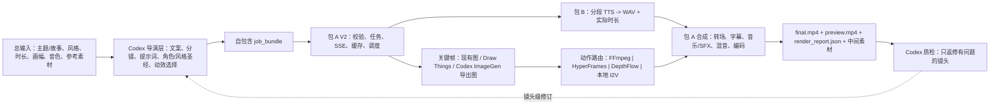
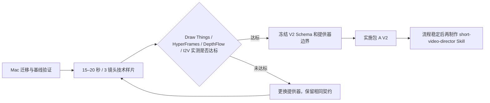

# 文本视音屏生成器：Mac 迁移与短视频 V2 改造交接文档

> 用途：将当前 Windows 上的整个项目目录迁移到 MacBook Pro 后，在新的 Codex 会话中继续分析、验证和开发。
>
> 新会话必须先完整阅读本文档，再执行末尾的「下一个可执行命令」。不要依赖旧会话历史。

## 1. 交接元数据

- 生成时间：2026-08-11（Asia/Shanghai）
- 当前 Windows/WSL 项目根：`/mnt/d/Desktop/文本视音屏生成器`
- 迁移后预期 Mac 项目根：`~/Desktop/文本视音屏生成器`（以实际位置为准）
- Git 分支：`main`
- Git HEAD：`eaa3bf37e82be8822c70dc5dcad129cbbba08f7d`
- 最近提交：`eaa3bf3 初版mac版本`
- 当前工作树不干净，有 3 个包 B 文件已修改，本交接文档为新增未跟踪文件。详见第 10 节。
- 本次交接只整理项目事实、架构决策和后续路线，没有开始短视频 V2 业务代码改造。

## 2. 用户的最终目标和硬约束

### 2.1 原始项目现状

项目由两部分组成：

- 包 A：接收语音和文本，当前生成「黑色背景 + 读字字幕 + 音轨」的 MP4。
- 包 B：基于 dots.tts 的本地文本转语音服务，与包 A 通过 `127.0.0.1:7860` 通信。

### 2.2 目标产品

将当前项目改造为「文本驱动的高质量短视频生成工作流」：

- 输入可以是一件事情、一段故事或一个短视频主题。
- 成片可以是动漫风格或现实/写实风格。
- 通过多个镜头按顺序讲述故事。
- 每个镜头通常由一张高质量图片发展成动态画面，使用推近、拉远、平移、视差、粒子、遮罩或局部 AI 动作。
- 镜头之间使用有意图的转场，避免生硬切换。
- 支持第三人称旁白，也可支持角色台词。
- 第一版明确不要求角色嘴型与包 B 音频准确同步。

### 2.3 硬约束

- 不使用付费云 API；不将 OpenAI Image API、Sora、Runway、Veo、Luma 等按量付费服务设为核心依赖。
- 可以使用本地 HTTP、gRPC 或 CLI 接口。这些在技术上也可以称为 API，但不是付费云 API。
- 可在 Codex 会话中使用内置 ImageGen 产生图片，但它只能作为「Codex 伴随式制作」的可选能力，不应嵌入独立项目运行时。
- 实际开发和渲染设备将是 MacBook Pro M1 Pro / 32GB 统一内存 / 512GB SSD。
- 迁移完成后不再使用 Windows 作为主开发机；Codex 新会话也在 Mac 上新开。
- 所有大模型、临时帧、音频和视频渲染都应在 Mac 本地磁盘上完成，不要继续跨机逐帧读写。

## 3. 已验证的项目事实

### 3.1 这不是待移植的 Windows-only 工程

根目录 [README.md](README.md) 明确写明：

- 当前仓库已是 macOS Apple Silicon 版本。
- 目标为 M1/M2/M3/M4 arm64 Mac。
- 包 A 和包 B 均使用本地运行时。
- 已包含 macOS 启动、停止、端口、路径、MPS/float32、FFmpeg 边界和子进程管理适配。

关键文件证据：

- `README.md:1-12`：项目定位为 macOS Apple Silicon 版本。
- `README.md:16-29`：Mac 源码运行时和模型准备流程。
- `README.md:52-89`：先启动包 B，再启动包 A。
- `README.md:117-123`：macOS 适配范围。
- `【包A】视频引擎包/macOS使用与构建说明.md:5`：记录目标 Apple Silicon，当前实机是 M1 Pro。
- `【包B】语音引擎包/macOS使用说明.md:5-7`：已在 M1 Pro 32GiB 验收，使用 PyTorch MPS/float32，不静默回退 CPU。

### 3.2 包 B 已经是可复用的本地 TTS 引擎

《包 B Apple Silicon macOS 使用说明》记录：

- 快速版 `dots-tts-mf` 是默认生产路径。
- M1 Pro 实测稳态中位 RTF 约 `2.82455`，可用但不是实时级。
- 质量版 `dots-tts-soar` 实测 RTF 约 `9.4`，明显更慢，不应作为日常默认。
- 超过 200 字的长段可能出现局部音量变小，因此 V2 应按旁白/镜头分段生成，不要把全文一次性交给包 B。

### 3.3 包 A 的工程化骨架有保留价值

已检查 `【包A】视频引擎包/程序文件/网站/kt_web.py`：

- `kt_web.py:171-220`：任务、状态和事件管理。
- `kt_web.py:441-554`：视频任务工作目录、输入校验、进度、停止、输出校验和清理。
- `kt_web.py:555-683`：调用包 B 完成本地 TTS。
- `kt_web.py:1133-1215`：当前 `/api/generate` 只接受 WAV + TXT/旧 JSON base64，还不支持分镜和素材清单。
- `kt_web.py:1233-1299`：SSE 实时进度和终态事件。

这些都应保留并抽象给 V2 使用，不要因为视觉表现简单而整仓推倒。

### 3.4 当前视觉引擎的限制非常集中

`【包A】视频引擎包/程序文件/引擎/kt_video.py:503-537` 构造 FFmpeg 命令，其中：

- `kt_video.py:521-524`：只把 ASS 字幕叠加到画面。
- `kt_video.py:529`：背景源被固定为 `color=c=black`。
- `kt_video.py:529-537`：输出是黑底、字幕、音轨和 H.264/AAC 编码。

因此当前项目的精确评价是：

> 整体不是玩具 demo，而是已有较完整本地任务与 TTS 基础设施的单机工程；但当前的视觉渲染器是功能原型/演示级表现。

## 4. 已决定的总体架构

### 4.1 核心分工

- Codex = 导演/编剧/分镜/提示词/质量检查控制面。
- 包 A V2 = 结构化任务的本地编排、动效路由、转场、混音、字幕、编码、缓存、回退和输出引擎。
- 包 B = 本地 TTS，第一版尽量不改。
- 本地视觉提供器 = Draw Things/已有图片/Codex 导出的图片。
- 动效提供器 = FFmpeg、HyperFrames、DepthFlow，以及经实测通过后的本地 I2V。

Codex 不应直接在每次任务里拼接长 FFmpeg filtergraph；Codex 只输出 `motion.mode`、`preset`、`duration`、`transition` 等语义字段，由包 A 映射到经验证的渲染模板。

### 4.2 建议数据流



### 4.3 第一版应采用「Codex 伴随式」而非完全无人化

推荐的第一版交互：

1. 用户在 Codex 里提供主题/故事和约束。
2. Codex 生成文案、分镜、提示词和任务包，并可选使用 ImageGen 生成关键帧。
3. 包 A+B 在 Mac 本地确定性执行任务。
4. Codex 检查成片/抽帧和渲染报告，只重做失败镜头。

不应在第一版就要求网页输入一句话、完全脱离 Codex 后自动编剧和分镜。那会需要再引入本地 LLM，并显著增加工程量和质量风险。

## 5. Codex 与项目的输入/输出契约

### 5.1 整个 Codex + 项目的输入

- 主题、故事或原始文案。
- 目标时长。
- 画幅（第一版默认 `1080x1920` / `9:16`）。
- 动漫或现实/写实风格。
- 旁白语气、音色和语速。
- 可选角色参考图、风格参考图、资料和限制。

### 5.2 Codex 的输出

```text
job-<id>/
├── brief.md
├── project.json
├── storyboard.json
├── style_bible.json
├── references/
├── assets/
│   └── keyframes/
├── audio/
├── shots/
└── output/
```

Codex 可以把图片直接放入 `assets/keyframes/`；如果选择 Mac 本地 Draw Things 生图，则在 `storyboard.json` 中保留提示词、参考图和种子。

### 5.3 包 A V2 的输入

包 A V2 不直接理解一大段自然语言，而是验证并执行 `project.json + storyboard.json + assets`。

建议的单镜头形式：

```json
{
  "id": "shot-003",
  "narration": "就在众人以为危机已经解除时，天空再次暗了下来。",
  "duration_sec": 4.8,
  "visual": {
    "source": "assets/keyframes/shot-003.png",
    "prompt": "古代城池，乌云遮蔽日光，写实国风电影感",
    "character_reference": "references/hero.png"
  },
  "motion": {
    "mode": "parallax",
    "preset": "slow_push_in"
  },
  "transition": {
    "type": "crossfade",
    "duration_sec": 0.35
  }
}
```

### 5.4 包 A V2 的输出

- `audio/*.wav`：分镜/台词级音频。
- `shots/*.mp4`：已标准化的单镜头视频。
- `captions/*.ass` 或其他字幕文件。
- `preview.mp4`：快速预览版。
- `final.mp4`：最终成片。
- `render_report.json`：每个镜头所用提供器、时长、缓存命中、失败、重试、回退、总耗时和产物路径。

## 6. 工具调研结论与当前排名

### 6.1 Codex ImageGen / GPT Image 2

已确认：

- Codex 内置 ImageGen 使用 `gpt-image-2`，可在会话里生成或编辑图片。
- 内置生图消耗 Codex/ChatGPT 套餐使用额度，不是独立项目可以免费调用的常驻后端，也不是无限免费。
- `gpt-image-2` 的官方模态不支持视频输出：<https://developers.openai.com/api/docs/models/gpt-image-2>
- 因此 Codex ImageGen 只负责产生 PNG/JPEG 关键帧，不能取代动效或 I2V 层。

### 6.2 本地图片和视频模型：Draw Things（当前首选）

官方资料：

- 官网：<https://drawthings.ai/>
- 版本记录：<https://drawthings.ai/downloads/>
- 官方开源仓库/CLI/gRPC：<https://github.com/drawthingsai/draw-things-community>

已确认的能力：

- macOS/iOS 本地离线图片生成。
- 本地 LoRA 训练和 ControlNet/参考图约束。
- 支持 image-to-video。
- 支持 Wan 2.1/Wan 2.2/LTX/Hunyuan 等部分视频模型。
- 有 macOS `draw-things-cli` 和 `gRPCServerCLI-macOS`，因此有机会被包 A 作为外部本地提供器调用。

尚未验证：

- M1 Pro 32GB 上具体生图速度。
- CLI/gRPC 对视频模型的自动化稳定性。
- Wan/LTX 在该设备上生成 3–5 秒镜头的时间、峰值内存、温度和失败率。
- Draw Things 的开源服务部分为 GPL-3.0。个人本地使用没有当前阻碍；如未来分发闭源产品，应将其维持为外部进程/服务，不要直接复制源码或深度捆绑。

### 6.3 FFmpeg（必须存在的默认生产基线）

官方滤镜文档：<https://www.ffmpeg.org/ffmpeg-filters.html>

适合：

- `zoompan`、推拉、平移、局部缩放。
- `xfade`、淡入淡出、擦除、闪白等转场。
- `overlay`、遮罩、暗角、光效、颗粒、字幕叠加。
- 音视频标准化和最终 H.264/AAC 输出。

局限：它只产生镜头/层级运动幻觉，不会理解画面语义，无法让角色真正转身、走路或改变表情。

### 6.4 HyperFrames（推荐的高级 2.5D/动效层）

官方仓库：<https://github.com/heygen-com/hyperframes>

当前 Windows Codex 环境里已有 HyperFrames 和 HyperFrames CLI 技能，但这些是 Codex 环境资产，不会随项目文件夹自动迁移到 Mac；新会话要先检查是否仍安装。

能力边界：

- 通过 HTML + CSS + GSAP 时间线制作确定性动画。
- 可渲染标题卡、图片分层、粒子、遮罩、动态字幕、音频响应和复杂转场。
- 使用 Node.js 22+、无头 Chrome 和 FFmpeg 在本地渲染 MP4。
- 它适合动效和 2.5D 视差，不是生成式角色动作模型。
- 建议将其作为包 A 的可选镜头渲染器，不要第一步就让它替换包 A 的整个任务系统。

### 6.5 DepthFlow（可选的深度视差层）

官方仓库：<https://github.com/BrokenSource/DepthFlow>

- 从图片和深度图生成 3D parallax 动画。
- 有 CLI、Python 自动化和 Gradio UI，官方文档包含 macOS 安装方式。
- 适合风景、建筑、人物半身像等缓慢视差镜头。
- 它不会产生真正的语义动作。
- 项目为 AGPL-3.0，应保持可选外部提供器边界，不应在未处理许可证的情况下复制进本项目。

### 6.6 本地生成式 I2V（只能作为实验性英雄镜头）

建议初始策略：

- 普通镜头：FFmpeg。
- 高级 2.5D/视觉包装：HyperFrames。
- 景深突出镜头：DepthFlow。
- 动作、高潮或局部真实运动：实测通过后的 Draw Things Wan/LTX。

不允许让所有镜头强依赖 I2V。I2V 失败时必须自动回退到 2.5D/基础镜头，不能让整个任务失败。

### 6.7 不选为初始基础的工具

- ComfyUI：官方支持 Apple Silicon MPS 和 Wan 2.2 本地工作流，但节点图、模型和自定义节点维护成本高。保留为 Draw Things 自动化失败后的备选实验台，不作第一选择。
- DiffusionKit：虽然面向 Apple Silicon，但官方仓库已于 2026-03-21 归档只读，不应成为新架构根基：<https://github.com/argmaxinc/DiffusionKit>
- Remotion：可用，但 React/Node 模型相比 HyperFrames 需要更大改造，当前没有必要并列两套 HTML/浏览器渲染技术。
- RIFE/DAIN 类插帧：只能平滑已有运动，不能把单张静态图变成有语义的角色动作，不应误当成 I2V。

## 7. 建议的第一版验收标准

| 项目 | V2 MVP 默认标准 |
| --- | --- |
| 画幅 | 1080x1920，9:16 |
| 时长 | 30–45 秒 |
| 镜头数 | 6–10 个 |
| 风格 | 单个项目使用一种统一风格 |
| 角色 | 最多 1–2 个主要角色 |
| 配音 | 第三人称旁白为主，允许少量角色台词 |
| 口型 | 第一版不要求同步 |
| 基础动效 | 每个镜头都有合理运动，不允许纯静帧长时间停留 |
| 转场 | 根据场景语义选择，不是所有镜头都用同一个转场 |
| I2V | 允许为零；实测通过后用于 1–2 个重点镜头 |
| 字幕 | 可关闭；开启时按分镜旁白时间轴显示 |
| 音频 | 旁白、背景音乐、环境音/SFX 独立音轨和音量控制 |
| 失败处理 | 高级提供器失败时回退基础动效 |
| 重渲染 | 单镜头可单独重做，不强制整片重渲染 |

## 8. 开发准备度判断

当前已经：

- 足够开始「Mac 实机迁移 + 基线验证 + 技术样片」。
- 足够开始定义 V2 PRD、架构文档、JSON Schema 和测试规格。
- 不足以直接大规模重写包 A，因为 M1 Pro 上的图片/视频提供器仍未实测。

不需要继续大量纯理论调研。后续正确路径是：



## 9. Mac 迁移现状和重要注意事项

### 9.1 当前目录中已有的大文件

本次检查得到：

- `【包B】语音引擎包/pretrained_models` 已存在，大小约 `9.7GB`。
- 其中同时包含 `dots-tts-mf` 和 `dots-tts-soar`。
- 两个主模型 `model.safetensors` 分别约 `4.4GB`，两个 vocoder 分别约 `724MB`。
- `【包B】语音引擎包/runtime` 当前不存在，因此迁移到 Mac 后必须在 Mac 上创建 arm64 Python 3.12 运行时和安装锁定依赖。
- `【包A】视频引擎包/程序文件/runtime` 当前约 `41MB`，但源码开发模式仍按 README 使用 Mac 系统/Homebrew Python 3.12。

因此「复制整个目录」会携带已有模型，但不会携带可直接使用的包 B Mac Python 环境。Python 虚拟环境本就不应跨 Windows/macOS 复制复用。

### 9.2 不要只在 Mac 重新 git clone

当前有未提交修改、本交接文档以及已下载的大模型。如果只重新 `git clone`：

- 3 个包 B 未提交修改会丢失。
- `项目交接文档.md` 会丢失。
- Git 忽略的约 9.7GB TTS 模型会丢失。

应该直接传输整个目录，并包含 `.git`、未跟踪文件和忽略的模型文件。复制完成后，在 Mac 上使用 `git status --short` 确认下文记录的修改仍存在。

### 9.3 文件权限

仓库中的 `.command` 启动文件在 Git 索引中是可执行模式 `100755`。如果通过会丢失 Unix 权限的介质复制，到 Mac 后要检查并必要时恢复执行权限。不要为所有文件盲目授予可执行权限，只处理 `.command` 和实际启动脚本。

### 9.4 Mac 上的建议准备顺序

1. 确认 `uname -m` 输出 `arm64`。
2. 确认实际 macOS 版本；仓库文档曾记录实机为 macOS 26.5.1，新会话不应假设迁移时仍是同一版本。
3. 安装基线：`brew install python@3.12 ffmpeg`。
4. 因模型已随目录传输，先用 `--model none` 创建运行时，避免设置脚本立即重新调用 Hugging Face 下载：

   ```bash
   python3.12 scripts/setup_macos_source.py --model none
   ```

5. 使用新建的包 B 运行时离线校验已传输的两个模型：

   ```bash
   "【包B】语音引擎包/runtime/python/bin/python3.12" \
     scripts/download_macos_models.py --model all --verify-only
   ```

6. 先运行包 B preflight，再启动包 B。
7. 运行包 A development preflight，再启动包 A。
8. 运行两包测试。
9. 完成一次现有 A+B 黑底视频的基线冒烟测试；只有基线正常后才开始 V2。

### 9.5 512GB SSD 约束

- 当前 TTS 模型已占约 9.7GB。
- Draw Things 静态图模型和 Wan/LTX 视频模型还会显著增加占用。
- V2 必须实现中间帧/失败镜头清理和缓存配额，不应无限保留每次渲染的原始帧。
- 高价值关键帧、单镜头成品和最终成片可以保留。
- 如后续同时保留多套视频模型，应考虑高速外置 SSD，但在做完实际模型读取测试前不将外置盘作为强制前置。

## 10. 当前工作树和必须保留的未提交修改

2026-08-11 检查到：

```text
 M 【包B】语音引擎包/apps/gradio/service.py
 M 【包B】语音引擎包/macOS使用说明.md
 M 【包B】语音引擎包/tests/test_phase3_api_contract.py
?? 项目交接文档.md
```

3 个已修改文件的内容：

- `apps/gradio/service.py`：调整 `_apply_speed`，使语速调整优先使用可选 Rubber Band；Rubber Band 不存在时回退包内/resolve 到的 FFmpeg `atempo`，输出 PCM WAV。
- `macOS使用说明.md`：补充上述 Rubber Band -> FFmpeg 回退行为说明。
- `tests/test_phase3_api_contract.py`：新增源码契约测试，确认 Rubber Band 为 `required=False`且 FFmpeg `atempo` 回退存在。

这些修改在当前 Windows/WSL Python 环境中执行了：

```bash
python3 -m unittest '【包B】语音引擎包/tests/test_phase3_api_contract.py'
```

结果：`Ran 7 tests ... OK (skipped=1)`。跳过项是当前环境缺少可用 Gradio runtime 时的条件测试；这不等于已在 Mac 上完成真实音频变速冒烟测试。

新 Mac 会话不得回退这些修改。先在 Mac 上重新验证，再决定是否单独提交。

## 11. 已完成的分析与验证

### 11.1 已完成

- 梳理包 A、包 B 和 A+B 的主要职责和调用边界。
- 确认项目已是 Apple Silicon/M1 Pro 适配项目，纠正了把 Windows 当作未来运行设备的早期假设。
- 确认包 A 当前黑色视频源的具体代码位置。
- 确认可复用的任务/SSE/停止/字幕/TTS/输出校验基础设施。
- 确认不要求第一版嘴型同步。
- 确认无付费云 API 的技术边界。
- 完成 Codex 控制面 / 项目执行面的职责拆分。
- 形成 FFmpeg + HyperFrames + DepthFlow + 可选本地 I2V 的分层动效策略。
- 形成 Draw Things 作为 Mac 本地视觉提供器的首选假设。
- 确认当前目录已含约 9.7GB 的两套 TTS 模型，但不含包 B 可直接使用的 Mac Python runtime。
- 执行包 B 契约测试，确认当前 3 个未提交修改至少通过静态/契约级测试。

### 11.2 验证命令和证据

- `git -c core.quotepath=false status --short`：确认 3 个包 B 修改和新增交接文档。
- `git diff --stat`：3 个包 B 文件共计 `77 insertions / 33 deletions`。
- `python3 -m unittest '【包B】语音引擎包/tests/test_phase3_api_contract.py'`：7 个测试通过，1 个条件跳过。
- `du -sh '【包B】语音引擎包/pretrained_models'`：约 `9.7GB`。
- `python3 -m json.tool .omx/state/deep-interview-state.json`：旧会话的需求澄清状态 JSON 有效；该状态已标记澄清完成。`.omx/` 可能被 Git 忽略，它不是新 Mac 会话的必要依赖，本文档才是交接真实源。

## 12. 尚未验证的事项和风险

### 12.1 尚未在迁移后的 Mac 上验证

- 整个目录是否完整传输，包括 `.git`、未提交修改、交接文档和 9.7GB 模型。
- Python 3.12 arm64、FFmpeg/ffprobe 和包 B 锁定依赖安装。
- 两套已传输 TTS 模型的 SHA-256 清单校验。
- 包 B MPS 启动、真实 TTS 和 Rubber Band -> FFmpeg atempo 回退。
- 包 A 启动、连接包 B、SSE/停止/下载和现有黑底视频全链路。
- 两包完整测试集。

### 12.2 本地视觉工具尚未实测

- Draw Things 是否已安装，实际版本、模型目录和 CLI/gRPC 能力。
- 静态图生成速度、质量和角色一致性。
- HyperFrames 技能/CLI 在新 Mac Codex 环境中是否可用。
- Node.js 22、无头 Chrome 和 HyperFrames 实际渲染速度。
- DepthFlow 的 macOS/M1 Pro 安装、深度图质量、边缘破损和渲染速度。
- Wan/LTX 本地 I2V 的可用性和性能。

### 12.3 关键产品风险

- 角色一致性将比口型同步更早成为质量瓶颈。需要风格圣经、角色参考图、种子、LoRA/ControlNet 或其他约束。
- 纯静态推拉并不等于高质量成片；高质量还依赖分镜节奏、声音设计、叙事重音和少量高价值动作镜头。
- 不要在缺少实测数据时承诺 Wan/LTX 在 M1 Pro 上的具体生成时间。
- Draw Things GPL-3.0 和 DepthFlow AGPL-3.0 对未来分发有潜在影响；当前应始终保持外部提供器边界。
- 背景音乐、SFX 和素材使用需要明确版权来源，不应随意抓取或复制抖音成片的受保护素材。

## 13. 后续开发计划与停止门槛

### Phase 0：Mac 迁移与现有链路基线

- [ ] 检查 Git 分支、HEAD、工作树和交接文档。
- [ ] 检查 arm64/macOS/Python/FFmpeg。
- [ ] 以 `--model none` 创建包 B runtime。
- [ ] 使用 `--verify-only --model all` 校验已迁移模型。
- [ ] 运行包 A 和包 B 完整测试。
- [ ] 启动包 B 快速版并生成真实 WAV。
- [ ] 验证语速不为 1.0 时的 FFmpeg atempo 回退。
- [ ] 启动包 A，连接包 B，生成一个现有黑底读字 MP4。
- [ ] 记录基线时间、内存和日志。

停止门槛：如果现有 A+B 基线不能在 Mac 上稳定通过，不得开始 V2；先修复迁移/运行时问题。

### Phase 1：先写稳定契约，不急着改 UI

建议创建：

```text
docs/
├── SHORT_VIDEO_V2_PRD.md
├── SHORT_VIDEO_V2_ARCHITECTURE.md
├── SHORT_VIDEO_V2_TEST_SPEC.md
└── schemas/
    └── storyboard-v2.schema.json
```

要求：

- 明确必填/可选字段、默认值、版本号和路径安全。
- 结构化分镜是 Codex/项目边界，不将提供器特有的数十个原始参数暴露给顶层 Schema。
- 考虑旧 `/api/generate` 的向后兼容。
- 新建 V2 入口，不要直接将旧 `kt_video.generate()` 改成无限增长的巨型函数。

### Phase 2：15–20 秒、3 镜头技术样片

使用一个原创短故事，不直接复制用户提到的抖音视频素材。建议包含：

1. 环境建立镜头：Draw Things 关键帧 + FFmpeg 推拉 + 可选 DepthFlow。
2. 角色叙事镜头：测试参考图和跨镜头一致性 + 包 B 旁白。
3. 高潮镜头：HyperFrames 特效，并尝试一次 Draw Things Wan/LTX I2V。

每个方案记录：

- 生成/渲染耗时。
- 峰值内存。
- 磁盘占用。
- 角色一致性。
- 肢体、脸部、边缘和穿帮。
- 失败率和重试次数。
- I2V 相对 2.5D 的实际质量收益。

决策门槛：不是只判断「I2V 能否运行」，而是判断它带来的质量改善是否值得时间、稳定性和磁盘成本。

### Phase 3：冻结提供器边界并实施包 A V2

建议新结构（具体名称由新会话结合代码规范决定）：

```text
video_v2/
├── schema/
├── orchestrator/
├── timeline/
├── visual_providers/
├── motion_renderers/
├── composer/
├── cache/
└── report/
```

实施原则：

- 保留 v1 黑底流程作为回归基线。
- 新增 v2 API/任务类型。
- 每个提供器输入/输出标准化。
- 每个镜头可单独重试、替换提供器和回退。
- 每个镜头在最终合成前统一分辨率、FPS、像素格式、编码和时间基。
- 任务缓存和临时文件清理要从第一版即存在。
- 先完成 API/渲染内核，再改新 UI。

### Phase 4：Codex Skill

只有在至少 1–2 个手工/Codex 伴随式项目证明 Schema 和渲染流程稳定后，再创建专用 `short-video-director` Skill。

Skill 应负责：

1. 理解 brief。
2. 生成文案、分镜、风格圣经和提示词。
3. 可选调用 Codex ImageGen 或生成 Draw Things 任务。
4. 生成自包含 job bundle。
5. 调用包 A V2。
6. 检查渲染报告、抽帧和成片。
7. 只返修失败镜头。

请始终记住：Skill 是可重复执行的流程说明/编排逻辑，不是图片或视频模型，不会「凭空」把图片变成语义动画。

## 14. 已做出的架构决策

1. **保留当前仓库，在包 A 内建立隔离的 V2 管线。**
   - 原因：包 A 的任务基础设施和包 B TTS 已具有复用价值，推倒会重复支付运行时、路径、端口、停止、进度和模型适配成本。

2. **保留旧 `/api/generate` 和黑底渲染作为 v1 回归基线。**
   - 原因：V2 属于中大型视觉域重写，不应把已稳定链路改得无法对照。

3. **Codex 是控制面，包 A+B 是执行面。**
   - 原因：在无付费 OpenAI API 时，独立项目无法把 Codex 内置 ImageGen 当作免费常驻服务。文件契约能让两者解耦。

4. **默认动效必须不依赖生成式 I2V。**
   - 原因：M1 Pro 上 I2V 速度和稳定性未验证，不能让一项高风险能力决定整个 MVP 能否出片。

5. **第一版不做精确口型同步。**
   - 原因：用户已明确不需要，这使叙事音轨和视觉可解耦，大幅降低第一版复杂度。

6. **在完整实施前先做 Mac 技术样片。**
   - 原因：当前最大不确定性是本地视觉工具的实际性能/质量，而不是总体责任边界。

7. **先冻结 Schema 和测试规格，再改 UI。**
   - 原因：UI 过早绑定尚未验证的提供器参数会造成重复返工。

## 15. 阻塞项和开放问题

当前没有需要用户立即回答才能继续的阻塞项。以下都应由新 Codex 会话通过代码检查或 Mac 实测自主解决：

- Draw Things 当前版本在该 Mac 上最稳定的自动化接口是 CLI、gRPC 还是脚本 API。
- 第一个静态图模型的具体选择，应依据实际风格、质量、速度和许可证而定，不要只根据模型热度。
- HyperFrames 更适合单镜头渲染还是整条视觉轨渲染，需通过一个样片比较 Chrome 启动成本、转场质量和与包 A 合成责任是否重复。
- 角色一致性策略是只用参考图/种子，还是需要 LoRA/ControlNet，应用 3 镜头样片评估。
- 第一个样片可默认使用「原创的写实国风/历史叙事」，不需要先要求用户提供更多信息；如果用户后续指定其他风格，再局部覆盖。

只有以下情况才需要再询问用户：

- 选择会导致不可逆的大范围架构分叉。
- 需要付费、外部账号/凭据或云端调用。
- 需要删除大量模型/数据或覆盖用户未提交修改。
- 新的产品需求与本文档确定的方向实质冲突。

## 16. 新 Codex 会话必须先阅读的关键文件

按以下顺序：

1. `项目交接文档.md`（本文档）
2. `README.md`
3. `【包A】视频引擎包/macOS使用与构建说明.md`
4. `【包B】语音引擎包/macOS使用说明.md`
5. `scripts/setup_macos_source.py`
6. `scripts/download_macos_models.py`
7. `【包A】视频引擎包/程序文件/网站/kt_web.py`
8. `【包A】视频引擎包/程序文件/引擎/kt_video.py`
9. `【包A】视频引擎包/程序文件/网站/index.html`
10. `【包A】视频引擎包/程序文件/网站/dots_synth.py`
11. `【包B】语音引擎包/apps/gradio/service.py`（含未提交修改）
12. `【包B】语音引擎包/apps/gradio/api_contract.py`
13. `【包B】语音引擎包/tests/test_phase3_api_contract.py`（含未提交修改）

如果项目根在 Mac 上存在 `AGENTS.md`，必须在任何修改前优先阅读。当前 Windows 项目根扫描未发现实体 `AGENTS.md` 或 `state/SESSION.md` / `state/TODO.md` / `state/DECISIONS.md` / `state/DEBUG_LOG.md`。

## 17. 新会话的第一轮执行清单

新 Codex 不应立即修改 V2 代码，而应按顺序自动执行：

1. 阅读本文档和第 16 节的关键文件。
2. 执行 `git -c core.quotepath=false status --short`，确认未提交修改未丢失。
3. 执行 `git rev-parse HEAD`，确认仍为 `eaa3bf37e82be8822c70dc5dcad129cbbba08f7d`，否则先对比新变更。
4. 检查 `uname -m`、`sw_vers`、Python 3.12、FFmpeg/ffprobe。
5. 检查 `【包B】语音引擎包/pretrained_models` 是否仍包含 MF + SOAR。
6. 按第 9.4 节创建 Mac runtime 并离线校验模型。
7. 执行包 A/B 测试和基线冒烟测试。
8. 把实际命令、版本、测试输出和问题写入新的持久状态文档，再进入 Phase 1。

## 18. 下一个可执行命令

在 Mac 上进入项目根后，先执行下面的只读基线检查：

```bash
git -c core.quotepath=false status --short
git rev-parse HEAD
uname -m
sw_vers
python3 --version
command -v python3.12
command -v ffmpeg
command -v ffprobe
du -sh "【包B】语音引擎包/pretrained_models"
```

如果输出确认目录完整、架构为 arm64，随后执行：

```bash
brew install python@3.12 ffmpeg
python3.12 scripts/setup_macos_source.py --model none
"【包B】语音引擎包/runtime/python/bin/python3.12" \
  scripts/download_macos_models.py --model all --verify-only
```

## 19. 可复制到新 Codex 会话的恢复提示词

```text
请先完整阅读项目根目录的《项目交接文档.md》，然后按文档第 16 节顺序阅读关键项目文件。
这是从 Windows 迁移到 MacBook Pro M1 Pro 32GB 的新会话。不要回退或覆盖任何未提交修改。
先执行文档第 18 节的只读基线检查，核对 Git HEAD、工作树、arm64/macOS、Python/FFmpeg 和已传输模型。
然后完成 Phase 0：创建 Mac runtime、离线校验 MF+SOAR 模型、运行 A/B 测试，并验证现有 A+B 黑底视频基线。
基线通过前不要开始短视频 V2 改造；基线通过后，进入 PRD/Architecture/Test Spec/Storyboard JSON Schema 和 15–20 秒技术样片阶段。
```

---

最终架构原则的一句话摘要：

> 保留现有 A+B 的 Mac 本地任务和 TTS 骨架，在包 A 内建立独立 V2 视觉管线；Codex 产生结构化分镜和可选关键帧，包 A 通过 FFmpeg/HyperFrames/DepthFlow/可选本地 I2V 完成确定性渲染，任何高级提供器失败都不能阻止整片出片。
